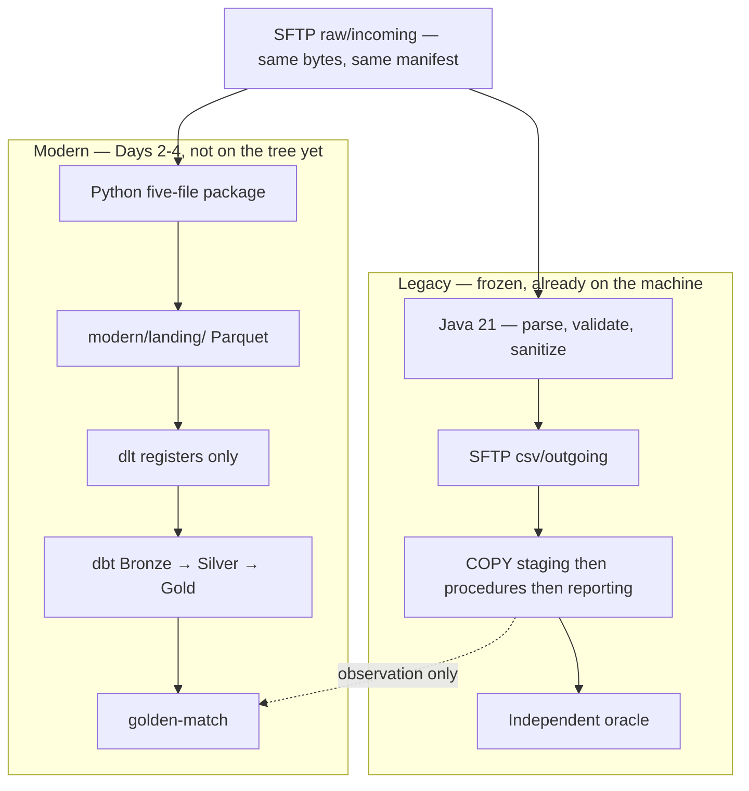
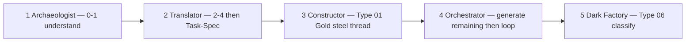

# NorthWind Pay EDP

Overnight card settlement for merchants — a **working legacy plant**, a messy customer drop, and a five-day week that builds a **second, independent plant** beside Java. Money does not arrive as an API call. A batch lands on SFTP. The contract is the judge.

```bash
make init && make deploy && make status
make run TYPE=01 SCENARIO=valid-minimal
```

Done when `evidence/B202607230000001/reconciliation.json` reads **MATCHED**, net **173.45**. Open that file in the **terminal**. Do not edit `legacy/`, `contracts/`, `gen/`, or `infra/` to go green.


> **No oracle, no build.** A pack that cannot be adjudicated is refused before any modern code exists.  
> **A gate that cannot fail is worse than no gate.** Prove it red before you accept it green.  
> There is **no CI** on this tree. Local `make test` is the proof. Do not invent a pipeline badge.

---

## Contents

1. [What this is](#what-this-is)
2. [Two plants, same bytes](#two-plants-same-bytes)
3. [The week — living status](#the-week--living-status)
4. [Operator surface](#operator-surface)
5. [Prove the base](#prove-the-base)
6. [Four truth roles](#four-truth-roles)
7. [The tree](#the-tree)
8. [Context is the product](#context-is-the-product)
9. [Safety and lifecycle](#safety-and-lifecycle)
10. [Documentation map](#documentation-map)

---

## What this is

This repository is the **base use case** for an agentic-engineering bootcamp: a frozen SFTP → Java 21 → PostgreSQL settlement line, five live file types, and the inbound drop the customer actually mailed.

| You are | You are not |
|---|---|
| Booting a plant that already settles | Migrating Java tonight |
| Reading `spec/` as mail | Treating `cover.md` as `contracts/` |
| Grading **gates**, not vendors | Installing one blessed IDE |
| Building `modern/` **after Bind + Consensus** (Day 2) | Writing `modern/` on Day 1 |

When two components disagree, [`contracts/`](contracts/README.md) decides which one is wrong. Nothing in `legacy/`, `contracts/`, `gen/`, or `infra/` may be edited to make a later gate pass.

---

## Two plants, same bytes

One SFTP drop. Two first writes. Everything downstream follows.



Legacy’s first write is **CSV on SFTP**. Modern’s first write is **Parquet in `modern/landing/`**. Mixing those destinations is a failed day. Type `06` is **not** in `spec/` until Friday.

---

## The week — living status

Update **Status** as each night closes. Do not invent a Pass the brief did not authorize.

**One Night** each day. No morning / afternoon split.

| Night | Seat | Rings | Converge | Closes | Status |
|---|---|---|---|---|---|
| **1** | Archaeologist (SA + AI) | Prompt + context | **0 Capture → 1 Intent** | MATCHED plant. Second Brain (nine packs). OntoLayer without/with. BRD + tech-spec in [`docs/`](docs/README.md). **No product code.** | **live** |
| **2** | Translator (SWE) | Harness (Bind) | Recap 0–1. **2–4**, then **5** Task-Spec. Mesh internals. Factory 6–8 is Day 4 | Recap MATCHED + papers. Bind fail-closed. Query. ADRs, seams, **Consensus signed**. One leaf in `docs/tasks/`. **No `modern/` required** | **live** |
| **3** | Constructor (DE + analytics) | Harness + loop seed | Recap. **2–4–5** on dlt → Gold. Mesh seed | Type 01 **steel thread**: landing → Gold + golden-match. `02`–`04` parked | **next** |
| **4** | Orchestrator | Loop + eval | SeamWise again. Generate remaining SWE+DE. **6–8** crank. Linear. Type `05` unattended | Queue cranks. Small `HALF_UP` pill | — |
| **5** | Dark Factory | Orchestration | Full 0–8 on sealed Type `06` | Classify. Do not patch `legacy/` | sealed |



| Role tonight | Owns |
|---|---|
| **Scope** | [`agenda/`](agenda/README.md) — what the night closes |
| **Staff clock** | Night 1: [`run/d1/`](run/d1/README.md) (17 beats, six boards). Night 2: [`run/d2/`](run/d2/README.md) (12 beats, five boards). Night 3: [`run/d3/`](run/d3/README.md) (12 beats, four boards). Days 4–5 still stubs |
| **What the room sees** | [`presentation/`](presentation/README.md) — Night 1 HTML **live** (44). Night 2 HTML **live** (`d2-translator.html`, 34). Night 3 HTML **live** (`d3-constructor.html`). Identify by `data-act-name` |
| **Converge papers** | [`docs/`](docs/README.md) — ingest papers exist; Day 3 writes lakehouse ADRs, seam 2, `consensus-lakehouse.md`, Type 01 Gold leaves |
| **Engagement map** | [`plans/`](plans/README.md) — legacy, modern, factory seed |

Day 1 public page lists *P1 Intent · P2 Structure*. **This week keeps Capture + Intent on Day 1** so the brain and the graph exist before ADRs. Nights 2–3 are **Type 01 steel threads** (SWE ingest → landing, then DE landing → Gold). Night 4 **generates remaining swimlanes / SWE+DE tasks**, cranks them (Mesh + Pass 6–8, Linear), then Type `05` unattended. An unsigned Consensus is not a license to code.

---

## Operator surface

Requirements: **Git**, **Docker with Compose**, **GNU Make**, **Python 3.12 or newer**. If these four fail, stop. Do not debug an agent.

```bash
make init          # venv, .env, container builds
make deploy        # SFTP + PostgreSQL, migrations, health
make status        # four SFTP roles + Postgres — healthy or stop
make run TYPE=01 SCENARIO=valid-minimal
```

One public runner for every registered type:

```bash
make run TYPE=01 SCENARIO=valid-minimal
make run TYPE=05 SCENARIO=rounding-half-up
make run TYPE=all SCENARIO=valid-minimal
make run-file TYPE=03 FILE=/absolute/path/to/source.rem
make worker                    # autonomous poller, foreground
```

`TYPE=all` is supported where one operation applies safely: `gen`, `run`, `test-e2e`. An explicit file always needs one exact type.

<details>
<summary>Graph over the live plant (Day 1 Slice E) — not the use case</summary>

```bash
make ontology                  # crawl → ontology/output/graph.json
make ontology-ask-sql          # same “paid” question, SQL only — the miss
make ontology-ask              # same question against the catalog
make ontology-mcp              # stdio MCP, read-only
```

Do not ask the graph what Converge is. That is Slice F.

</details>

---

## Prove the base

```bash
make check              # source, build, Java, and the fast suites
make test-postgres      # rollback-only, live database
make test-e2e TYPE=all  # live acceptance, types 01–05
make test               # check + PostgreSQL + worker portfolio
```

Live suites need a deployed runtime and **do not clean state on your behalf.** Canonical batch IDs are immutable. Repeat of `B202607230000001` needs a clean runtime:

```bash
make clean CONFIRM=clean-runtime && make deploy
```

Look up when Type `01` `valid-minimal` is the steel thread:

| Field | Value |
|---|---|
| Batch | `B202607230000001` |
| File | `NW_CARD_SETTLEMENT_20260723_B202607230000001.dat` |
| Status | `MATCHED` |
| `source_net_amount` | `173.45` |
| `applied_net_amount` | `173.45` |
| `amount_delta` | `0.00` |

The source **can** lie. Trailer `173.44` vs rows `173.45` is `DF-SOURCE-001`. Keep the declaration. Refuse the batch. Do not patch it.

[`tests/README.md`](tests/README.md) is the verification map. Test counts are not frozen here.

---

## Four truth roles

| Role | Meaning here |
|---|---|
| **System of record** | The simulated source owns its raw file and declared controls; committed PostgreSQL tables own applied legacy state |
| **Source of observation** | Immutable SFTP bytes, hashes, manifests, database observations, and per-run evidence show what actually happened |
| **Source of correctness** | Independently reviewed expected CSV, reconciliation, and governed business rules define what should happen |
| **Executable Git contract** | Versioned YAML, schemas, canonical fixtures, and tests encode the currently approved expectation |

A source system can be the system of record and still emit a defective batch. A referee may name that mismatch. **No implementation may silently redefine its own expected answer.**

---

## The tree

Setup sits at the front. These folders *are* the use case.

| Order | Folder | What it is |
|---|---|---|
| 1 | [`contracts/`](contracts/README.md) | Source of correctness. **Five** signed types. Type `06+` is a later kit, not an empty folder |
| 2 | [`gen/`](gen/README.md) | DataGen — simulated upstream. Raw bytes, checksum, source manifest |
| 3 | [`infra/`](infra/README.md) | Local SFTP image. Four roles, eight zones |
| 4 | [`legacy/publisher/`](legacy/publisher/README.md) | Drops a bundle onto `raw/incoming`, manifest last |
| 5 | [`legacy/intake/`](legacy/intake/README.md) | Claims the batch (rename = lock) |
| 6 | [`legacy/processor/`](legacy/processor/README.md) | Java 21: parse, validate, **sanitize**, write CSV |
| 7 | [`legacy/postgres/`](legacy/postgres/README.md) | COPY, stored procedures, reporting reconciliation |
| 8 | [`legacy/runner/`](legacy/runner/README.md) | The one public orchestrator: `make run`, `make worker` |
| 9 | [`validation/oracle/`](validation/README.md) | Independent referee. Recomputes the contract; never repairs |
| 10 | [`tests/`](tests/README.md) | Live acceptance, contract oracles, unit, PostgreSQL, security |

Root control plane: `Makefile`, `compose.yaml`, `.env.example`.

### Not the plant — the week around it

| Folder | What it is |
|---|---|
| [`spec/`](spec/README.md) | Customer drop for types `01`–`05`. Mail, not the judge. Type `06` is not here |
| [`brain/notebooklm/`](brain/notebooklm/README.md) | Human Second Brain — nine packs compiled from `spec/`. Days 2–5 **query** it. No tenth source |
| [`ontology/`](ontology/README.md) | Read-only graph over live Postgres. `make ontology`. Not Converge |
| [`agenda/`](agenda/README.md) | Five-day scope |
| [`run/`](run/README.md) | Staff follow-along. Night 1 live (17 beats). Night 2 live (12 beats, five boards). Days 3–5 stubs |
| [`plans/`](plans/README.md) | Engagement map — legacy, modern, factory seed |
| [`presentation/`](presentation/README.md) | Night 1 deck live (44). Night 2 deck live (34). Method manuals live here, not in `docs/` |
| [`docs/`](docs/README.md) | Converge paper trail — BRD, tech-spec, ADRs, seams, consensus, Task-Specs. Not the HTML manuals |
| [`transcripts/`](transcripts/README.md) | Live Night captions (`.vtt`). Speech, not the brief |
| [`assets/`](assets/) | Images and logos the decks reference |
| [`validation/golden-match/`](validation/README.md) | Modern referee — attached when that implementation exists |
| `evidence/` | Per-run packet. `make clean` removes it. Open in the **terminal** |
| `modern/` | **Must not exist on Day 1.** Day 2 designs it. Disk write is after the sign — not required Tuesday |

```text
spec/          inbound  — mail, meetings, layouts, samples
contracts/     judge    — frozen. Outranks code
legacy/ gen/ infra/    frozen plant. Do not write
docs/          papers   — Converge BRD, tech-spec, ADRs, the sign
ontology/      graph    — live Postgres, read-only MCP
brain/         memory   — NotebookLM pack, types 01–05
evidence/      the run  — MATCHED or it did not happen
modern/        not here until Bind is on and the owner signs
```

---

## Context is the product

A repo tour is not context. Day 1 stands up two instruments the rest of the week **queries** — it does not rebuild them.

| Instrument | What you feed it | What you must not |
|---|---|---|
| **Second Brain** | [`brain/notebooklm/northwind-pay-brain.zip`](brain/notebooklm/northwind-pay-brain.zip) — unzip, upload **nine** `.md` files (`00`–`08`) | The zip itself. `legacy/`. `contracts/`. A `.dat`. Type `06` |
| **OntoLayer** | Live Postgres after `make deploy`. Same “paid” question **without** (`make ontology-ask-sql`) then **with** (`make ontology-ask`) | Asking the graph what a kit is |
| **Converge 0–1** | BRD + tech-spec in [`docs/`](docs/README.md). `cvg` gates; the agent drafts | Pass 2–8. A stack. `modern/`. Uploading papers into NotebookLM |

Rebuild the brain when inbound changes:

```bash
bash brain/notebooklm/build.sh
```

Paid on this plant lives on `reporting.card_settlement_reconciliation`, grain `batch_id + currency`, written by `reporting.refresh_card_settlement_reconciliation`. That is retrieved, not guessed.

---

## Safety and lifecycle

Raw synthetic files contain deliberately restricted identifiers. **Java is the mandatory privacy boundary** on the legacy side: raw values may not enter sanitized CSV, logs, evidence, staging, operational tables, or reconciliation unless a contract permits a validated transform.

Separation is Unix groups, not a comment. Four SFTP roles, eight zones — see [`infra/README.md`](infra/README.md).

Services bind to `127.0.0.1`. PostgreSQL application access is non-superuser. Publication is manifest-last. Terminal failures are batch-scoped: one bad batch never stops the line.

`make clean CONFIRM=clean-runtime` is destructive and never implicit. It removes Compose volumes plus `.runtime/` and `evidence/` — **not** `gen/output/`, which is immutable and never overwritten.

---

## Documentation map

| Need | Open |
|---|---|
| What the night closes | [`agenda/d1.md`](agenda/d1.md) … [`agenda/d5.md`](agenda/d5.md) |
| What the three of you execute | Night 1 [`run/d1/`](run/d1/README.md) · Night 2 [`run/d2/`](run/d2/README.md) · map [`run/README.md`](run/README.md) |
| What the room sees | [`presentation/README.md`](presentation/README.md) |
| Converge papers | [`docs/README.md`](docs/README.md) |
| What was said | [`transcripts/README.md`](transcripts/README.md) |
| Why the plant is frozen | [`plans/legacy.md`](plans/legacy.md) |
| What `modern/` must satisfy | [`plans/modern.md`](plans/modern.md) — not an implementation |
| Lights-out seed | [`plans/dark-factory.md`](plans/dark-factory.md) |
| Inbound vs judge | [`spec/README.md`](spec/README.md) vs [`contracts/README.md`](contracts/README.md) |

House stack for the seat (Day 1 Slice A): Oh My Pi → OpenRouter → a workspace (CMUX, ORCA, Super Engineering, or BYO) → DeepSeek. Any agent that can edit files and run shell can sit here.

---

## The rule the whole system rests on

> **No oracle, no build.**  
> **Keep the lie. Refuse the batch.**  
> **Green for the right reason.**
