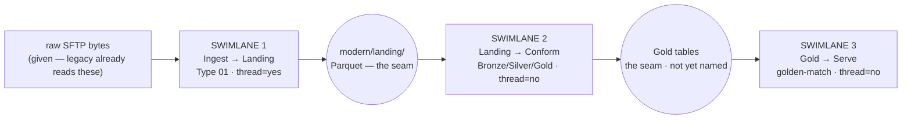

# Seams — Converge Pass 3 (Decompose)

> Reads `docs/adrs/*.md` (Pass 2, same understanding) and
> `docs/tech-spec-type-01-card-settlement.md` (Pass 1). Plan altitude
> only — no tasks, no evals, no implementation code. This repo's
> Converge home is `docs/`, not `cvg/docs/`; per `docs/README.md`'s map,
> Pass 3's output here is this single file, not a `swimlanes/` tree.

Vocabulary: **seam** — a nameable interface with a one-way dependency.
**swimlane** — one plan per seam, one focus. **leg** — a lane's named
stretch (one responsibility, one proving test); yields 1:N task-specs
at Pass 5, never here. **One owner per handoff** — every seam names the
single stream that owns crossing it.

## The week's seams

| # | Seam (interface) | Swimlane | `thread` | `risk` | `owner` (one per handoff) |
|---|---|---|:-:|:-:|---|
| 1 | `modern/landing/` Parquet, Type 01 shape | Ingest → Landing | **yes** | **high** | Translator (Night 2 — tonight) |
| 2 | Gold tables (not yet named) | Landing → Conform | no | med | Constructor (Night 3) |
| 3 | golden-match comparison surface | Gold → Serve | no | med-high | Constructor (Night 3, "golden-match attached" per the week table) |

No cycles (H5): the pipeline is strictly one-way, raw bytes through
serve. Nothing here co-depends; no dependency-inversion or shared-kernel
break was needed.

---

## SWIMLANE 1 — Ingest → Landing (Type 01)

`lane-meta: thread=yes · risk=high · owner=Translator (Night 2)`

### Identity + why

The steel thread. The thin vertical path that exercises every piece of
tonight's build end to end — read the raw bytes, decide accepted /
refused / kept-lie, and land — before any type beyond `01` or any layer
beyond `modern/landing/` is touched. Cutting this first is H1 (walking
skeleton): prove the skeleton connects before Swimlane 2 fattens it.

### Seam produced

The published contract this lane owns and Swimlane 2 consumes:
**`modern/landing/` Parquet, Type `01` shape** — one file (or file set)
per batch, decimal-typed money (ADR `0003`), privacy already applied
(ADR `0004`), zero rows for a refused or kept-source-lie batch (ADR
`0005`). Additive columns are non-breaking; a rename or a newly-required
column is breaking and needs a coexistence window before Swimlane 2
cuts over (H4).

### Non-goals

- No Bronze/Silver/Gold conform logic (Swimlane 2's job).
- No golden-match comparison (Swimlane 3's job).
- No call into Java, no read of Java's sanitized CSV as input (ADR
  `0004`'s boundary; tech-spec R-6).
- No stack/engine pick beyond what's already fixed (`modern/landing/`,
  Parquet — ADR `0001`); nothing here binds a warehouse, transform
  tool, or lakehouse.
- No Type `06`.
- No task-specs, no evals, no code (Pass 3 altitude).

### Legs (five-file package, ADR `0002`)

| Leg | Responsibility | Consumes | Produces |
|---|---|---|---|
| `leg-01-model` | Represent one Type `01` header/detail/trailer record in memory, amounts as exact decimal scale 2 (ADR `0003`), overpunch already decoded to signed decimal. | raw `.dat` bytes (conceptually) | in-memory record instances |
| `leg-02-schema` | Bind the model against the signed contract's shape — `contracts/types/01-card-settlement/layout.yaml` field positions and `canonical_rejection_codes` — so a structurally invalid record is named, not guessed. | `contracts/types/01-card-settlement/` (read-only judge) | pass/fail + rejection code per record |
| `leg-03-parser` | Turn raw bytes into `leg-01` model instances; apply the privacy transform (tokenize PAN, mask CPF) inside this same boundary, before any record leaves the parser (ADR `0004`). | raw `.dat` bytes, `contracts/types/01-card-settlement/privacy.yaml` | privacy-clean model instances |
| `leg-04-writer` | Independently recompute the batch's control total from the parsed details (tech-spec R-1) and compare to the declared trailer at zero tolerance (R-2). Accepted → write the batch's Parquet rows to `modern/landing/`. Refused or kept-lie → write **zero** rows for that batch (ADR `0005`); declaration stays unedited. | privacy-clean model instances | `modern/landing/` Parquet rows, or none |
| `leg-05-handler` | Orchestrate `leg-01`–`leg-04` per batch: claim the raw file, run parser → schema → writer in order, and surface the terminal outcome (accepted / refused / kept source lie — tech-spec R-3) as this lane's observable result. | `leg-01`–`leg-04` | one terminal outcome per batch |

Build order: `leg-01` and `leg-02` first (no dependency between them —
model and schema can be built in parallel against the same contract);
`leg-03` depends on both; `leg-04` depends on `leg-03`; `leg-05` depends
on all four and is built last, since it only orchestrates.

### Tests that prove each leg (assertion in prose, no evals)

- `leg-01` — a known-good sample's overpunch bytes decode to the exact
  decimal amounts the type pack already states (e.g. `valid-minimal`
  → `173.45`).
- `leg-02` — a structurally malformed sample is named with the
  contract's own rejection code, not a generic error.
- `leg-03` — no PAN or CPF value survives past this leg in the clear,
  on any accepted or refused sample (whole-output scan, per the privacy
  policy).
- `leg-04` — `df-source-001` (declared `173.44`, computed `173.45`)
  writes **zero** Parquet rows and leaves the declared value untouched;
  `valid-minimal` writes rows whose net reconciles to `173.45`.
- `leg-05` — every one of the drop's five Type `01` samples ends in
  exactly one of the three terminal outcomes tech-spec R-3 names.

### Open questions

- question: "What is the exact Parquet column shape (names/types) for
  the landing schema?"
  owner: Translator (Night 2)
  blocks: `leg-01`/`leg-02` detail, not the lane cut itself — this is
  Pass 5 task-spec territory once this plan clears Pass 4.
- question: "Gold-layer vocabulary — 'net amount' vs 'settlement
  total' — is pinned in `docs/CONTEXT.md`; does the landing schema
  itself use the same canonical name?"
  owner: Helena Dias
  blocks: `leg-01` field naming only, not this lane's existence.

---

## SWIMLANE 2 — Landing → Conform (Bronze/Silver/Gold)

`lane-meta: thread=no · risk=med · owner=Constructor (Night 3)`

### Seam consumed

**`modern/landing/` Parquet, Type `01` shape** (Swimlane 1's published
output) — reads only that contract, never reaches below it into the
parser's internals or the raw bytes directly.

### Seam produced

Gold-layer tables — **not yet named**. No ADR grounds this lane's join,
grain, or metric definitions yet (Pass 2 tonight covered only the
ingest→landing decisions in ADRs `0001`–`0005`).

### Non-goals (tonight)

Legs are **not planned here**. Planning this lane's contents now, ahead
of its own Pass 2 grounding, would be exactly the failure this skill
warns against ("Planning contents before naming the seam enshrines a
boundary you haven't justified"). This record only names the seam and
its direction so Swimlane 1 has a known consumer.

### Open questions

- question: "What are Bronze/Silver/Gold's join keys, grain, and
  metric definitions for Type `01`?"
  owner: Constructor (Night 3)
  blocks: this lane's own leg-level plan — run this lane's Pass 2
  grounding first, then re-decompose it, on Night 3.

---

## SWIMLANE 3 — Gold → Serve (golden-match)

`lane-meta: thread=no · risk=med-high · owner=Constructor (Night 3, per the week's "golden-match attached" milestone)`

### Seam consumed

Gold-layer tables (Swimlane 2's published output — not yet named).

### Seam produced

The comparison surface `validation/golden-match/golden_match.py`
already defines two questions per batch — legacy parity and business
correctness — and six classification outcomes
(`CONFIRMED_SOURCE_DEFECT`, `CONFIRMED_LEGACY_DEFECT`,
`APPROVED_BEHAVIOR_CHANGE`, `MODERN_DEFECT`, `CONTRACT_AMBIGUITY`,
`UNRESOLVED`) — this module already exists on the tree; this lane's
job is to feed it real modern observations, not to redesign it.

### Non-goals (tonight)

Legs are **not planned here**, for the same reason as Swimlane 2: no
Pass 2 grounding exists yet for what Gold exposes.

### Open questions

- question: "What observations does golden-match need from Gold, and
  in what shape?"
  owner: Constructor (Night 3)
  blocks: this lane's leg-level plan, not tonight's Swimlane 1.

---

## Cross-lane build order

1. **Swimlane 1** (Ingest → Landing, Type `01`) — tonight. Gates
   everything downstream: nothing in Swimlane 2 or 3 can be planned in
   detail until Swimlane 1's Parquet shape is frozen and proven at Pass
   4/5.
2. **Swimlane 2** (Landing → Conform) — Night 3, after its own Pass 2
   grounding.
3. **Swimlane 3** (Gold → Serve) — Night 3–4, after Swimlane 2's Gold
   shape exists.

## Grounded against

Every fact this record leans on for Swimlane 1 traces to
`docs/adrs/0000`–`0005` and `docs/tech-spec-type-01-card-settlement.md`
R-1–R-5. No fact here contradicts an ADR; where no ADR exists
(Swimlanes 2–3's internals), this record says so explicitly instead of
inventing one.
