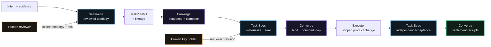
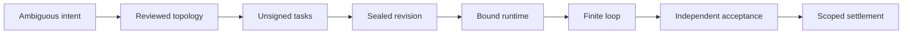
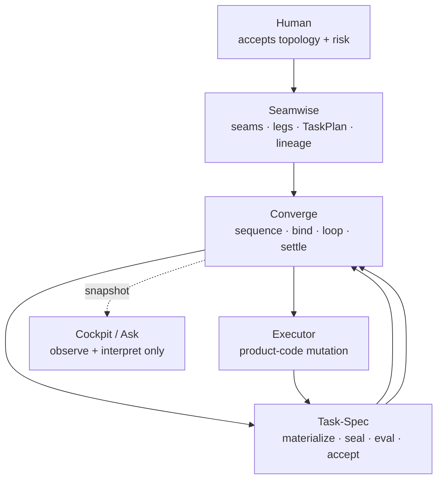
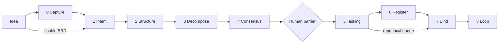
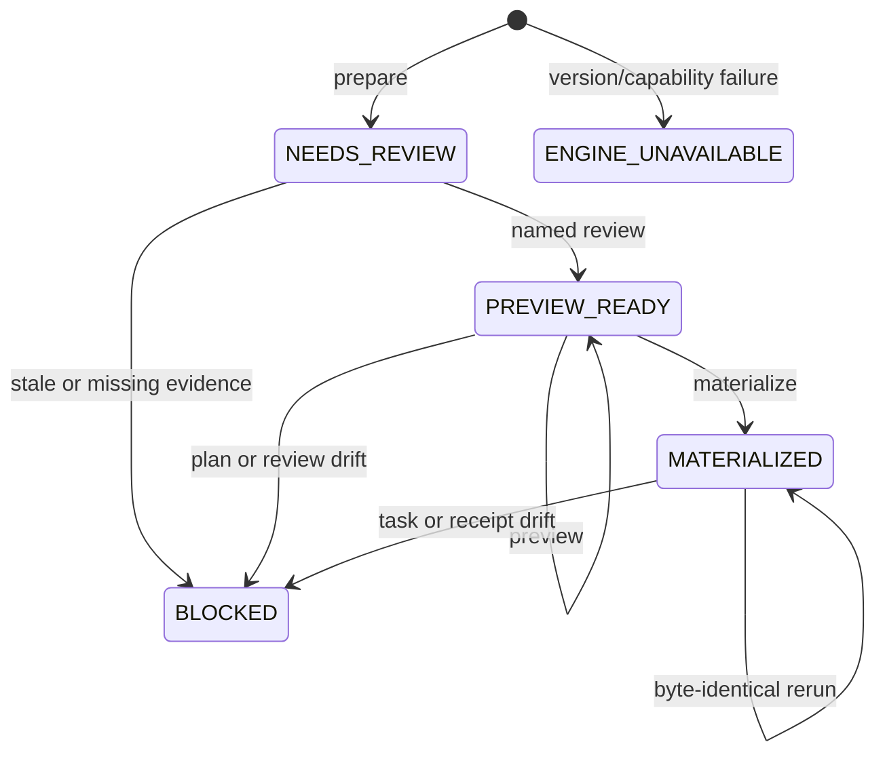
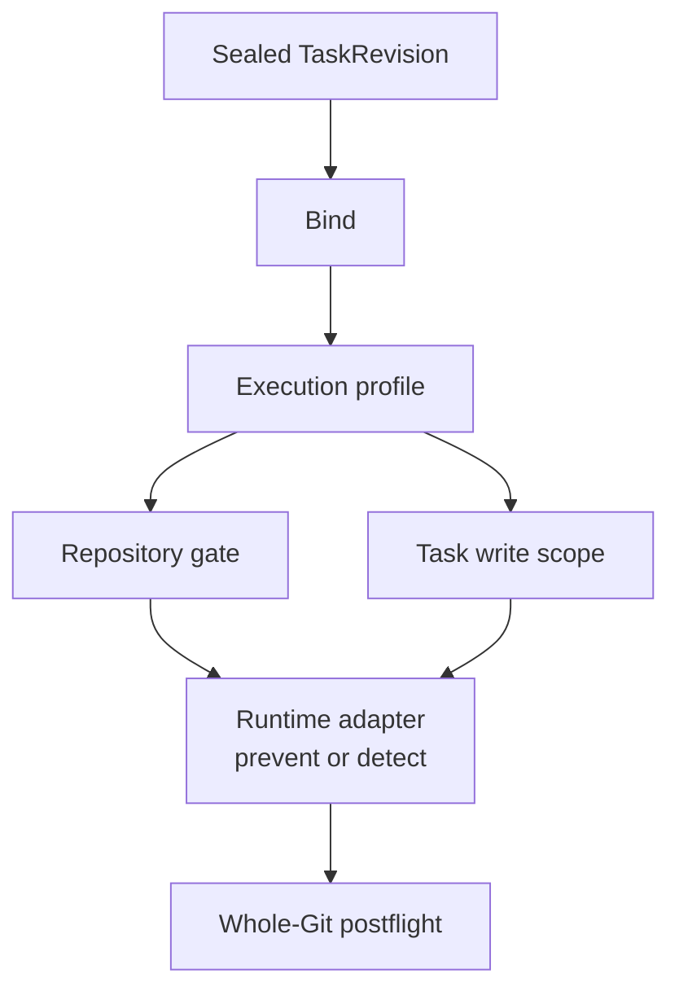
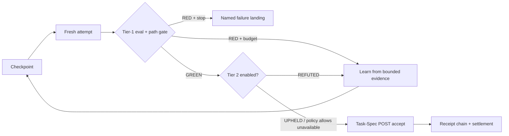
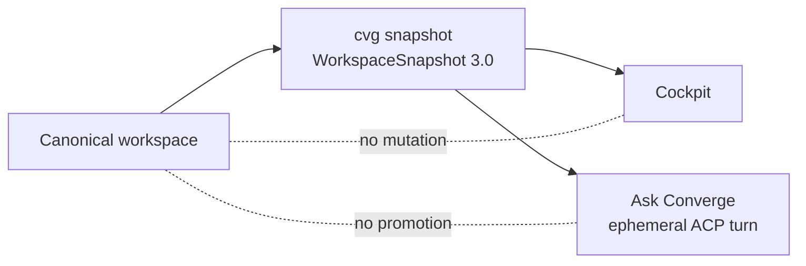

# CONVERGE — deep-dive presentation architecture

**Target deck:** `presentation/converge.html`  
**Design references:** `presentation/task-spec.html`, `presentation/seamwise.html`, and `presentation/cvg-aut-systems-spine-steps.html`  
**Canonical product source:** `/Users/luanmorenomaciel/GitHub/converge`  
**Source revision audited:** `58b1ddb73e31a2b03426ab9ad25f02b9a166f559` (`main`, 2026-08-19; equal to `origin/main`)  
**Immutable release anchor:** `v0.2.0` → `3de9f0b5f83f1bb62475308317c58e53f851b0db` (2026-08-17)  
**Working-tree boundary:** 16 modified files plus one untracked guided-chat contract; never present those changes as committed or released  
**Agenda authored and source re-audited:** 2026-08-26  
**Product version:** Converge `0.2.0`; standalone Task-Spec compatibility `3.8.x`; Seamwise release pairing `0.2.0`  
**Build method:** one slide at a time; review and sign off each slide before moving on

This file is the construction source for the definitive Converge deep-dive
deck. It is intentionally denser than the on-screen presentation. The HTML
must distill one numbered section at a time, keep each source label and truth
boundary intact, and never hide a failed gate behind a large count of passing
subsystem tests.

---

## 1. North star

The deck must leave the audience with one exact mental model:

> Converge is the factory coordinator and assurance layer around independent
> decomposition and task-contract engines. It sequences authority without
> duplicating it, binds one authorized task to a bounded runtime, and settles
> only after inspectable evidence. It is the referee, not the player.

The essential authority chain is:



The emotional arc is:

1. **Unease** — many agents can act, but authority becomes ambiguous.
2. **Separation** — topology, authorization, execution, acceptance, and observation are different jobs.
3. **Descent** — intent becomes progressively more falsifiable across nine passes.
4. **Barrier** — a human accepts the adversarially reviewed topology before build authority begins.
5. **Bounded motion** — one sealed revision receives one runtime contract and one finite loop.
6. **Settlement** — green evals, path policy, independent acceptance, and receipts agree.
7. **Honesty** — proof is scoped; release, current main, working tree, and roadmap stay distinct.

---

## 2. Evidence and claim policy

The deck must teach the source ladder. A polished README, a green leaf test,
and an immutable release receipt are not interchangeable evidence.

| Rank | Label | Surface | Use in the deck |
|---:|:---:|---|---|
| 1 | **A — Authority** | `OPERATING.md`, `AGENTS.md`, `docs/concepts/authority.md` | Ownership, non-authority, merge and factory/everyday boundaries |
| 2 | **C — Contract** | `contracts/`, schemas, `VERSION`, CLI matrix | Machine-visible shapes, commands, tokens, versions, mutation flags |
| 3 | **I — Implemented** | `bin/`, `skills/*/scripts/`, `apps/cockpit/` | Executable behavior at audited committed HEAD |
| 4 | **T — Tested** | `tests/`, skill suites, direct 2026-08-26 runs | Claims directly discriminated by observed checks |
| 5 | **E — Evidence** | `evidence/releases/`, immutable receipts and snapshots | Retained execution proof; invalidated corridors remain invalid |
| 6 | **R — Release** | `v0.2.0`, release workflow, archived assets | Frozen release claims only; do not import later-main behavior |
| 7 | **D — Documentary** | `README.md`, `docs/`, `CHANGELOG.md`, existing decks | Explanation and reported hosted evidence; reconcile against code/tests |
| 8 | **W — Working tree** | 16 modified + one untracked guided-chat file | Audited but uncommitted behavior; visibly label `CHECKOUT ONLY` |
| 9 | **F — Future** | explicit exclusions, Manager/fleet references | Roadmap or absent behavior; never render as a current capability |

### Audit snapshot

The source audit covered **508 tracked paths**:

| Area | Tracked paths | What was inspected |
|---|---:|---|
| `skills/` | 220 | 11 packaged skills, 55 scripts, 108 skill-test files, prompts, templates, fixtures |
| `apps/` | 102 | Cockpit client/server, ACP Ask path, schemas, tests, build |
| `evidence/` | 72 | release, invalidated, environment, receipt, acceptance, and final-status records |
| `tests/` | 22 | aggregate CLI, compose, install, clean room, loop, package, docs, layout |
| `assets/` | 21 | Settlement Fold brand and process assets |
| `docs/` | 18 | authority, trust, descent, bind/loop, recovery, CLI and knowledge map |
| `scripts/` | 11 | bootstrap, docs, evidence, release, demo, asset validation |
| `bin/` | 7 | referee CLI, composition, lane, snapshot, agent-context, UI helper |
| `.github/` | 7 | CI, release, dependency and ownership configuration |
| `contracts/` | 6 | CLI matrix and versioned JSON Schemas |

The committed baseline is `main` at `58b1ddb`, exactly aligned with
`origin/main`. The immutable `v0.2.0` tag is `3de9f0b`, **42 commits behind**
the audited HEAD. The working tree adds guided chat and expands the command
matrix from committed **57 forms** to checkout-only **60 forms**.

### Direct validation snapshot · 2026-08-26

The audit did not stop at documentation. It ran the current checkout against
the pinned engines and observed:

| Surface | Direct result | Honest interpretation |
|---|---|---|
| Runtime contract | 48/48 green | Strong Pass 7 policy, binding, freshness, topology, adapter, and settlement checks |
| Register | 145/145 green | Strong offline Pass 6 parity, idempotency, DAG, receipt, identity, and projection behavior |
| Loop kernel | 57/57 green | Brakes, budgets, isolation, tier 2, path policy, external-write policy, terminal states |
| Passes 0–4 | 39 + 24 + 38 + 33 + 23 rows green | Structural pass gates discriminate their named fixtures |
| Conductor checkout | 44/44 green | Guided mode and public pre/post routing work in the uncommitted checkout only |
| Clean-room path | 21/21 green | Copy install → init → seal → bind → loop → accept → done |
| Compose | 14/14 green | Review cannot be skipped; tamper and engine drift fail closed; rerun is idempotent |
| JSON envelope | 25/25 green | Position independence, exit preservation, mutation truth, snapshot contract |
| JSON matrix | 60 forms / 239 calls green | Checkout-only 60-form machine surface is serializable and usage-complete |
| Docs / package | `DOCS=READY files=22 commands=60`; `PACKAGE=READY files=244 skills=11` | Checkout documentation and package manifests are internally aligned |
| Cockpit | 40 server + 62 client tests green; production build green | Read-only bridge, bounded Ask, snapshots, artifacts, SSE, and UI compile |
| Retained evidence | 20 files green | Named live evidence validates; not a production-duration claim |
| Archived assets | 6/6 resolve on `v0.1.0` | Historical binaries remain recoverable from their owning tag |
| Composed demo | `LOCAL_SETTLED`, `ACCEPTED=1`, `DEMO_COMPOSED=READY` | Deterministic local composed path works with default external-write denial |
| Aggregate `make check` | **FAIL** | `tests/test-repo-layout.sh` rejects tracked `AGENTS.md` and `OPERATING.md` as undeclared top-level files |

The aggregate failure is load-bearing. The deck may say that the observed
subsystems above passed. It may **not** say that current-main `make check` is
green or that the checkout is release-ready.

### Claims the deck may make

- Converge `0.2.0` is a thin factory coordinator around independently versioned Seamwise and Task-Spec binaries.
- Each decision has one authority; duplicate capability is tolerated, duplicate authority is not.
- The method has nine passes, two phases, one human barrier, optional Capture, and opt-in Register.
- Materialization never authorizes dispatch; the composition receipt records `dispatch_authorized: false`.
- Task-Spec `gate --stamp` is the only engine action that seals a leaf for delegation.
- Bind adds a repository fence that may be stricter than the Task-Spec write scope.
- The loop chooses no work; it runs one named issue under finite iteration, time, token, and path budgets.
- Default isolation is a Git worktree; settled work survives on a task branch while disposable loop state is cleaned up.
- `LOCAL_SETTLED`, `SETTLED`, `NO_OP`, `BLOCKED`, `STALLED`, `EXHAUSTED`, `CANCELLED`, and `ERROR` are distinct terminal outcomes.
- Task-Spec performs independent acceptance of the exact handoff and revision; Converge does not reimplement it.
- Cockpit and Ask Converge are observation/interpretation surfaces and cannot authorize or settle work.
- The immutable v0.2.0 release and current main are different evidence corridors.

### Claims the deck must refuse

- Converge is the everyday portfolio coordinator; `OPERATING.md` assigns that plane to WorkHelm.
- Converge owns Seamwise decomposition or Task-Spec authorization/acceptance internals.
- A reviewed topology, materialized task, green model narration, or composition receipt authorizes execution.
- HMAC proves human identity, hides the signing key from any repository-capable worker, or provides sandbox isolation.
- Bind prevents every out-of-scope write; some adapters detect after the fact rather than prevent at the OS layer.
- Tier-2 holdouts are secret from the worker; the current brief still points the worker at the Task-Spec.
- `LOCAL_SETTLED` means a PR was opened, remote state changed, production is healthy, or a human merged anything.
- Cockpit, Ask, `cvg next`, or a tracker projection is a second source of canonical state.
- Manager fleet scheduling, autonomous fan-out, live-tracker reliability, or production reliability ships in v0.2.0.
- Checkout-only guided chat and 60-form CLI changes are committed, released, or hosted.
- Current `make check` passes; the layout gate is red.

---

## 3. Visual system for every slide

Use the established cinematic factory grammar from the signed-off method decks,
then apply Converge's Settlement Fold brand and authority semantics.

| Semantic role | Color | Use |
|---|---|---|
| Factory Black | near-black | stage, repository floor, operational seriousness |
| Human Gold | `#F3B64C` family | topology acceptance, barrier, explicit risk decisions |
| Seam Cyan | `#68C7FF` family | Seamwise topology, TaskPlan, lineage, decomposition |
| Contract Purple | `#A78BFA` family | Converge sequencing, binding, composition, machine contracts |
| Accepted Green | `#3DDC97` family | verified gates, acceptance, current receipt, safe settlement |
| Refused Red | red family | stale review, tamper, scope escape, refutation, unsupported claim |
| Observer White | warm white / gray | Cockpit and read-only projections; never use authority gold |

### Brand and reusable components

- Use `assets/converge-icon.svg` in this repository for the local deck icon.
- Use the canonical Settlement Fold process assets from the source repository only after copying approved assets into this repository; never hot-link an absolute local path in the final HTML.
- Use one luminous **descent rail** for passes 0–8. Optional/opt-in hops use a bypass rail, not faded invisibility.
- Use a **barrier gate** component for Pass 4: reviewed hashes enter, explicit human acceptance opens the gate.
- Use a **contract fold** component for compose → seal → bind → loop → accept. Each fold reveals one authority and refuses the others.
- Use a **receipt stack** with visibly different cards: review record, composition receipt, authorization/HMAC, runtime contract, execution receipt, acceptance record.
- Use the existing macOS code-window component for CLI and JSON specimens; keep commands to 8–18 visible lines.
- Use solid connectors with arrowheads. Dotted lines are reserved for optional/opt-in routes or non-authoritative observation.
- Never depict Cockpit or a model response with an arrow that writes back into canonical state.

### Density guardrails

- One authority decision, one pass, or one trust boundary per slide.
- One primary visual and at most one compact supporting callout.
- Three cards preferred; four for a real four-state distinction; eight only for the terminal-state matrix.
- On-screen tables: six rows maximum. Split longer banks across slides.
- Body copy: 18–34 words per card. Speaker notes carry exact paths, versions, hashes, and caveats.
- Every green claim gets a named gate, receipt, or observed test token nearby.
- Every red claim states both the refusal and the safe next action.
- Build at 1440×900 first; verify 1920×1080, 1366×768, and 390×844 after every slide.

---

## 4. Story map

| Act | Slides | Question answered | Emotional move |
|---|---:|---|---|
| I — One decision, one owner | 01–08 | What is Converge, and why not another agent framework? | ambiguity → authority |
| II — The human descent | 09–22 | How does raw intent become accepted topology? | uncertainty → agreement |
| III — Compose and Tasking | 23–36 | How does reviewed topology become unsigned, then authorized work? | agreement → explicit authority |
| IV — Bind the runtime | 37–46 | How is one sealed revision constrained before execution? | authority → bounded motion |
| V — The loop and settlement | 47–60 | How does execution stop honestly and settle with proof? | motion → evidence |
| VI — Operating surfaces | 61–69 | How do agents, humans, CLI, and Cockpit observe and steer safely? | evidence → operational control |
| VII — Product and proof | 70–76 | What is shipped, current, checkout-only, proven, and still open? | control → honest confidence |

### Master transition



---

## 5. Slide-by-slide blueprint

## ACT I — ONE DECISION, ONE OWNER

### S01 — CONVERGE

**Act/HUD:** `CONVERGE · TITLE`  
**Core line:** “Coordinate intent, decomposition, task authority, execution, and settlement—without duplicating authority.”  
**Visual:** Converge icon and Settlement Fold lockup over a single folded rail: `intent → topology → contract → execution → evidence`.  
**Proof token:** `cvg 0.2.0 (task-spec 3.8.0)`.  
**Why it exists:** names the category before the nine-pass mechanics appear.  
**Sources:** [A] `OPERATING.md`; [D] `README.md`; [C] `VERSION`, `bin/cvg`.  
**Transition:** “The hard problem is not getting an agent to act. It is deciding who is allowed to decide what.”

### S02 — Agentic delivery fails when authority becomes ambient

**Act/HUD:** `THE PROBLEM · DUPLICATE AUTHORITY`  
**Core line:** “When every layer can decompose, authorize, execute, and declare done, no receipt means what it says.”  
**Visual:** four overlapping red circles—planner, coordinator, executor, observer—each claiming `APPROVED`. Collapse them into one decision/one owner cards.  
**On-slide refusals:** model narration is not acceptance; tracker state is not authority; materialization is not dispatch; observation is not control.  
**Why it exists:** makes governance concrete without selling generic “multi-agent orchestration.”  
**Sources:** [A] `docs/concepts/authority.md`; [D] `docs/trust/index.md`.  
**Transition:** “Converge solves that by getting thinner, not bigger.”

### S03 — It is a referee, not the player

**Act/HUD:** `THE CATEGORY · THIN COORDINATOR`  
**Core line:** “Converge sequences independent engines and verifies boundaries. It does not absorb their authority.”  
**Visual:** central purple referee plate with external Cyan engines on either side and a scoped executor below.  
**On-slide table:**

| Converge owns | Converge does not own |
|---|---|
| cross-engine sequence | seam discovery |
| composition receipts | Task-Spec rendering |
| runtime binding | HMAC authorization |
| bounded loop + settlement | independent acceptance internals |

**Sources:** [A] `OPERATING.md`, `docs/concepts/authority.md`; [I] `bin/_cvg_compose.py`, `bin/cvg`.  
**Transition:** “That thinness matters because Converge is not the default path for every task.”

### S04 — Everyday work and factory work are different planes

**Act/HUD:** `OPERATING MODEL · CONSULT VS FACTORY`  
**Core line:** “WorkHelm is the everyday plane. Converge is the dock, factory, and big-bang assurance plane.”  
**Visual:** two horizontal lanes. Everyday: `human ↔ WorkHelm → engines`. Factory: `human barrier → Converge → compose/bind/settle`.  
**Boundary:** neither lane may skip the Task-Spec HMAC seal; neither merges the user branch automatically.  
**Why it exists:** prevents Converge from becoming an all-purpose coordinator in the audience’s mind.  
**Sources:** [A] `OPERATING.md`.  
**Transition:** “Across either lane, authority still has exactly one owner.”

### S05 — One decision, one owner

**Act/HUD:** `AUTHORITY · SOLE OWNERS`  
**Core line:** “Duplicate capability is tolerable. Duplicate authority is not.”  
**Visual:** five tall authority cards: Human, Seamwise, Task-Spec, Converge, Executor; Cockpit sits outside the write rail.  
**On-slide mapping:** Human reviewer accepts topology/risk; human key holder authorizes a leaf; Seamwise owns seams and lineage; Task-Spec owns materialization/seal/evals/acceptance; Converge owns sequencing/bind/settlement; executor changes product code.  
**Sources:** [A] `docs/concepts/authority.md`.  
**Transition:** “The rule becomes visible when one feature moves through the system.”

### S06 — Follow one feature, not nine abstract passes

**Act/HUD:** `THE STEEL THREAD · HEALTH ENDPOINT`  
**Core line:** “A reviewed health endpoint becomes one unsigned leaf, one sealed revision, one bounded attempt, and one accepted result.”  
**Visual:** a persistent specimen card `T-20260815-health-status` traveling through every later act.  
**On-slide states:** topology accepted → materialized unsigned → HMAC sealed → bound → RED/GREEN → accepted → local settlement.  
**Why it exists:** gives non-experts a stable object to track.  
**Sources:** [D] `README.md`; [T] `scripts/demo-composed.sh`.  
**Transition:** “Every stage leaves evidence, but not every evidence object grants authority.”

### S07 — Six receipts, six different claims

**Act/HUD:** `EVIDENCE · DO NOT FLATTEN THE STACK`  
**Core line:** “A review record, composition receipt, HMAC seal, runtime contract, execution receipt, and acceptance record answer different questions.”  
**Visual:** stacked cards with one verb each: `accepted topology`, `materialized`, `authorized`, `bounded`, `executed`, `accepted`.  
**Red callout:** `composition receipt ≠ authorization`; `execution receipt ≠ acceptance`.  
**Sources:** [C] `contracts/converge-composition-receipt-v1.schema.json`; [E] `evidence/releases/v0.2.0/live-codex/`.  
**Transition:** “Now zoom out: those receipts sit on a nine-pass descent.”

### S08 — Nine passes, two phases, one barrier

**Act/HUD:** `THE METHOD · WHOLE SPINE`  
**Core line:** “Design above the barrier. Machine build below it. Capture is optional; Register is opt-in.”  
**Visual:** full vertical descent with Pass 4 barrier and bypass rails around 0 and 6.  
**On-slide labels:** `0 Capture → 1 Intent → 2 Structure → 3 Decompose → 4 Consensus → 5 Tasking → 6 Register → 7 Bind → 8 Loop`.  
**Sources:** [D] `docs/guides/descent.md`; [I] `skills/evidence-to-next-pass/scripts/next-pass.sh`.  
**Transition:** “The first half is not automation theater. It is the work of making intent falsifiable.”

## ACT II — THE HUMAN DESCENT

### S09 — Design above. Build below.

**Act/HUD:** `THE DESCENT · TWO PHASES`  
**Core line:** “Passes 0–4 make intent precise. Passes 5–8 turn accepted intent into bounded evidence.”  
**Visual:** split-stage descent, Gold/Cyan human design above and Purple/Green machine build below.  
**Boundary:** “machine-led” does not mean self-authorized; the HMAC seal still belongs to Task-Spec and an explicit key holder.  
**Sources:** [D] `docs/guides/descent.md`; [A] `OPERATING.md`.  
**Transition:** “Before choosing passes, Converge may choose a lane—but never waive a gate.”

### S10 — FAST, NORMAL, FULL route work; they do not erase proof

**Act/HUD:** `ROUTER · NOT A PASS`  
**Core line:** “`cvg lane` changes ceremony, model tier, and verification defaults within hard floors. It cannot widen a signed budget or waive a gate.”  
**Visual:** three rails merging at Tasking; a red floor beneath all three.  
**On-slide callouts:** FAST may enter at Pass 5; NORMAL skips optional ceremony; FULL enables tier 2 by default. Sensitive/greenfield floors can force a stronger lane.  
**Sources:** [I] `bin/cvg-classify-lane.py`, `skills/task-loop/scripts/loop-kernel.sh`; [T] runtime/loop suites.  
**Transition:** “When there is no usable brief, the descent begins with Capture.”

### S11 — Pass 0 · Capture asks whether the idea should exist

**Act/HUD:** `PASS 0 · CAPTURE · OPTIONAL`  
**Core line:** “Raw idea in. Owner-voice BRD or durable no-go out.”  
**Visual:** fork from one idea card to `BRD` and `NO-GO`.  
**Gate:** `CHECK_BRD=PASS`; draft mode may explain gaps but never authorizes.  
**Sources:** [I] `skills/idea-to-brd/`; [T] 39/39 Pass 0 rows.  
**Transition:** “Capture is an interview, not a summarizer.”

### S12 — Frontier rounds ask every currently unblocked question together

**Act/HUD:** `PASS 0 · INTERVIEW CONTROL`  
**Core line:** “Ask the live frontier, wait once, recompute. Do not serialize questions that can be answered together.”  
**Visual:** dependency graph of unknowns; only unblocked nodes glow.  
**On-slide checks:** quantified pain, KPI-shaped goal, in/out scope, provenance, owner, open questions, canonical sign-off.  
**Sources:** [I] `skills/idea-to-brd/SKILL.md`, pass prompt, gate tests.  
**Transition:** “The fastest valid result can be an honest stop.”

### S13 — The do-nothing test is a kill switch

**Act/HUD:** `PASS 0 · NO-GO IS A RESULT`  
**Core line:** “If inaction has no meaningful cost, stop manufacturing a project.”  
**Visual:** cost-of-action vs cost-of-inaction balance; no-go receipt exits the descent.  
**Boundary:** a no-go must be durable, owned, dated, and specific—not model reluctance.  
**Sources:** [I] Pass 0 templates and tests.  
**Transition:** “A usable BRD enters Pass 1, where aspiration becomes falsifiable.”

### S14 — Pass 1 · Intent converts the brief into a technical contract

**Act/HUD:** `PASS 1 · INTENT`  
**Core line:** “Client problem in. Falsifiable tech-spec out.”  
**Visual:** BRD claims pass through interrogate/crystallize gates into numbered requirements.  
**Gate:** `CHECK_TECH_SPEC=PASS`; unsigned, pending, open blockers, invalid dates, and ambiguous inputs fail closed.  
**Sources:** [I] `skills/brd-docs-to-tech-req/`; [T] 24/24 rows.  
**Transition:** “Requirements say what must be true. They do not choose architecture.”

### S15 — Intent stays above architecture altitude

**Act/HUD:** `PASS 1 · WHAT, NOT HOW`  
**Core line:** “A tech-spec names observable behavior, constraints, and blockers—not infrastructure preferences disguised as requirements.”  
**Visual:** altitude diagram: owner problem → requirement → forbidden premature solution.  
**Boundary:** implementation leakage may warn; unresolved blockers still block.  
**Sources:** [I] Pass 1 gate and fixtures.  
**Transition:** “Pass 2 grounds those requirements against the system that actually exists.”

### S16 — Pass 2 · Structure names the terrain

**Act/HUD:** `PASS 2 · STRUCTURE`  
**Core line:** “Tech-spec plus real repository in. Grounding ADRs and a shared context glossary out.”  
**Visual:** requirement cards pinned onto a repository terrain map.  
**Gate:** `CHECK_ADR=OK`; final mode rejects proposed ADRs, dangling supersedes, empty evidence, and missing context.  
**Sources:** [I] `skills/tech-req-to-adrs/`; [T] 38/38 rows.  
**Transition:** “The most important Pass 2 rule is what an ADR must not become.”

### S17 — Grounding decisions are not solution plans

**Act/HUD:** `PASS 2 · TERRAIN ALTITUDE`  
**Core line:** “Record what is true about the ground. Leave ‘build, create, implement, refactor, migrate’ to the next pass.”  
**Visual:** two-column red/green verb wall.  
**On-slide structure:** Context, Decision, Evidence, Consequences, status, supersession, glossary.  
**Sources:** [I] `scaffold-adr.sh`; [T] drift-verb and supersession fixtures.  
**Transition:** “Once the terrain is explicit, Pass 3 can cut along natural seams.”

### S18 — Pass 3 · Decompose the system at plan altitude

**Act/HUD:** `PASS 3 · DECOMPOSE`  
**Core line:** “ADRs in. One typed swimlane tree with capability legs out.”  
**Visual:** monolith splits into seams, owning swimlanes, then legs.  
**Gate:** `CHECK_PLAN=OK`; no Mermaid, no non-goals, no legs, orphan legs, or missing proof all fail.  
**Sources:** [I] `skills/reqs-to-swimlane-plans/`; [T] 33/33 rows.  
**Transition:** “Three nouns keep decomposition from collapsing into a task list.”

### S19 — Seam → swimlane → capability leg

**Act/HUD:** `PASS 3 · DECOMPOSITION GRAMMAR`  
**Core line:** “A seam separates responsibility. A swimlane owns it. A leg names an observable capability state.”  
**Visual:** nested hierarchy with one owner per seam and dependency arrows between legs.  
**Boundary:** a leg is not yet an atomic Task-Spec; real task IDs appearing here are altitude drift.  
**Sources:** [I] Pass 3 skill, templates, gate.  
**Transition:** “A coherent plan is still only one model’s story until an adversary attacks it.”

### S20 — Pass 4 · A different-family model tries to break the plans

**Act/HUD:** `PASS 4 · CONSENSUS`  
**Core line:** “Refutation in. Hardened plans, objection log, owners, decisions, and residual risk out.”  
**Visual:** primary-family plan enters a cross-family adversary chamber; objections fan out.  
**Gate:** `CHECK_CONSENSUS=OK`; self-review, no objections, no decider, and open residual risk fail.  
**Sources:** [I] `skills/sketch-plans-adversarial-review/`; [T] 23/23 rows.  
**Transition:** “Dispatching the adversary does not close the pass.”

### S21 — An objection exists until a human decides it

**Act/HUD:** `PASS 4 · RESOLUTION`  
**Core line:** “The adversary proposes. A named human decides FIX or ACCEPT and owns residual risk.”  
**Visual:** objection cards must cross `DECIDED_BY` before reaching the barrier.  
**Boundary:** a fresh review log with unresolved findings is evidence of scrutiny, not consensus.  
**Sources:** [I] `cvg review --resolve`, consensus gate.  
**Transition:** “Even a fully decided review can become stale.”

### S22 — Consent binds the reviewed bytes

**Act/HUD:** `THE BARRIER · HASHED CONSENT`  
**Core line:** “If a reviewed plan changes, the barrier reopens. Consent does not transfer to new text.”  
**Visual:** plan digest stamped at review; mutated bytes turn the gate red and route back to re-attack.  
**Proof:** conductor tests discriminate matching hashes from post-review changes and refuse Pass 5 behind stale consent.  
**Sources:** [I] consensus gate and conductor; [T] 44/44 conductor checkout rows.  
**Transition:** “Only beyond this barrier may topology become task material.”

## ACT III — COMPOSE AND TASKING

### S23 — Converge composes external engines; it does not vendor them

**Act/HUD:** `COMPOSE · ENGINE BOUNDARIES`  
**Core line:** “Seamwise and Task-Spec remain independent binaries with versioned capability contracts.”  
**Visual:** process boundary diagram with JSON/CLI bridges and no shared implementation box.  
**On-slide checks:** Seamwise must deny materialization/dispatch authority; Task-Spec must return the supported result contract and version `3.8.x`.  
**Sources:** [A] `docs/concepts/authority.md`; [I] `bin/_cvg_compose.py`; [T] compose suite.  
**Transition:** “Compose itself is a small, explicit state machine.”

### S24 — Compose has five named states and one safe next action

**Act/HUD:** `COMPOSE · STATE MACHINE`  
**Core line:** “Status re-hashes the evidence and emits exactly one `NEXT=` action.”  
**Visual:** `NEEDS_REVIEW → PREVIEW_READY → MATERIALIZED`, with red exits to `BLOCKED` and `ENGINE_UNAVAILABLE`.  
**Boundary:** status is read-only and blocks on stale review, changed plan, changed task bytes, stale receipt, or engine incompatibility.  
**Sources:** [D] `docs/concepts/compose-and-settlement.md`, `docs/guides/recovery.md`; [I] composer.  
**Transition:** “The first verb asks only Seamwise to prepare.”

### S25 — Prepare creates a delivery plan, not tasks

**Act/HUD:** `COMPOSE · PREPARE`  
**Core line:** “`cvg compose prepare --source recipe.yaml` asks Seamwise for topology and lands at `NEEDS_REVIEW`.”  
**Visual:** recipe enters Seamwise; delivery plan and lineage emerge; Task-Spec remains disconnected.  
**Boundary:** prepare does not require Task-Spec, compile a TaskPlan, record acceptance, or create Markdown leaves.  
**Sources:** [I] composer; [T] compose rows for fresh status and Seamwise-only prepare.  
**Transition:** “Review accepts topology; it does not compile.”

### S26 — Review records one named acceptance

**Act/HUD:** `COMPOSE · REVIEW`  
**Core line:** “A reviewer and substantive reason move current topology to `PREVIEW_READY`.”  
**Visual:** human card signs delivery-plan digest; compiler remains locked.  
**Boundary:** no anonymous reviewer, no empty reason, no silent acceptance.  
**Sources:** [I] composer; [T] review-performs-no-compilation row.  
**Transition:** “Preview lets the human inspect exactly what Task-Spec would receive.”

### S27 — Preview crosses the engine boundary without writing leaves

**Act/HUD:** `COMPOSE · PREVIEW`  
**Core line:** “Seamwise compiles `TaskPlan/v1`; standalone Task-Spec validates and previews it; no Task-Spec Markdown is written.”  
**Visual:** lineage + TaskPlan cross a contract bridge into `taskspec plan`; output is a read-only proposed DAG.  
**Boundary:** preview fails if review is missing or Task-Spec is unavailable.  
**Sources:** [I] composer; [T] compose suite.  
**Transition:** “Materialize writes exactly the reviewed plan—and still grants no dispatch authority.”

### S28 — Materialize writes unsigned tasks and the receipt last

**Act/HUD:** `COMPOSE · MATERIALIZE`  
**Core line:** “Task-Spec batches the reviewed plan; Converge writes a composition receipt only after the exact task set exists.”  
**Visual:** TaskPlan → Task-Spec leaves → composition receipt, with receipt pen held until bytes settle.  
**Proof:** interrupted finalization recovers idempotently; an exact rerun is byte-identical.  
**Sources:** [I] composer; [T] 14/14 compose rows.  
**Transition:** “The composition receipt says what happened—and what definitely did not.”

### S29 — The composition receipt is non-authorizing by contract

**Act/HUD:** `COMPOSE · RECEIPT`  
**Core line:** “It binds engine versions, source commit, lineage, plan digest, task IDs, and task digests—with `dispatch_authorized: false`.”  
**Visual:** annotated `ConvergeCompositionReceipt/v1` JSON card.  
**Red callout:** a valid receipt proves materialization integrity, not permission to run or acceptance after running.  
**Sources:** [C] composition schema; [E] release receipt.  
**Transition:** “Open one materialized leaf: both lifecycle booleans remain false.”

### S30 — Creation never grants authority

**Act/HUD:** `TASK LIFECYCLE · UNSIGNED BY DEFAULT`  
**Core line:** “Materialized means inspectable, not runnable.”  
**Visual:** Task-Spec card with `signed_off: false`, `accepted: false`, and a locked execution rail.  
**Boundary:** Seamwise review and Converge materialization are upstream evidence; neither may flip the Task-Spec seal.  
**Sources:** [A] authority docs; [T] compose materialization authority row.  
**Transition:** “Pass 5 belongs to standalone Task-Spec.”

### S31 — Pass 5 · Tasking creates the atomic execution contract

**Act/HUD:** `PASS 5 · STANDALONE TASK-SPEC`  
**Core line:** “Accepted capability legs become atomic leaves with runnable evals, dependency closure, scope, budgets, and acceptance criteria.”  
**Visual:** one capability leg expands into a small Task-Spec DAG.  
**Boundary:** Converge offers compatibility doors under `cvg tasks *`; it delegates directly to the external engine.  
**Sources:** [A] `docs/concepts/authority.md`; [I] `route_taskspec()` in `bin/cvg`.  
**Transition:** “Before files appear, the human can inspect the proposed task set.”

### S32 — `tasks plan` is a dry run, not a second decomposer

**Act/HUD:** `PASS 5 · PREVIEW THE LEAVES`  
**Core line:** “The preview derives proposed units from the TaskPlan and never invents work to fill a missing leg.”  
**Visual:** TaskPlan rows produce exact proposed commands; an empty yield stays visibly empty.  
**Proof:** the compatibility door is read-only and forwards the standalone TaskPlan unchanged.  
**Sources:** [I] `cvg tasks plan`; [T] `TASKS_PLAN_TESTS=PASS`.  
**Transition:** “A complete task is still not delegable until the PRE gate seals it.”

### S33 — HMAC authorization binds one exact revision

**Act/HUD:** `PASS 5 · TIER 1`  
**Core line:** “`taskspec gate --stamp` sets `signed_off: true` only after validating the exact body digest under the repository key.”  
**Visual:** TaskRevision enters PRE; HMAC envelope and `TIER=1` exit.  
**Boundary:** HMAC is tamper evidence under a shared key—not identity, secrecy, isolation, or semantic truth.  
**Sources:** [A] `OPERATING.md`; [D] `docs/trust/index.md`; [T] clean-room and version checks.  
**Transition:** “The repo can now keep the queue local or project it to a tracker.”

### S34 — Pass 6 · Register is an opt-in projection

**Act/HUD:** `PASS 6 · REGISTER · OPTIONAL`  
**Core line:** “One signed Task-Spec becomes one tracker issue; `blocked-by` mirrors the DAG; repository files remain canonical.”  
**Visual:** task DAG projected onto an issue board via dotted non-authoritative lines.  
**Boundary:** Pass 6 authors no tasks, changes no dependency truth, and may be skipped for a repo-local queue.  
**Sources:** [I] `skills/task-specs-to-issues/`; [T] 145/145 register rows.  
**Transition:** “Projection safety is more than ‘the API call succeeded.’”

### S35 — Registration is a parity contract

**Act/HUD:** `PASS 6 · ONE-TO-ONE`  
**Core line:** “Count, identity, dependency edges, receipts, and landed-task history must agree.”  
**Visual:** five Task-Specs and five issues connected one-to-one; orphan, missing, cycle, and dangling examples glow red.  
**Proof:** idempotent reruns update in place; cycle and dangling preflights write no half-board; receipt stamping preserves the HMAC payload.  
**Sources:** [T] register suite.  
**Transition:** “Even external-write permission is explicit and capability-scoped.”

### S36 — Tracker writes are capability-gated and fail-soft

**Act/HUD:** `PASS 6 · EXTERNAL EFFECTS`  
**Core line:** “Identity, projection structure, and tracker mutation are separate decisions with private machine-local state.”  
**Visual:** capability envelope controlling `tracker.write`; config and projection lock carry `0600` badges.  
**Boundary:** adapter failure is reported; it must not rewrite the task-loop verdict. Symlinked local state is refused.  
**Sources:** [I] register/setup code; [T] register and install suites.  
**Transition:** “Whether registered or repo-local, one sealed leaf must now be bound to a runtime.”

## ACT IV — BIND THE RUNTIME

### S37 — Pass 7 · Bind freezes execution authority

**Act/HUD:** `PASS 7 · BIND`  
**Core line:** “One signed Task-Spec becomes one execution profile plus guards, adapters, and a worker brief.”  
**Visual:** sealed revision folded into `7A contract` and `7B brief`.  
**Gate:** `CHECK_RUNTIME_CONTRACT=PASS`.  
**Sources:** [I] `skills/task-to-runtime-contract/`; [T] 48/48 runtime checks.  
**Transition:** “Bind begins by proving the input is still the revision that was authorized.”

### S38 — A stale or unsigned task never reaches runtime selection

**Act/HUD:** `PASS 7 · INPUT FRESHNESS`  
**Core line:** “The seal, body digest, backend, evidence, and task identity must still agree.”  
**Visual:** sealed task passes; mutated body and runtime drift hit red gates.  
**Boundary:** `bind --check` re-verifies without writing; a task moved to `tasks/done` remains verifiable by identity.  
**Sources:** [I] binder/checker; [T] freshness, determinism, read-only rows.  
**Transition:** “The resulting profile is intentionally thinner than the Task-Spec.”

### S39 — The runtime contract carries enforcement, not duplicated prose

**Act/HUD:** `PASS 7 · EXECUTION PROFILE`  
**Core line:** “Pin the task revision, backend, topology, budgets, evidence slice, path policy, capabilities, and authority epoch.”  
**Visual:** annotated execution-profile YAML with only load-bearing fields.  
**Boundary:** the profile references the task; it does not become a second task contract.  
**Sources:** [I] bind templates/scripts; [T] thin/portable/deterministic checks.  
**Transition:** “Task scope is necessary. The repository fence can still be stricter.”

### S40 — The repository gate outranks a task that asks for too much

**Act/HUD:** `PASS 7 · TWO FENCES`  
**Core line:** “The task authorizes a candidate set. The trusted repository policy may narrow it and protects itself from deletion or weakening.”  
**Visual:** outer Task-Spec scope and smaller inner repository fence.  
**Proof:** nested projects inherit the Git-root policy; renames include both endpoints; whole-repo diff catches sibling changes; invalid policy fails closed.  
**Sources:** [I] `check-gate.py`; [T] gate-policy tests.  
**Transition:** “Not every runtime enforces that fence the same way.”

### S41 — Prevent and detect are different control classes

**Act/HUD:** `PASS 7 · ENFORCEMENT HONESTY`  
**Core line:** “Codex may prevent some writes before the tool call. Claude and Kimi often detect violations postflight.”  
**Visual:** preflight shield vs postflight tripwire.  
**Boundary:** the resolver manifest records the class; documentation may not upgrade `detect` to `prevent`.  
**Sources:** [D] `docs/trust/index.md`; [I] runtime adapters; [T] enforcement/waiver checks.  
**Transition:** “Bind also decides whether one task should use one worker or several.”

### S42 — Intra-task topology must earn its complexity

**Act/HUD:** `PASS 7 · SINGLE OR PARALLEL`  
**Core line:** “Single is the default. Parallel requires substantive evidence and disjoint ownership.”  
**Visual:** one-worker path beside a parallel fan-out whose write sets do not overlap.  
**Boundary:** topology never creates new task authority or cross-task scheduling.  
**Sources:** [I] bind topology logic; [T] non-single and disjointness rows.  
**Transition:** “A machine profile is not enough context for a human-readable worker.”

### S43 — 7B emits a task brief without widening authority

**Act/HUD:** `PASS 7B · WORKER BRIEF`  
**Core line:** “The brief names identifiers, epoch, scope, proof route, and source contract—not a rewritten implementation plan.”  
**Visual:** compact `AGENTS.task.md` card linked back to the sealed revision.  
**Boundary:** stale brief fails the gate; generic router setup proposes beside human content and never clobbers it.  
**Sources:** [I] task-brief/scaffold scripts; [T] 7B and non-clobber rows.  
**Transition:** “Then adapters translate the contract into a bounded coding-CLI invocation.”

### S44 — Adapters are execution bridges, not new authorities

**Act/HUD:** `PASS 7 · CODEX · CLAUDE · KIMI`  
**Core line:** “An adapter selects a declared runtime, closes stdin, filters environment, and reports what it can enforce.”  
**Visual:** one profile feeding three adapter sockets; all return to the same verification rail.  
**Proof:** explicit engine/profile mismatch fails before execution; Codex, Claude, and Kimi receive closed stdin.  
**Sources:** [I] engine adapters; [T] runtime and loop suites.  
**Transition:** “Before the loop starts, the authorized artifacts must exist in committed state.”

### S45 — Worktree isolation sees committed state only

**Act/HUD:** `PASS 7 · COMMIT THE CONTRACT`  
**Core line:** “Commit the sealed task and execution profile before looping, or the isolated checkout cannot see them.”  
**Visual:** dirty main tree fades out; committed task/profile appear inside a fresh worktree.  
**Boundary:** committing the contract is not merging product work or opening a PR.  
**Sources:** [D] `docs/guides/bind-and-loop.md`; [I] loop kernel.  
**Transition:** “One final read-only check proves the binding still matches.”

### S46 — `bind --check` is the last preflight

**Act/HUD:** `PASS 7 · READY TO LOOP`  
**Core line:** “Re-hash task, profile, policy, evidence, and runtime capabilities without changing the repository.”  
**Visual:** five inputs converge on `CHECK_RUNTIME_CONTRACT=PASS`.  
**Proof:** direct test verifies zero writes and current freshness.  
**Sources:** [I] checker; [T] runtime-contract suite.  
**Transition:** “Only now can Pass 8 spend a budget.”

## ACT V — THE LOOP AND SETTLEMENT

### S47 — Pass 8 runs one named issue; it never selects the frontier

**Act/HUD:** `PASS 8 · THE LOOP`  
**Core line:** “`cvg loop --issue …` receives one assignment. Manager/fleet scheduling remains outside v0.2.0.”  
**Visual:** issue enters a single loop cell; a future fleet silhouette remains outside the product boundary.  
**Boundary:** no issue ID means usage error; Pass 8 may not invent or fan out tasks.  
**Sources:** [I] loop kernel; [D] README scope.  
**Transition:** “Inside that cell, fresh context and durable disk state do different jobs.”

### S48 — Fresh process per attempt; state lives on disk

**Act/HUD:** `PASS 8 · FRESH CONTEXT`  
**Core line:** “Each retry gets a new agent process. The spec, diff, Git history, checkpoint, and attempt log carry continuity.”  
**Visual:** agent bubbles disappear each iteration while disk artifacts persist below.  
**Boundary:** previous-failure context is bounded and explicit; hidden chat memory is not the loop state.  
**Sources:** [I] `loop-kernel.sh`; [D] `loop-spec.md`.  
**Transition:** “Fresh context is safe only when the loop cannot run forever.”

### S49 — Three budgets fail differently

**Act/HUD:** `PASS 8 · FINITE SPEND`  
**Core line:** “Iterations, working time, and tokens are independent ceilings; a CLI flag may tighten but never raise the signed maximum.”  
**Visual:** three gauges with a hard signed ceiling above them.  
**Boundary:** `--resume` continues accumulated working time, not wall time spent paused. Missing token budget is reported as unbounded, never guessed.  
**Sources:** [I] loop kernel; [T] budget rows.  
**Transition:** “Lane policy changes the cost dial inside those ceilings.”

### S50 — Lane chooses model cost and verification defaults

**Act/HUD:** `PASS 8 · COST DIAL`  
**Core line:** “FAST does not draw the largest model; FULL enables tier 2; effort scales per-attempt time.”  
**Visual:** lane × effort matrix yielding model tier, reasoning, timeout, and verification.  
**Boundary:** explicit `--no-verify` can override FULL; no lane widens signed budgets.  
**Sources:** [I] loop kernel; [T] lane rows.  
**Transition:** “Attempts run away from the live tree by default.”

### S51 — Worktree isolation is the default safety posture

**Act/HUD:** `PASS 8 · ISOLATION`  
**Core line:** “One run gets one isolated checkout and scratch branch; the human’s working tree remains untouched.”  
**Visual:** main checkout on the left, temporary worktree on the right, task branch below.  
**Landing rule:** SETTLED/LOCAL_SETTLED clean the duplicate worktree; BLOCKED/STALLED/EXHAUSTED keep inspectable uncommitted work; failed empty runs clean up.  
**Sources:** [I] loop kernel; [T] isolation/cleanup rows.  
**Transition:** “Within the worktree, the kernel follows one explicit sequence.”

### S52 — Attempt → verify → learn or settle

**Act/HUD:** `PASS 8 · KERNEL`  
**Core line:** “Run the worker once, run the sealed eval, inspect path policy, optionally refute, then either settle or create the next bounded attempt.”  
**Visual:** circular kernel with a red learn-back edge and a green settlement exit.  
**On-slide order:** checkpoint → attempt → tier 1 → path gate → tier 2 → acceptance → receipt.  
**Sources:** [I] `loop-kernel.sh`; [T] loop suite.  
**Transition:** “The kernel has a second brake for work that consumes attempts without changing the result.”

### S53 — Stagnation stops ritual retries

**Act/HUD:** `PASS 8 · CIRCUIT BREAKER`  
**Core line:** “Repeated ineffective attempts land `STALLED` before the full budget is burned.”  
**Visual:** three identical attempt traces trigger a breaker.  
**Proof:** ineffective engine stops at three attempts rather than the declared fifteen.  
**Sources:** [T] 57/57 loop rows.  
**Transition:** “Every stop has a name; only three states exit zero.”

### S54 — Eight terminal states make failure operational

**Act/HUD:** `PASS 8 · LANDINGS`  
**Core line:** “Success, no work, human dependency, stagnation, exhaustion, cancellation, and coordinator error never collapse into one status.”  
**Visual:** eight compact landing cards.  
**On-slide rule:** `SETTLED`, `LOCAL_SETTLED`, `NO_OP` exit 0; `BLOCKED`, `STALLED`, `EXHAUSTED`, `CANCELLED` exit 1; internal `ERROR` is a safe failure.  
**Sources:** [D] descent guide; [I] loop kernel.  
**Transition:** “A green eval is the first proof gate, not the final claim.”

### S55 — Tier 1 runs the sealed eval and the repository fence

**Act/HUD:** `SETTLEMENT · TIER 1`  
**Core line:** “The declared Exit Check must go green, and the whole Git reality must remain inside policy.”  
**Visual:** eval result and path-policy result converge; either red blocks settlement.  
**Boundary:** a zero exit proves only the encoded claim on this host; it can be weak or gamed.  
**Sources:** [D] trust docs; [I] gate/loop; [T] postflight rows.  
**Transition:** “Higher-risk lanes can add a different-family refutation.”

### S56 — Tier 2 tries to refute a green result

**Act/HUD:** `SETTLEMENT · INDEPENDENT JUDGE`  
**Core line:** “The judge sees intent, diff, and holdout criteria and returns `UPHELD`, `REFUTED`, or unavailable.”  
**Visual:** green eval enters adversarial chamber; `REFUTED` loops back, `UPHELD` proceeds.  
**Boundary:** an unobtainable verdict never becomes a pass. Low-risk documented unavailability may proceed under policy; high-risk work stops.  
**Sources:** [I] `verify-work.py`; [T] tier-2 loop rows.  
**Transition:** “The strongest-looking tier still has a concrete secrecy gap.”

### S57 — Holdout secrecy is a goal, not a shipped invariant

**Act/HUD:** `TRUST LIMIT · HOLDOUT`  
**Core line:** “The judge is intended to own `## Holdout`, but the worker brief still points at the Task-Spec that contains it.”  
**Visual:** supposed hidden card with a visible source-path leak.  
**Refusal:** do not say the worker could not read evaluator criteria.  
**Sources:** [D] `docs/guides/bind-and-loop.md`, `docs/trust/index.md`.  
**Transition:** “Even after proof, external publication is a separate capability.”

### S58 — External writes default to deny

**Act/HUD:** `SETTLEMENT · LOCAL FIRST`  
**Core line:** “Without explicit `external_writes: allow` and capability grants, the loop settles locally and suppresses tracker/remote effects.”  
**Visual:** local task branch and receipt glow green; PR/tracker arrows remain locked.  
**Proof:** unauthorized tracker writes report `SKIPPED`; adapter failure reports `FAILED` without changing the loop landing.  
**Sources:** [I] loop policy; [T] external-write rows.  
**Transition:** “Local or external settlement still requires Task-Spec acceptance.”

### S59 — Acceptance belongs to Task-Spec

**Act/HUD:** `POST · INDEPENDENT ACCEPTANCE`  
**Core line:** “Converge hands the exact revision and attempt back to Task-Spec; only `ACCEPTED=1` closes acceptance.”  
**Visual:** Converge loop passes handoff to external POST gate; AcceptanceRecord returns.  
**Boundary:** Converge does not set `accepted: true` itself; worker narration and execution receipt are insufficient.  
**Sources:** [A] authority docs; [I] acceptance routing; [T] clean-room path.  
**Transition:** “Only after acceptance can the full receipt chain settle.”

### S60 — Settlement is a hash-linked claim, not a victory message

**Act/HUD:** `SETTLEMENT · RECEIPT CHAIN`  
**Core line:** “Spec, profile, handoff, eval, path policy, execution receipt, acceptance record, lifecycle ledger, commit, and final status must agree.”  
**Visual:** green hash chain terminating in `LOCAL_SETTLED` or `SETTLED`.  
**Proof:** success receipt is written after settlement; clean-room test verifies hash chain and lifecycle ledger agreement.  
**Sources:** [E] release evidence; [T] runtime and clean-room suites.  
**Transition:** “Operators need to see where that descent stands without inventing a second loop.”

## ACT VI — OPERATING SURFACES

### S61 — `cvg next` reads the floor; it does not remember state

**Act/HUD:** `CONDUCTOR · EVIDENCE TO NEXT PASS`  
**Core line:** “Artifacts reveal the current boundary. The conductor names the owning skill and gate; the gate still decides.”  
**Visual:** `cvg/` folders feed a read-only evidence board ending in `NEXT_PASS=N|DONE`.  
**Boundary:** evidence presence is not verdict; a stale Pass 4 hash displays `[!]` and blocks later passes.  
**Sources:** [I] conductor skill/scripts; [T] conductor suite.  
**Transition:** “The current working tree adds a more conversational boundary—but it is not shipped.”

### S62 — Guided chat is checkout-only

**Act/HUD:** `CHECKOUT ONLY · GUIDED CONTROL`  
**Core line:** “Uncommitted `cvg next --guided` adds `CONTINUE`, `EXPLAIN`, `INSPECT`, and `PAUSE`, then waits.”  
**Visual:** four choice cards above the same evidence board; large `W · NOT COMMITTED` ribbon.  
**Boundary:** no chat state is persisted; silence never means continue; pre/post hooks and pass gates remain authoritative.  
**Proof:** 44/44 checkout conductor rows green; command matrix expands 57 → 60 only in the dirty tree.  
**Sources:** [W] guided-chat diff; [T] working-tree tests.  
**Transition:** “Whether conversational or not, automation sees one stable machine envelope.”

### S63 — Every public form speaks one JSON result contract

**Act/HUD:** `CLI · MACHINE CONTRACT`  
**Core line:** “Global `--json` and `--dry-run` are position-independent; exit code, token, mutation truth, and error remain explicit.”  
**Visual:** `ConvergeCLIResult/v1` specimen with `ok`, `token`, `verdict`, `exit_code`, `changed`, `dry_run`, `data`, `error`, `meta`.  
**Proof:** checkout matrix covers 60 forms and 239 calls; JSON envelope suite covers 25 contract rows.  
**Sources:** [C] CLI result schema/matrix; [T] JSON suites.  
**Transition:** “Machine stability also means diagnosing the exact upstream missing condition.”

### S64 — Doctors name the broken hop, not only the missing tool

**Act/HUD:** `OPERATIONS · DIAGNOSTICS`  
**Core line:** “Host, evidence, plugin, runtime-contract, and setup checks turn distant symptoms into one actionable upstream cause.”  
**Visual:** symptom chain `missing shellcheck → gate blocked → unsigned task → bind refused → loop error`, with doctor pointing to the first cause.  
**On-slide tokens:** `DOCTOR_HOST`, `DOCTOR_EVIDENCE`, `DOCTOR_PLUGIN`, runtime-contract result.  
**Sources:** [I] doctor functions/scripts; [T] host/evidence/plugin suites.  
**Transition:** “A clean host still needs a safe, non-clobbering installation.”

### S65 — Install projects Converge into a consumer without embedding engines

**Act/HUD:** `INSTALL · PINNED TOOL SURFACE`  
**Core line:** “Copy mode pins 11 skills and the CLI into Codex/Kimi, Claude Code, and Grok destinations; Task-Spec and Seamwise remain external.”  
**Visual:** one package fans out to `.agents/skills`, `.claude/skills`, `.grok/skills`; engine binaries remain outside.  
**Proof:** 17 install checks and 21 clean-room checks green; local config is `0600`, symlink-safe, idempotent, and Git-excluded.  
**Sources:** [I] `install.sh`, `package.json`; [T] install/clean-room suites.  
**Transition:** “Each installed skill exists to route one bounded intent.”

### S66 — Eleven skills; Pass 5 remains external

**Act/HUD:** `SKILLS · ROUTING SURFACE`  
**Core line:** “Eight pass skills, three utilities, and no mirrored Task-Spec skill.”  
**Visual:** 11 skill tiles around a separate Task-Spec engine tile.  
**On-slide utilities:** `evidence-to-next-pass`, `pass-to-lesson`, `skill-creator`.  
**Proof:** version unity finds exactly 11 skills at `0.2.0`; package contains 244 files and no vendored engine tree.  
**Sources:** [C] package/plugin manifests; [I] skills; [T] version/package gates.  
**Transition:** “Humans need an operational view, but that view must remain outside the authority chain.”

### S67 — Cockpit observes one canonical snapshot

**Act/HUD:** `COCKPIT · READ-ONLY PROJECTION`  
**Core line:** “The UI renders descent, decomposition, gates, queue, attempts, receipts, health, and documents from `WorkspaceSnapshot 3.0`.”  
**Visual:** full-screen Cockpit shell fed by `cvg snapshot`; no write arrow returns.  
**Security posture:** loopback only; explicit roots; token/exact-origin transport; GET-only observation; snapshot+SHA artifact allowlist; traversal, symlink, binary, and credential rejection.  
**Proof:** 40 server tests, 62 client tests, and production build green.  
**Sources:** [I] `apps/cockpit/`; [C] snapshot schema; [T] Cockpit gate.  
**Transition:** “Cockpit also hosts a chat-shaped interpretation path—but interpretation is not proof.”

### S68 — Ask Converge is bounded interpretation over fresh evidence

**Act/HUD:** `COCKPIT · ASK`  
**Core line:** “One snapshot-bound ACP turn can explain artifacts; it cannot create, approve, bind, transition, or settle them.”  
**Visual:** artifact slice + redacted history enter ephemeral ACP session; answer exits to the screen only.  
**Controls:** fixed executable/argv/cwd/env, permission denial, unsafe-tool refusal, bounded history/output, cancellation, stale-turn rejection, credential redaction.  
**Sources:** [I] Cockpit Ask services and ACP client; [T] server tests.  
**Transition:** “When evidence is stale or a run stops, recovery follows one named state.”

### S69 — Recovery follows tokens, not optimism

**Act/HUD:** `OPERATIONS · ONE SAFE NEXT ACTION`  
**Core line:** “Compose status emits one `NEXT=`. Loop landings preserve the handoff and work that a human needs.”  
**Visual:** compose and loop recovery table with one arrow per state.  
**On-slide examples:** stale review → prepare/review again; interrupted materialize → rerun idempotently; EXHAUSTED → raise signed budget or split; REFUTED → fix work; CANCELLED → resume from handoff.  
**Gap callout:** under worktree isolation, current `--resume` starts a fresh tree at attempt 1; do not imply continuation of uncommitted work.  
**Sources:** [D] `docs/guides/recovery.md`; [I] loop kernel.  
**Transition:** “The operating surface is broad, so release claims need a precise corridor.”

## ACT VII — PRODUCT AND PROOF

### S70 — Fifty-seven committed forms; sixty in the working tree

**Act/HUD:** `CLI · SURFACE TRUTH`  
**Core line:** “The committed `0.2.0` main surface has 57 forms. The audited dirty checkout adds three guided/conductor forms and tests 60.”  
**Visual:** 57 committed cards plus three purple cards under a `W · CHECKOUT ONLY` bracket.  
**Boundary:** never render 60 as released until the guided-chat change set is committed and release evidence is refreshed.  
**Sources:** [C] committed/current matrix; [W] diff; [T] JSON matrix.  
**Transition:** “Those forms sit in a repository deliberately split by authority.”

### S71 — The repository is an executable method, not one monolith

**Act/HUD:** `REPOSITORY · MAP`  
**Core line:** “CLI, contracts, skills, observer, tests, scripts, evidence, templates, and assets have distinct jobs.”  
**Visual:** repository map with source-of-truth arrows.  
**On-slide counts:** 508 paths; 220 skills; 102 apps; 72 evidence; 22 tests; 18 docs; 11 scripts; 7 bin; 6 contracts.  
**Boundary:** generated CLI reference comes from the command matrix; Cockpit comes from snapshot; tracker comes from Task-Spec—not the reverse.  
**Sources:** [I] repository tree; [D] README map.  
**Transition:** “A release freezes one corridor inside that moving repository.”

### S72 — Release, current main, and working tree are three corridors

**Act/HUD:** `RELEASE · PROVENANCE`  
**Core line:** “`v0.2.0` is immutable. Current main is 42 commits later. Guided chat is later still and uncommitted.”  
**Visual:** three parallel rails with hashes: release `3de9f0b`, main `58b1ddb`, dirty checkout `58b1ddb + diff`.  
**Reported hosted evidence:** README records all eight jobs green on feature SHA `1fa0545…` in run `32048296517`; treat this as repository-reported unless refreshed live.  
**Sources:** [R] tag/workflow; [D] README; [W] Git status.  
**Transition:** “Local proof is broad—but current aggregate truth is red.”

### S73 — The local evidence is strong and granular

**Act/HUD:** `PROOF · WHAT PASSED`  
**Core line:** “Hundreds of discriminating rows prove named behaviors across passes, composition, runtime, settlement, installation, JSON, docs, and Cockpit.”  
**Visual:** proof wall grouped by subsystem rather than one inflated total.  
**On-slide highlights:** Register 145; Loop 57; Runtime 48; Passes 0–4; clean room 21; compose 14; JSON 60 forms/239 calls; Cockpit 102 tests.  
**Boundary:** avoid summing overlapping suites into a fake universal test count.  
**Sources:** [T] direct 2026-08-26 outputs.  
**Transition:** “One failed aggregate gate still blocks a green release claim.”

### S74 — Current-main `make check` fails at repository layout

**Act/HUD:** `CURRENT GAP · AGGREGATE RED`  
**Core line:** “The tracked root gained `AGENTS.md` and `OPERATING.md`; the layout allowlist did not.”  
**Visual:** green suite rail stops at a red `LAYOUT=FAIL` gate naming both files.  
**Exact failure:** `tests/test-repo-layout.sh` reports both as undeclared top-level files; `make check` exits 2 before JSON/docs/compose/package phases. Those phases pass when run independently.  
**Safe remediation:** update the declared layout contract or relocate the files through an explicit repository decision, then rerun the full aggregate gate.  
**Sources:** [T] direct `make check`; [I] layout test.  
**Transition:** “That gap belongs beside—not underneath—the product’s explicit non-promises.”

### S75 — v0.2.0 proves a composed single-task path, not a factory fleet

**Act/HUD:** `SCOPE · HONEST LIMITS`  
**Core line:** “Reproducible composed execution is real. Production reliability, autonomous approval, live-tracker reliability, and Manager scheduling are not promised.”  
**Visual:** current capability island surrounded by named absent regions.  
**Additional limits:** private repository access; Task-Spec 3.8.x pin; Bash 4 needed for lint; HMAC key readability under weak confinement; holdout exposure; prevent/detect variation; NORMAL/FAST default local settlement without tier 2.  
**Sources:** [D] README scope, trust docs, changelog; [A] operating contract.  
**Transition:** “The close should leave one durable operating rule.”

### S76 — Sequence authority. Bind the attempt. Earn settlement.

**Act/HUD:** `CLOSE · THE CONVERGE RULE`  
**Core line:** “Make every transition inspectable, every authority singular, every loop finite, and every gap explicit.”  
**Visual:** final fold locks into four words: `SEQUENCE · BIND · PROVE · SETTLE`.  
**Closing tokens:** `CHECK_CONSENSUS=OK → TIER=1 → CHECK_RUNTIME_CONTRACT=PASS → TASK_LOOP=LOCAL_SETTLED|SETTLED → ACCEPTED=1`.  
**Final refusal:** “Converge can prove conformity to an encoded contract. It cannot prove the original business decision was wise.”  
**Sources:** [A] authority/operating docs; [D] trust docs; [T] composed demo.  
**Exit line:** “The referee never scores its own goal.”

---

## 6. Construction-ready visual library

These diagrams are reference compositions. Rebuild them with the deck's visual
components; do not paste raw Mermaid into the final on-screen slide when a
designed diagram communicates the same structure better.

### A. Authority without duplication



### B. The descent with bypasses



### C. Compose state machine



### D. Binding fences



### E. Loop kernel



### F. Receipt chain


### G. Observation boundary



---

## 7. Comparison table bank

Use one table per slide or speaker-note section. Never place all banks on one
screen.

### Product authority

| System | Owns | Explicitly does not own |
|---|---|---|
| WorkHelm | everyday RPI, nuances, backlog | engine internals, skipped HMAC, factory settlement |
| Seamwise | evidence-backed seams, swimlanes, legs, TaskPlan, lineage | Task-Spec Markdown, dispatch, acceptance |
| Task-Spec | materialization, seal, handoff, eval, acceptance, TaskMesh | seam cutting, Converge settlement, user-branch merge |
| Converge | factory sequence, compose, bind, bounded loop, settlement | everyday coordination, topology reinterpretation, self-acceptance |
| Cockpit / Ask | observation and bounded interpretation | create, approve, register, bind, run, transition, settle |

### Evidence objects

| Object | Proves | Does not prove |
|---|---|---|
| Review record | named acceptance of reviewed topology digest | task authorization |
| Composition receipt | exact engines/source/plan/task digests materialized | dispatch or acceptance |
| HMAC authorization | one TaskRevision sealed under repository key | identity, secrecy, isolation, wisdom |
| Runtime contract | revision mapped to explicit enforcement policy | every adapter prevents violations |
| Execution receipt | named attempt/eval/path evidence recorded | independent acceptance |
| AcceptanceRecord | Task-Spec accepted exact handoff/revision | production health or universal correctness |

### Pass contracts

| Pass | Input | Output | Closing gate |
|:--:|---|---|---|
| 0 | raw idea | BRD or no-go | `CHECK_BRD=PASS` |
| 1 | signed BRD | falsifiable tech-spec | `CHECK_TECH_SPEC=PASS` |
| 2 | tech-spec + repository | ADRs + glossary | `CHECK_ADR=OK` |
| 3 | requirements + terrain | swimlane/leg tree | `CHECK_PLAN=OK` |
| 4 | plans | hardened plans + decided objections | `CHECK_CONSENSUS=OK` |
| 5 | accepted TaskPlan/legs | HMAC-sealed atomic DAG | `TIER=1` |
| 6 | signed DAG | 1:1 tracker projection | `CHECK_REGISTER=OK` |
| 7 | one sealed revision | profile + guards + brief | `CHECK_RUNTIME_CONTRACT=PASS` |
| 8 | one assigned issue | named landing + evidence | `TASK_LOOP=*`, then `ACCEPTED=1` |

### Compose versus Task-Spec versus settlement

| Event | Converge | Seamwise | Task-Spec | Human |
|---|---|---|---|---|
| Prepare | sequence | produce delivery plan | absent | inspect later |
| Review | record cross-engine step | record named topology acceptance | absent | decide |
| Preview | coordinate | compile TaskPlan | validate/preview | inspect |
| Materialize | receipt | provide lineage | write unsigned leaves | no dispatch yet |
| Authorize | route only | absent | HMAC seal | key-holder decision |
| Settle | bind/loop/receipt | absent | eval + independent accept | review final PR/route |

### Terminal states

| State | Meaning | Exit | Work preserved |
|---|---|:--:|---|
| `SETTLED` | accepted; external publication allowed | 0 | task branch + receipts |
| `LOCAL_SETTLED` | accepted; external writes denied | 0 | local task branch + receipts |
| `NO_OP` | already green at entry | 0 | existing state |
| `BLOCKED` | human/upstream/tier-2 decision needed | 1 | handoff; inspectable worktree when applicable |
| `STALLED` | stagnation breaker fired | 1 | handoff + worktree |
| `EXHAUSTED` | signed budget reached | 1 | handoff + worktree |
| `CANCELLED` | external stop signal | 1 | written checkpoint/handoff |
| `ERROR` | coordinator cannot continue safely | nonzero | only trustworthy evidence retained |

### Release/current/checkout truth

| Corridor | Revision | CLI forms | What may be claimed |
|---|---|---:|---|
| Immutable release | `v0.2.0` / `3de9f0b` | release-owned surface | frozen release workflow/assets only |
| Committed main | `58b1ddb` | 57 | current committed code/docs/tests |
| Audited working tree | `58b1ddb` + 16 modified + 1 untracked | 60 | local checkout behavior, explicitly uncommitted |
| Future | no immutable revision | n/a | Manager/fleet and other named non-promises only as roadmap |

### Verified and still open

| Strong local proof | Explicit remaining limit |
|---|---|
| composed single-task path | no Manager/fleet scheduling |
| HMAC revision authorization | shared-key identity/secrecy not proven |
| repository gate + postflight | prevent class varies by adapter |
| optional different-family judge | holdout not filesystem-separated |
| local settlement + independent acceptance | production health not proven |
| Cockpit snapshot/Ask boundaries | no operational write control by design |
| subsystem and extended gates | aggregate `make check` red at layout |

---

## 8. Code specimen bank

### Composed path

```bash
export CVG_TASKSPEC_BIN=/absolute/path/to/task-spec/bin/taskspec
export CVG_SEAMWISE_BIN=/absolute/path/to/seamwise/bin/seamwise

cvg compose prepare --source recipe.yaml
cvg compose review --reviewer owner --reason "Topology and rollback accepted."
cvg compose preview
cvg compose materialize
cvg compose status
```

### Authorize, bind, run, accept

```bash
taskspec gate --stamp cvg/tasks/T-20260815-health-status.md
cvg bind --task cvg/tasks/T-20260815-health-status.md
cvg bind --check --task cvg/tasks/T-20260815-health-status.md
git add cvg/tasks cvg/execution
git commit -m "authorize and bind health status task"
cvg loop --issue T-20260815-health-status --agent codex
```

### Machine result shape

```json
{
  "contract": "ConvergeCLIResult/v1",
  "ok": true,
  "token": "COMPOSE=PREVIEW_READY",
  "verdict": "PREVIEW_READY",
  "exit_code": 0,
  "changed": false,
  "dry_run": false,
  "data": {},
  "error": null,
  "meta": {"schema_version": 1, "cvg_version": "0.2.0"}
}
```

### Composition receipt boundary

```json
{
  "contract": "ConvergeCompositionReceipt/v1",
  "dispatch_authorized": false,
  "source_commit": "<immutable-source-commit>",
  "task_plan_digest": "sha256:<digest>",
  "task_ids": ["T-20260815-health-status"],
  "task_digests": {"T-20260815-health-status": "sha256:<digest>"}
}
```

### Default-deny loop policy

```yaml
policy:
  external_writes: deny
capabilities:
  grants: []
budgets:
  iterations: 15
  wall_seconds: 5400
  tokens: 120000
isolation: worktree
```

### Recovery by token

```bash
cvg compose status --json
# Branch on token, exit_code, changed, dry_run.

cvg loop --estimate --issue T-20260815-health-status
cvg loop --gate-only --issue T-20260815-health-status
# Never convert BLOCKED/STALLED/EXHAUSTED into success.
```

### Checkout-only guided chat

```bash
# W · uncommitted at the audited checkout
cvg next --guided --lane FULL
cvg next pre 5 --lane FULL
cvg next post 5
```

---

## 9. Presenter route and timing

| Route | Slides | Time | Use |
|---|---:|---:|---|
| Executive | 01–08, 22, 29–30, 37, 47, 54, 59–60, 72–76 | 25–30 min | category, authority, proof boundary, current truth |
| Method | 01–36, 47, 54, 59–60, 75–76 | 50–60 min | nine-pass teaching without runtime internals |
| Engineering | all 76 | 95–120 min | full architecture, contracts, trust, operations, release audit |
| Workshop | all 76 + live specimens | 150–180 min | stop after each act for repository inspection |

### Demo placement

1. After S08: run `cvg agent-context --json` to show the product surface.
2. After S22: show a decided objection log, then mutate a reviewed plan in a disposable fixture and rerun the barrier gate.
3. After S30: inspect an unsigned materialized leaf and composition receipt.
4. After S46: run `cvg bind --check` and show that Git remains unchanged.
5. After S54: run `cvg loop --estimate` rather than spending a live model budget.
6. After S60: show the retained `v0.2.0/live-codex` receipt chain.
7. After S67: open Cockpit against a disposable workspace; never point the demo at sensitive customer evidence.
8. Before S74: show the exact `LAYOUT=FAIL` output. Do not “fix live” during the presentation.

### Audience checks

- “Which artifact authorizes dispatch?” Expected: Task-Spec HMAC seal, not review/materialization/receipt.
- “Who accepts the result?” Expected: Task-Spec POST gate; Converge coordinates and records settlement.
- “Does Cockpit control the run?” Expected: no; read-only projection and interpretation only.
- “What does `LOCAL_SETTLED` exclude?” Expected: external publication/tracker mutation unless separately authorized.
- “What is the current aggregate status?” Expected: subsystem proof is broad; `make check` is red at layout.

---

## 10. Build order

1. Build S01–S08 and sign off the category, authority model, and persistent steel-thread specimen.
2. Build the full descent rail once; reuse it as a progressive miniature on S09–S36.
3. Build Pass 4 barrier motion before other pass animations because its hash/consent semantics anchor the method.
4. Build compose states and receipt cards; verify non-authority language before adding code.
5. Build bind fences and enforcement-class visuals; avoid security-shield imagery that implies universal prevention.
6. Build the loop kernel, terminal-state cards, and receipt chain; confirm every failure route preserves its exact name.
7. Build Cockpit/Ask slides with visibly one-way observation arrows.
8. Build release corridors and the red aggregate gate last, using the frozen hashes and direct audit output in this file.
9. Add speaker notes with source labels and paths only after on-screen density passes.
10. Run full responsive, keyboard, console, link, Mermaid, overflow, reduced-motion, and print checks after the final content edit.

### Per-slide acceptance checklist

- [ ] One slide, one authority decision or trust boundary.
- [ ] The headline is a claim, not a topic label.
- [ ] The visual expresses the relationship without requiring notes.
- [ ] Every green statement names a source label and proof token.
- [ ] Release, current main, working tree, and future claims are visibly distinct.
- [ ] No receipt is shown granting authority it does not own.
- [ ] No dotted observation line looks like a write path.
- [ ] Code fits without horizontal scroll at 1366×768.
- [ ] Mobile order preserves semantic sequence.
- [ ] The transition creates one question answered by the next slide.

---

## 11. Canonical source index

### Authority and operating model

- [A] `OPERATING.md` — everyday/factory split, ownership, merge rule, fail-closed hop rule.
- [A] `AGENTS.md` — read-order and non-negotiable entry rules.
- [A] `docs/concepts/authority.md` — sole-authority table and executable boundary enforcement.
- [D] `docs/trust/index.md` — what each mechanism proves and refuses.

### Product and machine contracts

- [C] `VERSION`, `package.json`, `.claude-plugin/` — package identity and install surface.
- [C] `contracts/cli-command-matrix.json` — command names, pass mapping, mutation flags, tokens.
- [C] `contracts/converge-cli-result-v1.schema.json` — universal CLI result.
- [C] `contracts/converge-composition-receipt-v1.schema.json` — non-authorizing composition receipt.
- [C] `contracts/ui/v3/workspace-snapshot.schema.json` — observer read model.

### CLI, composition, and sequencing

- [I] `bin/cvg` — stable referee, routing, setup, doctors, global JSON/dry-run behavior.
- [I] `bin/_cvg_compose.py` — prepare/review/preview/materialize/status state machine.
- [I] `bin/cvg-classify-lane.py` — FAST/NORMAL/FULL routing.
- [I] `bin/cvg-snapshot.py` — canonical read-only workspace projection.
- [I] `skills/evidence-to-next-pass/` — evidence-derived sequence and pass prompts.

### Pass implementation

- [I] `skills/idea-to-brd/` — optional Capture.
- [I] `skills/brd-docs-to-tech-req/` — Intent.
- [I] `skills/tech-req-to-adrs/` — Structure.
- [I] `skills/reqs-to-swimlane-plans/` — Decompose.
- [I] `skills/sketch-plans-adversarial-review/` — Consensus and barrier.
- [I] external Task-Spec `3.8.x` — Tasking, HMAC seal, handoff, eval, acceptance.
- [I] `skills/task-specs-to-issues/` — optional Register.
- [I] `skills/task-to-runtime-contract/` — Bind, repository gate, adapters, tier 2.
- [I] `skills/task-loop/` — finite loop and settlement.

### Operations and observation

- [D] `docs/guides/descent.md` — pass map, optional/opt-in routes, terminal states.
- [D] `docs/guides/bind-and-loop.md` — authorize/bind/loop/verify/accept route and holdout caveat.
- [D] `docs/guides/recovery.md` — one safe next action and resume limitation.
- [I] `apps/cockpit/` — read-only UI, transport, artifact bridge, ACP Ask path.
- [I] `install.sh`, `templates/` — consumer projection and workspace policy.

### Direct proof

- [T] `Makefile` — local and release gate composition.
- [T] `tests/test-compose.sh` — review/materialization/receipt state machine.
- [T] `tests/test-clean-room-install-e2e.sh` — install-to-acceptance steel thread.
- [T] `tests/test-loop-kernel.sh` — budgets, isolation, refutation, external writes, terminal states.
- [T] `skills/task-to-runtime-contract/tests/run-tests.sh` — binding and policy boundary.
- [T] `skills/task-specs-to-issues/tests/test-register.sh` — tracker projection parity.
- [T] `tests/test-cvg-json-envelope.sh`, `tests/test-cvg-json-matrix.py` — machine surface.
- [T] `tests/test-repo-layout.sh` — current aggregate blocker.
- [T] Cockpit server/Vitest suites — read-only bridge, Ask, transport, UI.

### Release and retained evidence

- [R] tag `v0.2.0` at `3de9f0b5f83f1bb62475308317c58e53f851b0db`.
- [R] `.github/workflows/release.yml` — immutable tag verification and publication route.
- [E] `evidence/releases/v0.2.0/live-codex/` — retained valid composed execution.
- [E] invalidated alpha corridors — proof that dirty-engine and pipe-hang attempts are not silently upgraded.
- [D] `README.md` release truth — reported hosted run; refresh live before making a current hosted claim.

---

## 12. Final editorial rules

1. Call Converge a **factory coordinator**, **assurance layer**, or **referee**—never the autonomous reasoning engine.
2. Say “nine passes, two phases, one barrier”; show Capture optional and Register opt-in every time the full spine appears.
3. Keep topology acceptance, task authorization, runtime binding, execution, acceptance, and observation visually separate.
4. Never allow `reviewed`, `materialized`, `green`, `settled`, and `accepted` to become synonyms.
5. Use `LOCAL_SETTLED` when external writes are denied; reserve `SETTLED` for explicitly permitted publication.
6. Keep Task-Spec `3.8.x` compatibility explicit; do not borrow standalone 3.9 behavior into Converge 0.2.0.
7. Mark guided chat and 60-form CLI content `W · CHECKOUT ONLY` until committed and re-proven.
8. Mark hosted/release statements as reported or immutable; local reruns do not prove remote publication.
9. State the layout failure in the main narrative, not a footnote.
10. Treat HMAC as tamper evidence, not identity or isolation.
11. Treat tier-2 holdout secrecy as incomplete until the worker cannot read judge-only criteria.
12. Treat adapter enforcement as `prevent` or `detect` exactly as recorded.
13. Do not show Cockpit, Ask, tracker, or `cvg next` writing canonical truth.
14. Never imply Converge merges the user branch, chooses portfolio work, or silently widens authority.
15. Preserve failure tokens and exit semantics; an error or exhausted budget is never success.
16. End with the honest product promise: Converge can prove conformity to the encoded contract, not the wisdom of the original decision.
