# TASK-SPEC — deep-dive presentation architecture

**Target deck:** `presentation/task-spec.html`  
**Design reference:** `presentation/seamwise.html`  
**Canonical product source:** `/Users/luanmorenomaciel/GitHub/task-spec`  
**Source revision audited:** `76ff7b8880c95fd583f933c69b77c8d75ad041db` (`main`, 2026-08-22)  
**Agenda authored:** 2026-08-26  
**Product version:** Task-Spec `3.9.0`; task format v3 default; v4 opt-in  
**Build method:** one slide at a time; review and sign off each slide before moving on

This file is the source architecture for the Task-Spec deep-dive deck. It is
deliberately more complete than the final on-screen copy. The HTML should
distill one numbered section at a time, preserve the evidence boundary named in
that section, and never compress several sections into one crowded slide.

---

## 1. North star

The deck must leave the audience with one precise mental model:

> A prompt delegates intent. A Task-Spec binds one authorized revision to one
> bounded attempt, portable handoff, executable proof, and independent
> acceptance. TaskMesh may run that contract, but it may not rewrite its
> authority.

The story is not “better prompting.” It is a contract-and-receipt system around
agentic work:


The emotional arc is:

1. **Unease** — “done” is only a worker claim.
2. **Clarity** — authority, execution, and acceptance are different jobs.
3. **Control** — scope and proof become explicit, sealed, and portable.
4. **Scale** — a graph safely exposes parallel work.
5. **Trust under motion** — TaskMesh routes and recovers without becoming the authority.
6. **Honesty** — evidence proves named claims and leaves named gaps.

---

## 2. Evidence and claim policy

The presentation must teach the authority ladder instead of treating every
repository file as equally current.

| Rank | Surface | Use in the deck |
|---|---|---|
| 1 | `OPERATING.md` | Current product ownership and everyday/factory flow |
| 2 | `spec/` and `spec/schemas/` | Normative format and machine contracts |
| 3 | `src/`, `mesh/`, `bin/taskspec` | Current executable behavior |
| 4 | `release/3.8.1/`, `release/3.9.0/` | Frozen evidence for exact released claims |
| 5 | `docs/`, `harness/`, `tasks/` | Explanation, recipes, and dogfood; label drift or illustration |
| 6 | `docs/roadmap.md` and `[Unreleased]` | Proposed or current-main work; never present as 3.9.0 proof |

Use these source labels in speaker notes while building:

- **N — Normative:** format/schema/operating contract.
- **I — Implemented:** executable behavior at the audited commit.
- **E — Evidenced:** retained, digest-bound release proof.
- **C — Current-main:** implemented after the 3.9.0 frozen corridor.
- **D — Documentary:** explanatory; may lag the executable contract.
- **R — Roadmap:** proposed or incomplete.

### Audit snapshot

The source audit covered 466 tracked paths, including 60 normative `spec/`
paths, 60 `src/` paths, 18 Go TaskMesh paths, 35 harness paths, 67 documentation
paths, 72 test paths, 50 release paths, 25 dogfood task paths, 11 tool paths,
22 brand assets, 44 JSON Schemas, and the 41-command CLI surface.

The exact `make check` gate was rerun on 2026-08-26. It revalidated doctor,
documentation/CLI parity, graph behavior, Bash portability, the isolated demo,
effort sizing, engine/evidence fixtures, eval extraction fuzzing, 41 HMAC cases,
TaskMesh adapters/cockpit/contracts/daemon/leases/routing/recovery/install/live
isolation, the clean-room lifecycle, and protocol checks. It then failed at:

```text
RELEASE_STATUS=STALE missing markers
make: *** [test] Error 1
```

The current README redesign does not contain the
`<!-- release-status:start -->` / `<!-- release-status:end -->` markers expected
by `tools/render-status.py`. The test run left the Task-Spec source checkout
clean. This is a **current-main documentation projection drift**, not a reason
to rewrite the frozen 3.8.1 or 3.9.0 release evidence.

### Claims the deck may make

- One open contract binds scope, behavior, evals, authorization, handoff, and acceptance.
- Formats 1–4 are readable; v3 is the authoring default; v4 is opt-in.
- HMAC v3 detects mutation of the canonical TaskRevision under a shared key.
- TaskHandoff/v3 binds a portable attempt to revision, authorization, base, closure, scope, and budgets.
- Independent POST acceptance reruns proof and validates Git/worktree scope.
- TaskGraphView/v1 derives the ready frontier and safe concurrency from Markdown and Git.
- TaskMesh 3.9.0 is an optional local execution control plane over already-authorized leaves.
- The frozen 3.8.1 quality corridor scored 97/100 under its fixed rubric.
- The separate frozen 3.9.0 corridor retained TaskMesh install, isolation, recovery, cockpit, hosted, provenance, and publication evidence.

### Claims the deck must refuse

- Universal semantic truth.
- Ecosystem-wide executor or protocol certification.
- Long-running production reliability.
- HMAC as identity, isolation, or semantic correctness.
- A structural JSON receipt as proof that the claimed real-world behavior occurred.
- TaskMesh as a hosted service, authorizer, silent replanner, or automatic target-branch merger.
- A supervised local process as hostile-code isolation.
- Current-main roster changes as part of the immutable 3.9.0 release corridor.
- Firecrawl, Tavily, or Exa research as acceptance authority; research may inform authoring only.

---

## 3. Visual system for every slide

Use the signed-off Seamwise deck as the exact visual grammar, then apply the
Task-Spec brand assets and proof semantics.

| Semantic role | Color | Use |
|---|---|---|
| Factory Black | near-black background | every slide; keep the stage cinematic |
| Proof Gold | `#E4A51A` family | human authority, PRE/POST gates, receipts, decisive lines |
| Contract Cyan | `#68C7FF` family | schemas, handoffs, graph projections, portable interfaces |
| Portable Purple | purple family | harnesses, interop, adapters, cross-runtime movement |
| Accepted Green | `#3DDC97` family | evidence verified, accepted, recovered, safely integrated |
| Refused Red | red family | drift, tamper, stale handoff, blast radius, unsupported claims |

### Reusable components

- Use the same full-bleed atmosphere, grid floor, HUD, counter, tracker, tags,
  typography, glass cards, border glows, and reveal motion as `seamwise.html`.
- Use `assets/task-spec-brand-hero.svg`, `assets/task-spec-brand-lockup.svg`,
  `assets/task-spec-brand-flow.svg`, and `assets/task-spec-icon.svg`.
- Use the Seamwise “beautiful line” connector grammar: solid luminous rails,
  nodes, short labels, and arrowheads. Never use generic dotted connectors.
- Code uses the existing macOS-window component: three traffic-light dots,
  concise monospace content, syntax color, and no fake terminal chrome.
- Tags use the same capsule treatment as Seamwise “THE FLOW,” not plain text pills.
- Cards carry a short eyebrow, strong title, one explanatory sentence, and one
  bottom proof/cost token. Left-align body copy; vertically center the content.
- A comparison slide may use two large cards or one 3–5-row table. Never both.
- A graph slide gets one graph. A code slide gets one code specimen. A lifecycle
  slide gets one motion path. Do not turn a slide into a documentation page.

### Density guardrails

- One idea per slide.
- One primary visual plus at most one supporting callout.
- Three cards preferred; four only for a true four-part system; five only for a sequence.
- Body copy: 18–32 words per card.
- Code: 8–18 visible lines. Highlight only the fields being taught.
- Tables: maximum 6 rows on screen; split longer comparisons across slides.
- Speaker notes carry qualifiers, source paths, and extra examples.
- Build at 1440×900 first; verify 1920×1080, 1366×768, and 390×844 after every slide.

---

## 4. Story map

| Act | Slides | Question answered | Emotional move |
|---|---:|---|---|
| I — The receipt gate | 01–07 | Why is “done” not enough? | unease → category clarity |
| II — The atomic contract | 07–16 | What exactly is a Task-Spec leaf? | clarity → inspectability |
| III — From intent to a safe graph | 17–24 | How does work become approved, atomic, and parallel? | structure → control |
| IV — PRE and portable execution | 25–34 | What is authorized before a worker starts? | control → bounded motion |
| V — POST and stronger evidence | 35–44 | How is a result independently accepted? | claim → proof |
| VI — TaskMesh | 45–59 | How can many authorized leaves run without widening authority? | proof → safe scale |
| VII — Product surface and proof | 60–65 | How is it used, shipped, and evaluated honestly? | scale → confidence |

### Master transition

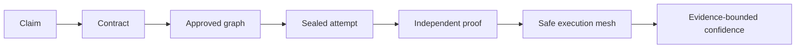

---

## 5. Slide-by-slide blueprint

## ACT I — THE RECEIPT GATE

### S01 — TASK-SPEC

**Status:** already built; preserve the signed-off first slide.  
**Act/HUD:** `TASK-SPEC · TITLE`  
**Core line:** “One bounded task in. One authorized attempt, portable handoff, and independently verified acceptance out.”  
**Visual:** Task-Spec brand lockup, question card, five semantic tags: bounds, seals, hands off, proves, accepts.  
**Why it exists:** names the category before exposing mechanisms.  
**Sources:** [N] `README.md`, `VERSION`, `spec/task-spec-v3.md`.  
**Transition:** “That promise exists because a worker saying ‘done’ is not a trust boundary.”

### S02 — Prompts can delegate work. They cannot define trusted done.

**Status:** already built; preserve the signed-off problem slide.  
**Act/HUD:** `THE PROBLEM · WHEN DONE IS ONLY A CLAIM`  
**Core line:** intent drifts, proof overfits, a Task-Spec binds.  
**Visual:** three large cards; two red failure cards and one Proof Gold contract card.  
**Why it exists:** separates prompt quality from acceptance authority.  
**Sources:** current slide’s cited evaluation research plus [N] `README.md`, `spec/task-spec-v3.md`.  
**Transition:** “So what is Task-Spec—and what is it deliberately not?”

### S03 — It is a contract, not another worker

**Act/HUD:** `THE CATEGORY · WHAT IT IS`  
**Core line:** “Task-Spec sits between intent and execution. It does not host the model.”  
**Visual:** one central Contract Cyan plate labeled `TASK-SPEC`, surrounded by four outside cards: prompt, model, sandbox, scheduler. Use red “not owned” rails from the center to the outside cards.  
**On-slide copy:**

| Task-Spec owns | Task-Spec does not own |
|---|---|
| bounded contract | model hosting |
| executable proof | credentials |
| sealed authority | hostile-code sandbox |
| portable handoff | silent scheduling policy |
| independent acceptance | universal semantic truth |

**Why it exists:** prevents the rest of the deck from being misread as an agent framework.  
**Sources:** [N] `OPERATING.md`, `spec/task-spec-v3.md`, `spec/task-spec-v4.md`; [D] `README.md`.  
**Transition:** “Before the mechanisms, watch one real session.”

### S04 — You ask in chat. The skill drives the CLI. A task file appears.

**Status:** built 2026-08-26; placed right after the category slide so the audience sees a concrete session before any mechanism. Later slide numbers in this section shift by one.  
**Act/HUD:** `THE DEVELOPMENT FLOW · FROM CHAT TO TASK FILE`  
**Core line:** the agent does not write the task by hand; the skill makes it compose a plan, preview it, wait for approval, then generate and check.  
**Visual:** a five-step strip (ask → skill loads → plan preview → approve → generate + check) above a two-column board: a chat window with user and agent avatars on the left; two stacked macOS code windows on the right (the TaskPlan the agent wrote; the leaf file the CLI generated).  
**Chat beats:** user asks in one sentence → `skill loaded` system pill → agent shows `taskspec plan` output with `TASK_PLAN=OK` and says nothing is materialized → user says "Approved" → agent shows `batch`, `validate`, `dod` output and the tokens `TASK_BATCH=OK`, `DOD=COMPLETE`.  
**Boundary:** `signed_off: false` and `accepted: false` stay false; creation never grants authority.  
**Why it exists:** concrete before abstract — non-experts see the real workflow once, then the gates and the loop explain what they just watched.  
**Sources:** [N] `SKILL.md` operating loop; [I] `src/author/taskplan.py`, `src/author/batch-generate.sh`, `src/gate/validate-task-spec.sh`, `src/gate/definition-of-done.sh`; [D] `docs/examples/task-plan.yaml`, `harness/claude-code/`.  
**Transition:** "Who is allowed to flip those two fields? Two gates, and they answer different questions."
### S05 — PRE says “may run.” POST says “may close.”

**Act/HUD:** `THE RECEIPT GATE · TWO DIFFERENT VERDICTS`  
**Core line:** authorization and acceptance are independent events.  
**Visual:** recreate the Receipt Gate mark as a functional diagram: tall PRE post, shorter POST post, contract crossing left-to-right, gold receipt emerging after POST.  
**Card copy:**

- **PRE · authorize** — the exact revision, scope, proof, and budget are safe to delegate at a named tier.
- **WORK · execute** — one attempt may change only the handed-off workspace and write surface.
- **POST · accept** — a separate gate rechecks behavior, history, scope, evidence, and identity binding.

**Why it exists:** creates the mental model reused throughout the deck.  
**Sources:** [N] `OPERATING.md`, `docs/concepts/signed-off.md`, `docs/reference/acceptance-contracts.md`.  
**Transition:** “Now see the whole loop those two gates sit inside.”
### S06 — One contract, end to end

**Act/HUD:** `THE LOOP · FROM INTENT TO ACCEPTED`  
**Core line:** “Nothing becomes done by narration.”  
**Visual:** a seven-node luminous rail with one animated proof packet moving through it.

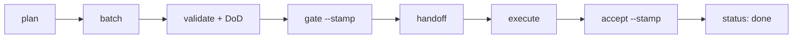

**Bottom tokens:** `TASK_PLAN=OK` → `DOD=COMPLETE` → `TIER=1` → `HANDOFF=TaskHandoff/v3` → `EVAL=PASS` → `ACCEPTED=1`.  
**Why it exists:** previews the full story without teaching each mechanism yet.  
**Sources:** [I] `src/setup/demo.sh`, `bin/taskspec`; [E] `tests/test-demo.sh`.  
**Transition:** “The rail works because no single actor owns every decision.”

### S07 — Four roles. No self-issued authority.

**Act/HUD:** `THE AUTHORITY · WHO MAY DECIDE`  
**Core line:** author, authorizer, executor, and acceptor have different powers.  
**Visual:** four vertically aligned lanes connected only by gold contract/receipt rails.

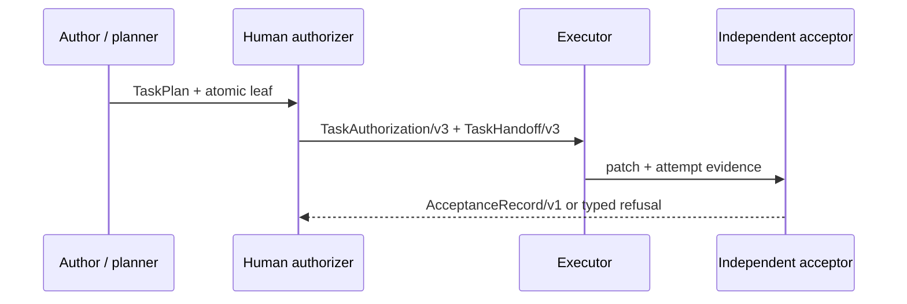

**Boundary labels:** author proposes; human approves topology and seal; executor changes only authorized paths; acceptor reruns and binds proof.  
**Why it exists:** makes human authority explicit without implying every technical gate is manual.  
**Sources:** [N] `OPERATING.md`; [I] `src/author/`, `src/gate/`, `src/dispatch/`, `src/accept/`.  
**Transition:** “With the roles clear, open the object they pass between them.”

---

## ACT II — THE ATOMIC CONTRACT

### S08 — A leaf has frontmatter and six zones

**Act/HUD:** `THE ANATOMY · ONE LEAF`  
**Core line:** “Identity and lifecycle live above; executable meaning lives below.”  
**Visual:** one tall Task-Spec card split horizontally: frontmatter cap, then six numbered bands.  
**Bands:** Intent; Behavior; Contract; Guardrails; Operations; Reversal & Runtime.  
**Why it exists:** gives the audience a stable map before individual fields.  
**Sources:** [N] `spec/task-spec-v3.md`; [D, historical naming] `docs/concepts/six-zones.md`.  
**Speaker note:** follow the current normative v3 structure where documentation naming differs.  
**Transition:** “The top of the card answers who, where, and what state.”

### S09 — Identity is explicit. Lifecycle is constrained.

**Act/HUD:** `THE FRONTMATTER · ACCOUNTABILITY`  
**Core line:** a leaf carries stable identity, dependency, write, execution, authorization, and acceptance fields.  
**Visual:** macOS code window on the left; five compact field-family cards on the right.

```yaml
id: T-20260826-repository-search
status: ready
format_version: 3
profile: standard
effort: S
depends_on: []
touches_paths: [src/search.py]
creates_paths: [tests/test_search.py]
execution_backend: any
signed_off: false
accepted: false
```

**Field families:** identity; graph; write surface; runtime/budget; PRE/POST envelopes.  
**Why it exists:** shows that accountability is data, not chat history.  
**Sources:** [N] `spec/task-spec-v3.md`, `spec/schemas/task-spec-frontmatter.schema.json`; [D] `docs/quick-reference.md`.  
**Transition:** “Not every card is executable; size decides whether it is a leaf or a node.”

### S10 — XS to L execute. XL and XXL only compose.

**Act/HUD:** `THE EFFORT GATE · LEAF OR NODE`  
**Core line:** “Large work must be decomposed before it can be delegated.”  
**Visual:** a size ruler. XS/S/M/L are solid executable cards; XL/XXL are outlined composition frames containing children.  
**On-slide table:**

| Size | Role | Max write-surface items | Direct handoff |
|---|---|---:|---|
| XS | leaf | 1 | yes |
| S | leaf | 2 | yes |
| M | leaf | 3 | yes |
| L | long-horizon leaf | 5 | only on a capable backend |
| XL / XXL | composition node | 0 | refused |

**Why it exists:** explains the atomicity guard before graph decomposition.  
**Sources:** [N] `spec/task-spec-v3.md`; [I/E] `src/gate/validate-task-spec.sh`, `tests/test-effort-sizing.sh`.  
**Transition:** “Size controls breadth; profile controls proof depth.”

### S11 — Lite, standard, full: proof scales with risk

**Act/HUD:** `THE PROFILES · RIGHT-SIZED RIGOR`  
**Core line:** “A tiny leaf should stay usable; a risky leaf should stay inspectable.”  
**Visual:** three ascending cards with increasing layers, not a feature checklist.  
**Copy target:**

- **lite** — minimum valid leaf for narrow, low-risk work.
- **standard** — explicit behavior-to-eval traceability; everyday default.
- **full** — operational, reversal, runtime, and stronger evidence detail.

**Bottom rail:** profile changes required depth; it never expands write authority.  
**Sources:** [N] `spec/task-spec-v3.md`; [D] `docs/concepts/profiles.md`.  
**Transition:** “Regardless of profile, the leaf begins with observable behavior.”

### S12 — Write the behavior before the patch

**Act/HUD:** `THE BEHAVIOR · GIVEN / WHEN / THEN`  
**Core line:** success is an observable state transition, not a to-do list.  
**Visual:** three connected contract cards: GIVEN → WHEN → THEN, with a separate red anti-card labeled “implementation narration.”  
**Example:**

```markdown
- B-1 — GIVEN a repository with indexed files
  WHEN a user searches for an exact symbol
  THEN matching paths and line numbers are returned deterministically
```

**Why it exists:** introduces eval-driven development without claiming it replaces design judgment.  
**Sources:** [N] `spec/task-spec-v3.md`; [D] `docs/concepts/eval-driven-development.md`, `docs/concepts/edd-vs-sdd-honest-comparison.md`.  
**Transition:** “Behavior says what must be true. Contract says where the worker may make it true.”

### S13 — The write surface is a set, not a vibe

**Act/HUD:** `THE CONTRACT · THE MOAT`  
**Core line:** `write_surface = touches_paths ∪ creates_paths`.  
**Visual:** a luminous rectangular boundary around two allowed path cards; attempted arrows to `secrets/`, `.git/`, and a sibling module terminate in red refusal nodes.  
**On-slide copy:** existing files belong in `touches_paths`; new files belong in `creates_paths`; everything else is outside authority.  
**Why it exists:** makes blast-radius acceptance intuitive later.  
**Sources:** [N] `spec/task-spec-v3.md`; [I] `src/lib/workspace.py`, `src/accept/preflight.py`.  
**Transition:** “Allowed paths define the moat; guardrails define the behavior inside it.”

### S14 — Guardrails make refusal part of the contract

**Act/HUD:** `THE GUARDRAILS · WHAT MUST NOT HAPPEN`  
**Core line:** anti-patterns, do-not-touch paths, retry policy, stop conditions, reversal, and runtime assumptions are first-class.  
**Visual:** three cards: prevent, stop, recover. Each uses red→gold→green progression.  
**Copy target:**

- **Prevent** — explicit anti-patterns and do-not-touch boundaries.
- **Stop** — iteration budget, no-progress circuit breaker, terminal failure behavior.
- **Recover** — rollback/reversal, observability, runtime assumptions.

**Why it exists:** reframes failure as a designed outcome, not an agent surprise.  
**Sources:** [N] `spec/task-spec-v3.md`; [D] `docs/patterns/do-not-touch-detection.md`.  
**Transition:** “A behavior is only operational when a runnable check points back to it.”

### S15 — Every behavior must have an eval witness

**Act/HUD:** `THE TRACEABILITY · BEHAVIOR TO EVAL`  
**Core line:** “No orphan behavior. No unexplained eval.”  
**Visual:** bipartite graph: B-1/B-2/B-3 on the left, eval_1/eval_2 on the right, solid cyan witness lines; one orphan edge shown in red as refused.

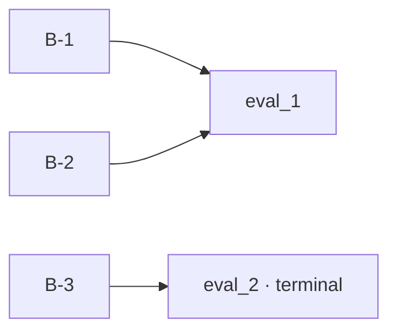

**Why it exists:** shows the load-bearing rule behind `DOD=COMPLETE`.  
**Sources:** [N] `spec/task-spec-v3.md`; [I] `src/gate/definition-of-done.sh`; [D] `docs/concepts/profiles.md`.  
**Transition:** “The Validation Card tells the runner how those witnesses behave.”

### S16 — The Validation Card is the execution contract for proof

**Act/HUD:** `THE VALIDATION CARD · RUN, RETRY, EMIT`  
**Core line:** eval metadata and the Agent Contract make the leaf portable across harnesses.  
**Visual:** macOS YAML window with three highlighted blocks.

```yaml
success_criteria:
  - id: eval_1
    runnable: bash
    check_type: deterministic
    verifies: [B-1, B-2]
    terminal: true
retry_policy:
  max_iterations: 12
  circuit_breaker_no_progress: 3
  on_terminal_failure: park_with_context
agent_contract:
  version: 2
  read: [intent, behavior, contract, guardrails]
  produce: [code, tests]
  emit: [pass, fail, retry_with_reason, parked_with_context]
```

**Why it exists:** connects written intent to a runtime-neutral execution boundary.  
**Sources:** [N] `spec/schemas/agent-contract.schema.json`; [D] `docs/patterns/validation-card-yaml.md`.  
**Transition:** “Put the pieces together and the leaf becomes a portable unit of authority.”

### S17 — One leaf, fully assembled

**Act/HUD:** `THE ARTIFACT · A COMPLETE LEAF`  
**Core line:** “Identity, behavior, write authority, evals, and lifecycle travel together.”  
**Visual:** one large annotated code card. Use gold callout pins pointing to `id`, paths, B-1, eval_1, Exit Check, and PRE/POST fields.  
**Code source:** use a concise, sanitized leaf derived from `tasks/done/T-20260815-acceptance-finalized-contract.md`; do not display its real HMAC value.  
**Why it exists:** closes the anatomy act with a concrete object.  
**Sources:** [N] `spec/task-spec-v3.md`; [D/dogfood] `tasks/done/T-20260815-acceptance-finalized-contract.md`.  
**Transition:** “One leaf is useful. A reviewed plan makes many leaves coherent.”

---

## ACT III — FROM INTENT TO A SAFE GRAPH

### S18 — Intent becomes a preview before it becomes files

**Act/HUD:** `THE PLAN · TASKPLAN/V1`  
**Core line:** `taskspec plan` validates a proposed topology without materializing tasks.  
**Visual:** left: compact TaskPlan YAML; right: read-only preview cards for units, edges, sizes, paths, and conflicts.

```yaml
api_version: taskspec.dev/v1
kind: TaskPlan
approved: false
metadata:
  name: repository-search
units:
  - id: T-20260826-index-search
    effort: S
    depends_on: []
    touches_paths: [src/search.py]
    creates_paths: [tests/test_search.py]
```

**Bottom token:** `TASK_PLAN=OK` means structurally reviewable, not human-approved.  
**Why it exists:** separates architectural proposal from filesystem mutation.  
**Sources:** [N] `spec/schemas/task-plan.schema.json`; [I] `src/author/taskplan.py`; [D] `docs/runbooks/decomposing-intent.md`.  
**Transition:** “The model may propose the graph. A human decides whether it becomes work.”

### S19 — Approval is the topology barrier

**Act/HUD:** `THE BARRIER · PLAN THEN BATCH`  
**Core line:** “No approval, no task files.”  
**Visual:** two-stage rail: `plan --manifest` stops at a gold HUMAN REVIEW gate; after `approved: true`, `batch --plan` fans out into atomic leaf cards and a materialization receipt.  
**Copy target:** plan never invents missing units; batch is non-clobbering and materializes only the declared approved manifest.  
**Why it exists:** shows where human architectural authority enters.  
**Sources:** [I] `src/author/taskplan.py`, `src/author/batch-generate.sh`; [N] `spec/schemas/task-materialization-receipt.schema.json`.  
**Transition:** “The approved graph still distinguishes work from organization.”

### S20 — Composition organizes; leaves execute

**Act/HUD:** `THE DECOMPOSITION · SHALLOW AND EXPLICIT`  
**Core line:** XL/XXL nodes own children and zero writes; leaves own behavior and paths.  
**Visual:** one outlined XXL parent containing three L/S leaves, with dependency arrows between leaves but no arrow that makes the parent executable.  
**Callout:** holes remain `blocked`; the planner does not manufacture missing facts.  
**Why it exists:** prevents “epic as task” and silent scope growth.  
**Sources:** [N] `spec/task-spec-v3.md`; [D] `docs/concepts/decomposition.md`, `docs/concepts/effort-gate.md`.  
**Transition:** “Once materialized, Markdown and Git can be projected into a deterministic graph.”

### S21 — The graph is derived, not a second source of truth

**Act/HUD:** `THE GRAPH · TASKGRAPHVIEW/V1`  
**Core line:** TaskGraphView is a deterministic, read-only projection of task files and Git.  
**Visual:** Markdown cards flow into a cyan graph projector; outputs fan into nodes, edges, cycles, dangling refs, conflicts, frontier, closure, and concurrency groups.  
**Bottom token:** `taskspec graph --check` / `taskspec graph --mermaid`.  
**Why it exists:** distinguishes canonical leaf authority from scheduling views.  
**Sources:** [N] `spec/schemas/task-graph-view.schema.json`; [I] `src/graph/task_graph.py`; [D] `docs/reference/task-graph-view.md`.  
**Transition:** “The first useful projection is the ready frontier.”

### S22 — Ready means more than `status: ready`

**Act/HUD:** `THE FRONTIER · ELIGIBLE NOW`  
**Core line:** a runnable frontier requires a valid leaf, satisfied dependencies, current revision, acceptable authority tier, and no blocking collision.  
**Visual:** a six-node DAG; ready leaves glow green, blocked dependencies red, composition nodes outlined, stale/unsigned leaves amber.  
**Block reason chips:** dependency; unsigned/stale; node-not-leaf; graph invalid; write conflict; superseded.  
**Why it exists:** introduces the scheduler-safe view without introducing TaskMesh yet.  
**Sources:** [I] `src/graph/task_graph.py`, `src/backlog/list-ready.sh`; [E] `tests/test-backlog-analysis.sh`.  
**Transition:** “Two ready leaves may still collide on disk.”

### S23 — Parallel is a write-set decision

**Act/HUD:** `THE CONCURRENCY · DISJOINT OR CONTESTED`  
**Core line:** deterministic concurrency groups contain only write-disjoint leaves.  
**Visual:** three lane cards connected with solid luminous rails. Leaves A and B flow in parallel; C collides on `src/search.py` and moves into a red contested lane.  
**On-slide comparison:**

| Relationship | Graph result |
|---|---|
| disjoint write sets | same concurrency group |
| same existing file | write conflict |
| same new file | dual-create error |
| dependency edge | later wave |

**Why it exists:** makes safe parallelism concrete and visual.  
**Sources:** [I] `src/graph/task_graph.py`; [E] `tests/test-backlog-analysis.sh`.  
**Transition:** “A handoff needs more than one node—it needs the exact authority closure around it.”

### S24 — The closure freezes what this leaf depends on

**Act/HUD:** `THE CLOSURE · REVISION-BOUND CONTEXT`  
**Core line:** closure includes the leaf, transitive dependencies, and composition ancestors as TaskRevision pairs.  
**Visual:** spotlight one leaf in a DAG; illuminate only its dependency ancestry and composition parents, gray out unrelated descendants and ancestor dependencies.  
**Bottom formula:** `closure_digest = sha256(ordered task_id + revision pairs)`.  
**Why it exists:** prepares the audience for stale-handoff and recovery checks.  
**Sources:** [N] `spec/schemas/task-handoff.schema.json`; [I] `src/graph/task_graph.py`, `src/dispatch/handoff.py`.  
**Transition:** “If the work changes materially, the closure must not be silently rewritten.”

### S25 — Replanning creates new authority

**Act/HUD:** `THE RECOVERY · SUPERSEDE, DO NOT MUTATE HISTORY`  
**Core line:** a material change becomes a successor task and a new authorization decision.  
**Visual:** old leaf → parked predecessor → successor leaf, with dependents manually re-pointed and re-authorized. Show a red crossed-out shortcut labeled “silent downstream rewrite.”  
**Copy target:** small pre-execution correction may amend and reseal; materially different or partially executed work gets a successor with `supersedes`; interrupted mutation parks with context.  
**Why it exists:** demonstrates honest recovery before execution mechanics.  
**Sources:** [N] `spec/task-spec-v3.md`; [D] `docs/guides/replanning-and-recovery.md`.  
**Transition:** “Now the leaf is shaped. The PRE gate decides whether it may run.”

---

## ACT IV — PRE AND PORTABLE EXECUTION

### S26 — DoD checks the contract before it checks the code

**Act/HUD:** `THE DOD · IS THE SPEC PROVABLE?`  
**Core line:** `DOD=COMPLETE` means the behavior/eval/Exit Check matrix is complete, not that the feature is implemented.  
**Visual:** matrix card with behaviors on rows and evals on columns; every row/column has a witness; one missing witness flips the token to `DOD=GAPS`.  
**Why it exists:** prevents confusion between “task is well-specified” and “work is done.”  
**Sources:** [I] `src/gate/definition-of-done.sh`; [N] `spec/task-spec-v3.md`.  
**Transition:** “Completeness is necessary. Safe delegation demands more.”

### S27 — PRE is a fail-closed pipeline

**Act/HUD:** `THE PRE GATE · SAFE TO DELEGATE`  
**Core line:** size, structure, traceability, shell integrity, and runnable evals must survive before stamping.  
**Visual:** five gate posts on one luminous rail.

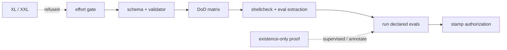

**Bottom token:** `VERDICT=DELEGATE TIER=1|2` or typed refusal.  
**Why it exists:** shows that `gate --stamp` is the last step, not a signature shortcut.  
**Sources:** [I] `src/gate/safe-to-delegate.sh`, `src/gate/validate-task-spec.sh`, `src/gate/run-task-spec.sh`.  
**Transition:** “The stamp does not sign the filename; it signs a canonical revision.”

### S28 — TaskRevision is the thing being authorized

**Act/HUD:** `THE REVISION · CANONICAL AUTHORITY`  
**Core line:** mutable reporting fields are excluded; authority-bearing fields—including unknown future fields—are sealed by default.  
**Visual:** code-to-digest animation: normalize frontmatter/body → remove permitted mutable envelope fields → canonical JSON/bytes → SHA-256 TaskRevision.  
**Formula card:**

```text
TaskRevision/v1 = sha256(
  canonical task identity
  + graph edges
  + write surface
  + behavior and evals
  + budgets and execution policy
  + all unknown authority-bearing fields
)
```

**Why it exists:** explains why scope, dependency, budget, agent, or backend edits break the seal while allowed status/reporting updates do not.  
**Sources:** [N] `docs/reference/task-revision.md`; [I] `src/security/task_revision.py`, `src/security/stamp.py`.  
**Transition:** “The same digest can be trusted at three very different levels.”

### S29 — Three tiers, three operating policies

**Act/HUD:** `THE TRUST TIER · DO NOT FLATTEN THE VERDICT`  
**Core line:** Tier 1 can support unsupervised dispatch; Tier 2 requires supervision; Tier 3 refuses.  
**Visual:** three large cards descending from green/gold to amber to red.

| Tier | Meaning | Operating policy |
|---|---|---|
| 1 | verified HMAC v3 over current TaskRevision | unsupervised eligible if every other gate passes |
| 2 | key unavailable, legacy envelope, or narrower proof | supervised only; explicit override at acceptance |
| 3 | malformed, wrong key, or revision mismatch | hard refusal |

**Footer:** HMAC is shared-key tamper evidence—not identity, isolation, or semantic truth.  
**Sources:** [N] `docs/concepts/signed-off.md`; [I] `src/security/stamp.py`, `src/gate/safe-to-delegate.sh`; [E] `tests/test-hmac-envelope.sh`.  
**Transition:** “Watch what a Tier-1 seal actually catches.”

### S30 — Change authority, break the seal

**Act/HUD:** `THE TAMPER MATRIX · WHAT REQUIRES RE-AUTHORIZATION`  
**Core line:** authority mutation and lifecycle reporting are intentionally different classes.  
**Visual:** a two-column tamper matrix with animated verdict chips.

| Mutation | Result |
|---|---|
| widen `touches_paths` | Tier 3 / re-authorize |
| change dependency | Tier 3 / re-authorize |
| raise iteration budget | Tier 3 / re-authorize |
| change agent/backend | Tier 3 / re-authorize |
| update allowed status field | seal remains valid |
| write tracker projection | seal remains valid |

**Why it exists:** turns cryptographic language into operational intuition.  
**Sources:** [E] `tests/test-hmac-envelope.sh`; [I] `src/security/task_revision.py`.  
**Transition:** “Once sealed, the contract is packaged as one portable attempt.”

### S31 — TaskHandoff/v3 is the pickup packet

**Act/HUD:** `THE HANDOFF · ONE AUTHORIZED ATTEMPT`  
**Core line:** every executor receives the same revision, base, closure, scope, budget, and acceptance route.  
**Visual:** macOS JSON card on the left; eight labeled pins on the right.

```json
{
  "contract": "TaskHandoff/v3",
  "task_id": "T-20260826-index-search",
  "task_revision": "sha256:…",
  "authorization": {"tier": 1, "ref": "hmac-sha256-v3:…"},
  "attempt_id": "uuid",
  "workspace": "/absolute/worktree",
  "base_commit": "<immutable commit>",
  "closure_digest": "sha256:…",
  "write_surface": ["src/search.py", "tests/test_search.py"],
  "budget_iterations": 12,
  "execution_backend": "any"
}
```

**Boundary:** no signing key, evaluator key, private holdout command, or provider credential enters the packet.  
**Sources:** [N] `spec/schemas/task-handoff.schema.json`; [I] `src/dispatch/handoff.py`; [D] `docs/reference/acceptance-contracts.md`.  
**Transition:** “That stable packet is why the executor can change without changing the job.”

### S32 — Same contract, different harness

**Act/HUD:** `THE PORTABILITY · HARNESS IS NOT AUTHORITY`  
**Core line:** Codex, Claude Code, Grok Build, Cursor, Kimi, or another conformant executor consume the same leaf and handoff.  
**Visual:** one TaskHandoff card fans to five harness cards and reconverges into one POST gate. Use solid purple rails and a single gold receipt rail.  
**Copy target:** the installed skill helps each harness find and drive the CLI; the skill does not replace the gates.  
**Why it exists:** explains portability without claiming identical model behavior.  
**Sources:** [I] `install.sh`, `SKILL.md`, `harness/`; [D] `README.md`, `docs/guides/multi-harness.md`.  
**Transition:** “Portability has levels; parsing a leaf is not the same as completing its lifecycle.”

### S33 — Conformance is cumulative

**Act/HUD:** `THE EXECUTOR CONTRACT · L0 TO L2`  
**Core line:** executor capability is measured against explicit pickup, execution, verification, and termination obligations.  
**Visual:** three nested rings or staircase cards labeled L0, L1, L2.  
**Copy target:**

- **L0** — reads the contract and preserves identity.
- **L1** — executes within declared scope/budget and emits machine states.
- **L2** — returns verifiable evidence compatible with independent acceptance.

**Footer:** conformance of the bundled reference path is not ecosystem-wide certification.  
**Sources:** [N] `spec/conformance/`; [D] `docs/concepts/conformance-levels.md`, `docs/concepts/agent-contract.md`.  
**Transition:** “At runtime, the executor runs the checks—but it still cannot accept itself.”

### S34 — Evals run at agent cadence

**Act/HUD:** `THE RUNNER · CLOSED-LOOP PROOF`  
**Core line:** deterministic evals provide a bounded feedback loop inside one attempt.  
**Visual:** circular loop: change → eval → pass/retry/park, bounded by iteration and no-progress counters.  
**Visible code:** one behavioral eval with a clear assertion and one terminal suite command.  
**Callout:** existence-only checks are weak; behavioral probes should fail on the unpatched baseline and pass on the patch.  
**Why it exists:** introduces the execution loop without letting “green” become acceptance.  
**Sources:** [I] `src/gate/run-task-spec.sh`; [D] `docs/patterns/runnable-bash-evals.md`.  
**Transition:** “A passing attempt is a candidate result. POST decides whether it can close.”

### S35 — The core boundary stays narrow

**Act/HUD:** `THE BOUNDARY · CORE VS RUNTIME`  
**Core line:** Task-Spec produces authority and acceptance contracts; external runtimes provide model execution, credentials, and isolation.  
**Visual:** two product plates connected by TaskHandoff and evidence rails.

| Task-Spec core | Runtime / executor |
|---|---|
| contract + graph | model process |
| PRE authorization | provider credentials |
| handoff | sandbox enforcement |
| eval/POST acceptance | compute and network |
| receipts/trust policy | actual external observation |

**Why it exists:** sets up v4 evidence and TaskMesh without blurring responsibility.  
**Sources:** [N] `OPERATING.md`, `spec/task-spec-v4.md`; [D] `docs/concepts/environment-contract.md`.  
**Transition:** “The boundary closes only when POST independently reconstructs what happened.”

---

## ACT V — POST AND STRONGER EVIDENCE

### S36 — POST is a second gate, not a replay button

**Act/HUD:** `THE POST GATE · INDEPENDENT ACCEPTANCE`  
**Core line:** acceptance rebinds the patch and evidence to the exact authorized attempt.  
**Visual:** five gold gate cards A–E on a left-to-right rail.

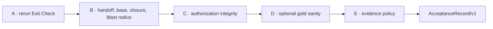

**Refusal chips:** `EVAL_FAILED`, `POLICY_TAMPER`, `HANDOFF_STALE`, `CLOSURE_DRIFT`, `BLAST_RADIUS`, `BASE_DIVERGED`.  
**Why it exists:** gives the audience the POST map before its hardest checks.  
**Sources:** [I] `src/accept/accept-task.sh`, `src/accept/preflight.py`, `src/accept/finalize.py`.  
**Transition:** “The most tangible check is: what actually changed?”

### S37 — Blast radius uses the whole Git reality

**Act/HUD:** `THE DIFF · COMMITTED + STAGED + UNSTAGED + UNTRACKED`  
**Core line:** a clean-looking patch view cannot hide out-of-scope changes.  
**Visual:** four Git layers merge into one observed-path set, which is compared with the sealed write surface. An escaped path is red.  
**Copy target:** realpath and symlink protections apply; base commit must remain an ancestor; nested workspaces resolve one canonical root.  
**Why it exists:** demonstrates why acceptance is stronger than “git diff looked fine.”  
**Sources:** [I] `src/accept/preflight.py`, `src/lib/workspace.py`; [E] `tests/test-v381-workspace.sh`, `tests/test-v38-hardening.sh`.  
**Transition:** “Scope can be perfect while the eval is still meaningless.”

### S38 — Gold sanity asks whether the eval can discriminate

**Act/HUD:** `THE GOODHART GUARD · DOES GREEN MEAN CHANGE?`  
**Core line:** the same eval should fail on the unpatched baseline and pass on the candidate.  
**Visual:** split-screen macOS terminals: BASELINE → red FAIL; PATCH → green PASS; gold verdict in the middle.  
**Refusal:** `EVAL_NONDISCRIMINATING` when the baseline also passes.  
**Qualifier:** opt-in `--gold-sanity`; it raises confidence but does not create universal semantic truth.  
**Sources:** [I] `src/accept/accept-task.sh`; [D] `docs/runbooks/dispatching-a-task-spec.md`.  
**Transition:** “When every gate passes, acceptance becomes a durable object.”

### S39 — AcceptanceRecord/v1 is the durable verdict

**Act/HUD:** `THE RECEIPT · ATTEMPT-BOUND ACCEPTANCE`  
**Core line:** task, revision, authorization, attempt, acceptor, time, and digest are recorded together.  
**Visual:** one gold receipt card with seven field callouts; green “accepted” seal at the bottom.  
**Copy target:** finalize writes the attempt record, task acceptance envelope, and metrics projection atomically; exact retries are idempotent; conflicting retries refuse.  
**Sources:** [N] `spec/schemas/acceptance-record.schema.json`; [I] `src/accept/record.py`, `src/accept/finalize.py`; [E] `tests/test-v38-hardening.sh`.  
**Transition:** “Only this receipt allows the lifecycle to reach done.”

### S40 — Done is a settled state, not a worker emotion

**Act/HUD:** `THE LIFECYCLE · READY TO DONE`  
**Core line:** `status: done` requires `accepted: true`; `status: sealed` is not a valid lifecycle state.  
**Visual:** the common lifecycle route with explicit parked/blocked branches. Do not imply a full edge whitelist; the transition tool validates the status enum and enforces the acceptance condition on entry to `done`.

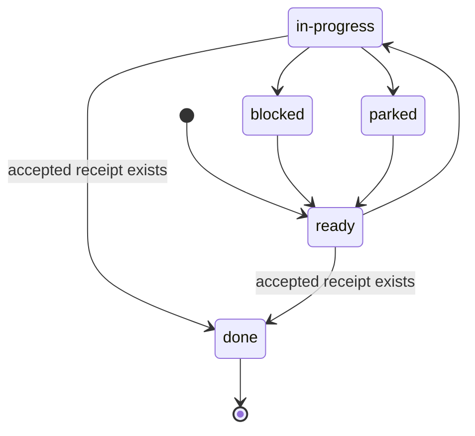

**Why it exists:** separates authorization metadata from backlog state.  
**Sources:** [N] `spec/task-spec-v3.md`; [I] `src/backlog/transition-status.sh`, `src/gate/validate-task-spec.sh`.  
**Transition:** “Format v3 closes the deterministic loop. Format v4 strengthens evidence that comes from outside it.”

### S41 — v3 is the default. v4 is the evidence upgrade.

**Act/HUD:** `THE FORMAT · STABLE CORE, OPT-IN EVIDENCE`  
**Core line:** formats 1–4 remain readable; v4 adds stronger policies without changing the core authority split.  
**Visual:** two large aligned contract cards.

| v3 default | v4 opt-in adds |
|---|---|
| atomic leaf and six zones | explicit evaluation policy |
| behavior↔eval traceability | environment contract |
| TaskRevision + HMAC | evaluator identity/trust |
| handoff and acceptance | sealed authoring evidence refs |
| deterministic eval path | attempt-bound external receipts |

**Why it exists:** explains evolution without implying v3 is deprecated.  
**Sources:** [N] `spec/task-spec-v3.md`, `spec/task-spec-v4.md`, `spec/schemas/task-spec-frontmatter.schema.json`; [D] `CHANGELOG.md`.  
**Transition:** “The first addition says what kind of judgment an eval represents.”

### S42 — Four evaluation policies, four trust questions

**Act/HUD:** `THE EVALUATOR · WHO OR WHAT JUDGES?`  
**Core line:** deterministic, holdout, graded, and human evidence are not interchangeable.  
**Visual:** four equal cards with distinct icons and a single question each.

| Policy | The question |
|---|---|
| deterministic | did a reproducible assertion pass? |
| holdout | did private sealed cases pass without entering the worker context? |
| graded | did an external evaluator meet a bound rubric and threshold? |
| human | did the named human approve the bound subject? |

**Why it exists:** prepares the receipt taxonomy.  
**Sources:** [N] `spec/task-spec-v4.md`, `spec/schemas/task-spec-frontmatter.schema.json`.  
**Transition:** “Every non-deterministic verdict must bind to the same subject.”

### S43 — ReceiptSubject/v1 prevents evidence replay

**Act/HUD:** `THE SUBJECT · SIX THINGS MUST MATCH`  
**Core line:** external evidence is valid only for this task, revision, authorization, attempt, base, and environment/closure context.  
**Visual:** a hexagonal binding around one receipt.

```json
{
  "task_id": "T-…",
  "task_revision": "sha256:…",
  "authorization_ref": "hmac-sha256-v3:…",
  "attempt_id": "uuid",
  "base_commit": "git-sha",
  "closure_digest": "sha256:…"
}
```

**Why it exists:** explains why a valid signature on the wrong attempt still fails.  
**Sources:** [N] `spec/schemas/receipt-subject.schema.json`; [I] `src/evidence/receipts.py`.  
**Transition:** “Different observers can now contribute evidence without becoming the task authority.”

### S44 — Stronger evidence fans in; authority does not fan out

**Act/HUD:** `THE EVIDENCE · MANY RECEIPTS, ONE ACCEPTANCE`  
**Core line:** holdout, graded, human, environment, and engine receipts converge into POST under evaluator trust policy.  
**Visual:** five receipt cards flow into one POST gate; the task authorization rail remains separate and unchanged.

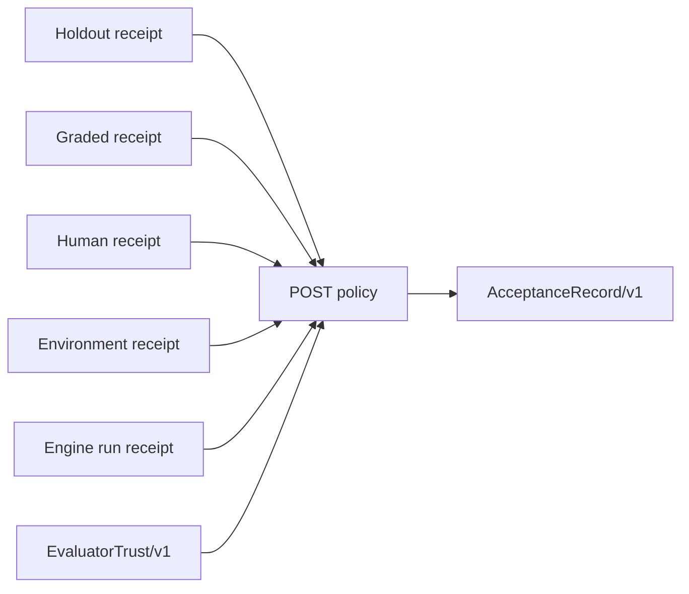

**Signature note:** portable or human-authorized non-deterministic receipts require external Ed25519 trust, not the worker’s self-report.  
**Sources:** [N] v4 receipt schemas; [I] `src/evidence/`; [D] `docs/concepts/evidence-receipts.md`.  
**Transition:** “More receipts improve observability, but every proof system keeps residual risk.”

### S45 — Proof is scoped; risk remains explicit

**Act/HUD:** `THE TRUST BOUNDARY · WHAT STILL CAN GO WRONG`  
**Core line:** controls eliminate named failure modes; they do not eliminate judgment.  
**Visual:** two-column table with controls in cyan/green and residual risk in amber/red.

| Control | Residual risk |
|---|---|
| HMAC v3 | a shared-key holder can authorize bad work |
| behavior/eval traceability | the behavior or eval can be weak |
| Ed25519 receipt | the evaluator can be wrong or compromised |
| blast-radius check | in-scope changes can still be harmful |
| environment receipt | structural proof may not equal deployed behavior |
| human receipt | the human can make a bad decision |

**Why it exists:** earns credibility before the orchestration act.  
**Sources:** [N] `spec/task-spec-v4.md`; [D] `docs/trust/`, `SECURITY.md`; [E] `release/evidence.json`.  
**Transition:** “With authority and proof bounded, an optional runtime can safely move more than one leaf.”

---

## ACT VI — TASKMESH

### S46 — Task-Spec authorizes. TaskMesh coordinates.

**Act/HUD:** `THE BOUNDARY · TWO PRODUCTS`  
**Core line:** TaskMesh consumes the canonical Tier-1 frontier; it cannot widen scope, rewrite a signed leaf, or accept on its own terms.  
**Visual:** two strong product cards joined by two rails: TaskGraphView/TaskHandoff outward; events/evidence inward.

| Task-Spec | TaskMesh |
|---|---|
| canonical task authority | optional execution control plane |
| graph and ready frontier | leases and waves |
| PRE and POST | routes and observes attempts |
| acceptance record | worktrees and integration branch |
| human topology/target merge | no target-branch mutation |

**Sources:** [N] `OPERATING.md`; [N/I] `docs/reference/taskmesh-contracts.md`, `mesh/`.  
**Transition:** “Here is the control plane around that boundary.”

### S47 — The local control plane

**Act/HUD:** `THE TASKMESH · SYSTEM ARCHITECTURE`  
**Core line:** multiple cockpits share one durable repository-local daemon and event history.  
**Visual:** full architecture graph.

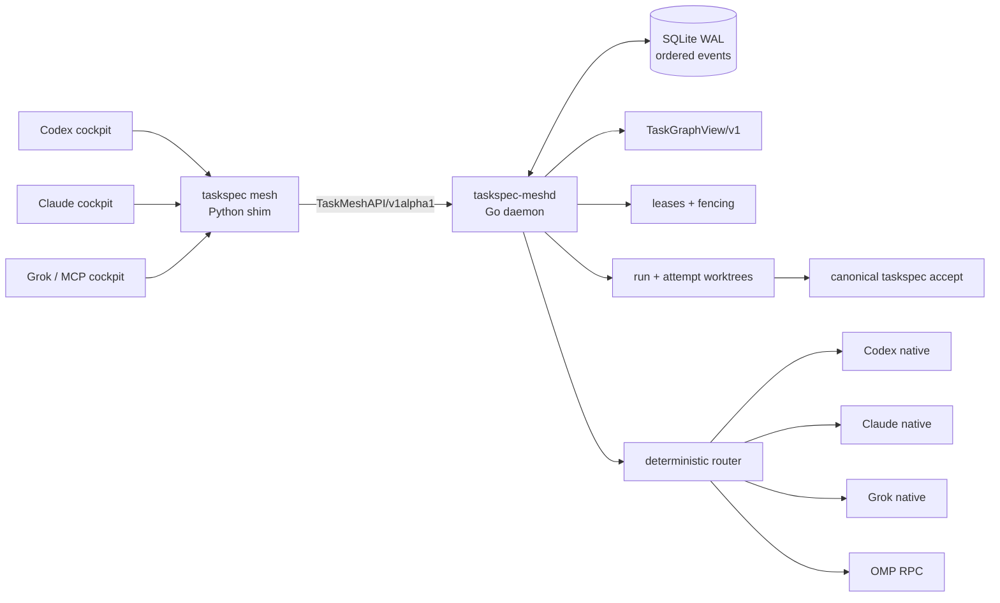

**Why it exists:** gives the TaskMesh act a stable map.  
**Sources:** [I] `src/meshctl/cli.py`, `src/meshctl/mcp_server.py`, `mesh/cmd/taskspec-meshd/`, `mesh/internal/mesh/`.  
**Transition:** “The shim exists so the optional helper can fail closed before any run.”

### S48 — Exact version negotiation comes first

**Act/HUD:** `THE SHIM · OPTIONAL MEANS FAIL-CLOSED`  
**Core line:** core-only installs explain how to add TaskMesh; mismatched helpers return a stable runtime error.  
**Visual:** handshake between `taskspec 3.9.0` and `taskspec-meshd 3.9.0`; red branches for missing helper and version mismatch.  
**Tokens:** `TASKMESH_ERROR=MESH_UNAVAILABLE`; `TASKMESH_ERROR=MESH_VERSION_MISMATCH`; exit 3 for unsupported runtime.  
**Why it exists:** demonstrates product separation at the executable boundary.  
**Sources:** [I] `src/meshctl/cli.py`, `mesh/cmd/taskspec-meshd/main.go`; [E] `tests/test-mesh-contracts.sh`.  
**Transition:** “Once negotiated, every runtime object is typed.”

### S49 — TaskMesh speaks versioned contracts

**Act/HUD:** `THE MESH CONTRACTS · OBSERVABLE STATE`  
**Core line:** run, capability, route, lease, event, view, sandbox, credential, and roster objects are machine-readable.  
**Visual:** central `TaskMeshAPI/v1alpha1` hub with nine contract cards around it.  
**Contract cards:** TaskMeshRun; ExecutorCapability; DispatchDecision; RunLease; TaskMeshEvent; TaskMeshView; SandboxEvidence; CredentialLease; TaskMeshRoster.  
**Why it exists:** makes the control plane inspectable and reconnectable.  
**Sources:** [N] `spec/schemas/taskmesh-*.schema.json`, related mesh schemas; [D] `docs/reference/taskmesh-contracts.md`.  
**Transition:** “Those objects describe a run that survives the cockpit.”

### S50 — Durable history lives with the repository

**Act/HUD:** `THE DAEMON · REPLAY, NOT MEMORY`  
**Core line:** SQLite WAL and ordered events rebuild the same view after client or daemon restart.  
**Visual:** event log timeline feeds a reconstructed TaskMeshView after a crash marker; two cockpit windows before/after show identical run IDs and state.  
**Security callouts:** repository-scoped identity; private runtime directory; Unix socket `0600`; idempotent request IDs.  
**Why it exists:** explains cross-cockpit continuity without a hosted control plane.  
**Sources:** [I] `mesh/internal/mesh/store.go`, `daemon.go`, `repository.go`; [E] `tests/test-mesh-daemon.sh`, `tests/test-mesh-cockpit.sh`.  
**Transition:** “The event history records a strict attempt state machine.”

### S51 — An attempt advances through explicit states

**Act/HUD:** `THE RUN · STATE MACHINE`  
**Core line:** execution, verification, supervision, acceptance, and integration are separate transitions.  
**Visual:** TaskMesh state diagram.

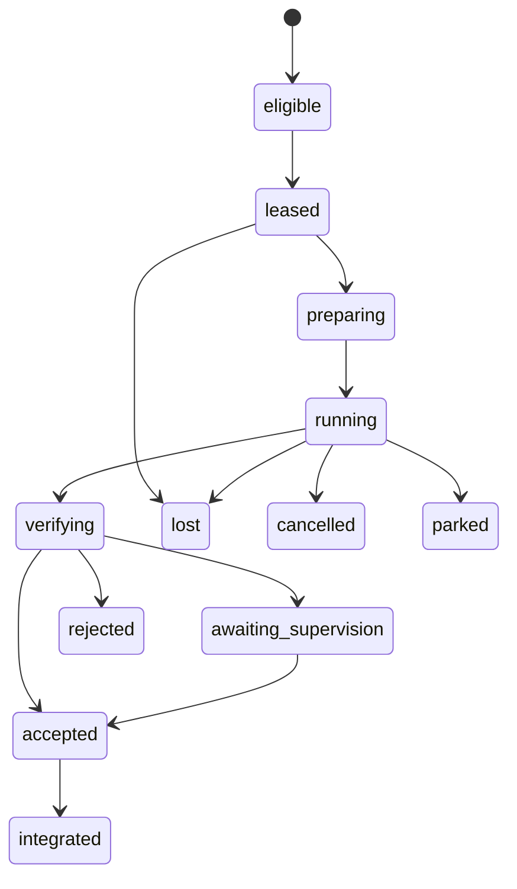

**Footer:** an attempt state is not Task-Spec lifecycle authority. Canonical acceptance remains the gate.  
**Sources:** [N/I] `spec/schemas/taskmesh-run.schema.json`, `mesh/internal/mesh/types.go`, `store.go`.  
**Transition:** “Before leasing, TaskMesh computes one safe wave from the canonical frontier.”

### S52 — A wave contains only authorized, disjoint leaves

**Act/HUD:** `THE WAVE · FRONTIER TO PARALLEL WORK`  
**Core line:** only current Tier-1, dependency-ready, non-conflicting leaves are eligible.  
**Visual:** TaskGraphView frontier enters five filters; the first deterministic concurrency group emerges as three parallel lanes.  
**Filters:** leaf; ready; Tier 1/current; dependency closure stable; write-disjoint.  
**Why it exists:** connects graph semantics directly to TaskMesh scheduling.  
**Sources:** [I] `mesh/internal/mesh/graph.go`, `routing.go`; [E] `tests/test-mesh-leases.sh`.  
**Transition:** “Eligibility narrows the set; routing chooses one executor without expanding it.”

### S53 — Routing may rank. It may not invent.

**Act/HUD:** `THE ROUTER · DETERMINISTIC AND EXPLAINABLE`  
**Core line:** every candidate, rejection, preference, advisor reorder, and tie-break is retained.  
**Visual:** routing funnel:

```text
eligible capabilities
  → explicit adapter override
  → task execution_backend
  → effort/kind roster preference
  → bounded advisor reorder
  → stable adapter-order tie-break
  → DispatchDecision/v1
```

**Red boundary:** advisor cannot add an unknown or ineligible adapter.  
**Sources:** [I] `mesh/internal/mesh/routing.go`, `roster.go`; [N] `spec/schemas/dispatch-decision.schema.json`.  
**Transition:** “Current main can also name models by effort—but that claim needs a qualifier.”

### S54 — Named-model rosters are current-main, not frozen 3.9 proof

**Act/HUD:** `THE ROSTER · CURRENT HEAD`  
**Core line:** current main can map effort bands and kinds to named models; `--model` wins and `require_named_model` fails closed.  
**Visual:** macOS JSON card plus a gold “CURRENT MAIN” tag.

```json
{
  "contract": "TaskMeshRoster/v1",
  "require_named_model": true,
  "bands": {
    "XS-S": {"candidates": [{"adapter": "codex-native", "model": "…"}]},
    "M-L": {"candidates": [{"adapter": "omp-rpc", "model": "…"}]}
  }
}
```

**Gap card:** the schema also carries `mode` and `failover`; at the audited commit those fields are parsed but are not consumed by runtime routing. Do not promise semantic mode/failover behavior.  
**Sources:** [C] `[Unreleased]` in `CHANGELOG.md`, `mesh/internal/mesh/roster.go`, `spec/schemas/taskmesh-roster.schema.json`; [E] frozen 3.9 evidence predates this change.  
**Transition:** “Once routed, a lease decides which attempt is authoritative.”

### S55 — Leases prevent stale workers from regaining authority

**Act/HUD:** `THE LEASE · MONOTONIC FENCING`  
**Core line:** at most one active lease is authoritative for a task revision; recovery issues a higher fencing token.  
**Visual:** sequence with attempt A, expiry, attempt B, and late A result refused.

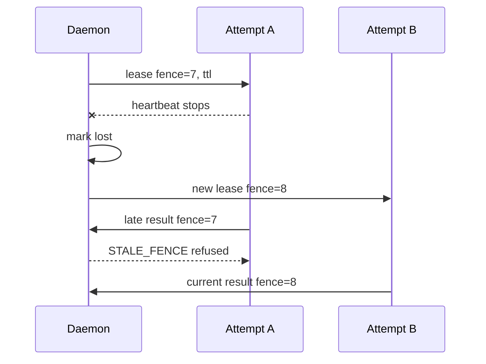

**Qualifier:** fencing prevents stale result authority; it does not make model execution exactly once.  
**Sources:** [I] `mesh/internal/mesh/lease.go`, `recovery.go`; [E] `tests/test-mesh-leases.sh`.  
**Transition:** “Each fenced attempt also gets its own branch and worktree.”

### S56 — Worktrees isolate attempts from the target branch

**Act/HUD:** `THE WORKTREE · BRANCH TOPOLOGY`  
**Core line:** accepted attempts merge into a run integration branch; the user’s target branch remains untouched.  
**Visual:** Git topology.

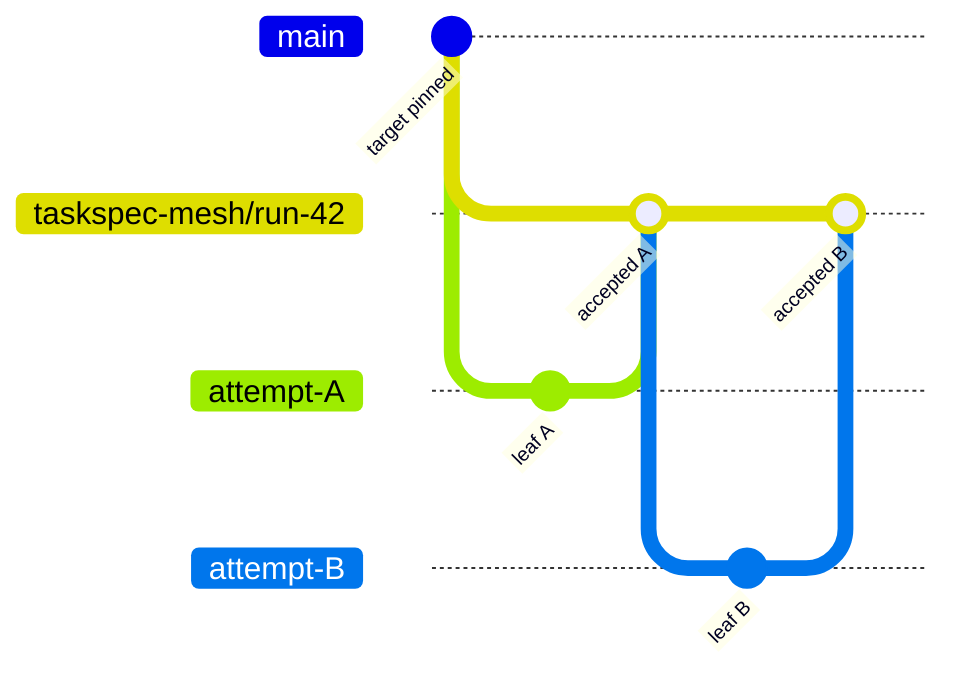

**Red refusal:** target divergence or merge conflict parks safely; no implicit rebase.  
**Sources:** [I] `mesh/internal/mesh/worktree.go`, `integration.go`; [E] `tests/test-mesh-routing-integration.sh`.  
**Transition:** “What runs inside those worktrees depends on the execution mode.”

### S57 — Supervised execution is process separation, not a sandbox

**Act/HUD:** `THE ADAPTERS · HUMAN IN THE LOOP`  
**Core line:** native Codex, Claude, Grok, and OMP adapters preserve one handoff and one observable attempt.  
**Visual:** four adapter cards with command-shape snippets and one shared TaskHandoff rail.  
**Adapter notes:** Codex ephemeral workspace-write; Claude `acceptEdits`; Grok disables subagents/memory/web search; OMP can run supervised.  
**Boundary:** local process controls, timeouts, cancellation, bounded output, and redaction do not create hostile-code isolation.  
**Sources:** [I] `harness/mesh-adapters/*.json`, `mesh/internal/mesh/adapter.go`, `process.go`; [E] `tests/test-mesh-adapters.sh`.  
**Transition:** “Autonomous execution is allowed only when the isolation evidence is materially stronger.”

### S58 — Autonomous OMP fails closed without isolation

**Act/HUD:** `THE ISOLATION · NO SILENT DOWNGRADE`  
**Core line:** autonomous mode requires an explicitly verified container, route, model, capability, and host-signed evidence chain.  
**Visual:** supervised card on the left, autonomous container boundary on the right.

| Supervised | Autonomous OMP |
|---|---|
| host process | Docker/Podman worker |
| human supervision required | verified isolation required |
| local provider access | expiring attempt capability |
| no hostile-code claim | non-root, read-only root, dropped caps |
| Task-Spec POST | Task-Spec POST + sandbox/environment evidence |

**Stable refusal examples:** missing runtime, unverified proxy, image digest mismatch, missing model, changed evidence.  
**Sources:** [I] `mesh/internal/mesh/sandbox.go`, `credential.go`, `release/mesh/Dockerfile`, `release/mesh/image.lock`; [E] `tests/test-mesh-isolation.sh`.  
**Transition:** “The most important isolation detail is what the worker never receives.”

### S59 — Credentials stay outside the worker

**Act/HUD:** `THE CREDENTIAL LEASE · LEAST AUTHORITY`  
**Core line:** the worker receives one expiring capability for one provider route—not the host’s credential set.  
**Visual:** host boundary contains provider credentials, signing keys, evaluator keys, SSH agent, Docker socket, and home directory; only one thin capability rail crosses into the non-root worker.  
**Worker limits:** one writable workspace; internal network to proxy only; 1 CPU; 512 MB; 128 PIDs; 64 MB tmpfs; no-new-privileges; known secret redaction; bounded output.  
**Sources:** [I] `mesh/internal/mesh/credential.go`, `sandbox.go`, `release/mesh/Dockerfile`; [N] credential/sandbox schemas.  
**Transition:** “The cockpit can disappear because authority and history live elsewhere.”

### S60 — Any cockpit can reconnect; only a human finishes the target merge

**Act/HUD:** `THE COCKPIT · OBSERVE, CONTROL, HAND BACK`  
**Core line:** CLI and local MCP expose the same durable run; finish prints the safe human merge route.  
**Visual:** Codex cockpit disconnects; Claude cockpit reconnects to the same event line; final screen shows merge commands, not an automatic merge.  
**Tool rail:** frontier → explain → start → get/watch → cancel/resume → supervised accept → finish.  
**Boundary:** MCP is a local stateless cockpit over the daemon; it cannot bypass leases or canonical acceptance.  
**Sources:** [I] `src/meshctl/mcp_server.py`, `src/meshctl/cli.py`, `mesh/internal/mesh/integration.go`; [E] `tests/test-mesh-cockpit.sh`, `tests/test-mesh-demo.sh`.  
**Transition:** “That runtime sits behind a much broader—but still phase-oriented—CLI.”

---

## ACT VII — PRODUCT SURFACE AND PROOF

### S61 — Forty-one commands, one lifecycle

**Act/HUD:** `THE CLI · COMMANDS BY PHASE`  
**Core line:** the surface is large because contracts, evidence, graph, runtime, and maintenance are explicit; the everyday path stays short.  
**Visual:** seven horizontal phase lanes; command tags use the Seamwise “THE FLOW” styling.

| Phase | Commands |
|---|---|
| prepare | `init`, `setup`, `setup signing`, `doctor`, `demo`, `example` |
| author | `new`, `plan`, `batch`, `migrate`, `author-doctor` |
| PRE | `validate`, `dod`, `gate`, `handoff` |
| execute / POST | `run`, `accept` |
| evidence / interop | `holdout`, `receipt`, `eval-audit`, `identity`, `evidence`, `bridge`, `dsse`, `mcp` |
| graph / backlog | `ready`, `graph`, `status`, `lint`, `transition`, `rebuild-state`, `archive`, `backup`, `metrics` |
| runtime / support | `mesh`, `conformance`, `executor`, `agent-context`, `completion`, `version`, `help` |

**Footer:** global `--json`, `--dry-run`; exit 0 success, 1 contract/gate failure, 2 usage, 3 runtime floor.  
**Sources:** [I] `bin/taskspec`, `taskspec agent-context`; [D] `docs/reference/cli.md`.  
**Transition:** “The same identity can cross protocol and packaging boundaries.”

### S62 — Portable outside the CLI, too

**Act/HUD:** `THE ECOSYSTEM · BRIDGES AND INSTALL DOORS`  
**Core line:** A2A, MCP, DSSE, skills, and installers preserve contract identity while staying honest about certification.  
**Visual:** center TaskHandoff/ReceiptSubject; rails to A2A artifact, MCP task/tool, DSSE/in-toto envelope, and four harness skill destinations.  
**Installation strip:** source checkout; pinned private release archive; npm+Git tag; Claude plugin skill entry.  
**Boundary:** A2A/MCP pinned conformance is evidence, not ecosystem-wide certification; the Claude plugin is not a second contract.  
**Sources:** [I] `src/interop/`, `install.sh`, `.claude-plugin/`, `harness/`; [E] `release/3.8.1/protocol-conformance.json`, install evidence.  
**Transition:** “The repository itself uses these contracts to build the product.”

### S63 — Task-Spec dogfoods Task-Spec

**Act/HUD:** `THE DOGFOOD · THE PRODUCT BUILT ITS OWN LEAVES`  
**Core line:** approved release manifests decomposed 3.8.1 and TaskMesh 3.9.0 into accepted leaves and parked composition nodes.  
**Visual:** show the TaskMesh 3.9.0 approved plan as an eight-leaf program flowing into one parked XXL composition frame.  
**Leaf labels:** contracts/CLI; daemon/state; leases/graph; routes/worktrees; supervised adapters; autonomous isolation; cockpit/MCP; package/release.  
**Receipt detail:** one sanitized accepted task frontmatter snippet with Tier, attempt ID, authorization ref, and acceptance-record digest.  
**Why it exists:** turns methodology into repository evidence.  
**Sources:** [D/dogfood] `tasks/.plans/task-spec-3.9.0.yaml`, `tasks/done/`, `.taskspec/acceptance/`; [I] `tests/test-repo-organization-e2e.sh`.  
**Transition:** “The release story also evolved by tightening one proof boundary at a time.”

### S64 — The evolution is a trust-chain story

**Act/HUD:** `THE EVOLUTION · FROM FORMAT TO CONTROL PLANE`  
**Core line:** releases add explicit trust surfaces while preserving readable older formats.  
**Visual:** horizontal timeline with five large milestones, not every patch release.

| Milestone | Story beat |
|---|---|
| v3 format | six-zone atomic contract, PRE/POST closed loop |
| 3.6 | revision-bound handoff and acceptance experience |
| 3.7 | v4 evidence, holdouts, identities, environment, interop foundations |
| 3.8.1 | hardening, real-engine/sandbox/protocol evidence, 97/100 corridor |
| 3.9.0 | optional TaskMesh control plane |
| current main | roster and repository organization; not frozen 3.9 proof |

**Sources:** [D] `CHANGELOG.md`; [E] `release/README.md`, frozen release trees.  
**Transition:** “Two different proof corridors support the current product story.”

### S65 — Read the evidence in two corridors

**Act/HUD:** `THE PROOF · RELEASED VS CURRENT`  
**Core line:** the 3.8.1 quality score and the 3.9.0 TaskMesh proof answer different questions.  
**Visual:** two large evidence cards and one narrow current-main audit strip.

| Corridor | What it proves | Honest boundary |
|---|---|---|
| 3.8.1 quality | fixed 97/100 rubric; authority, lifecycle, docs, packaging, engines, protocol pins, signed sandbox | 3 points deliberately unavailable: semantic truth, ecosystem certification, production reliability |
| 3.9.0 TaskMesh | local/hosted conformance, live isolation, install, recovery, cockpit, private provenance/publication | no hosted control plane, production reliability, protocol certification, Tier-1-from-worktrees, or auto target merge |
| current main audit | most exact `make check` suites revalidated on 2026-08-26 | final gate currently fails because README release-status markers are missing |

**Why it exists:** teaches how to read evidence without collapsing release history or hiding drift.  
**Sources:** [E] `release/evidence.json`, `release/3.8.1/scorecard.json`, `release/3.9.0/mesh-release-evidence.json`, `release/README.md`; [C] current `make check` result and `tools/render-status.py`.  
**Transition:** “The product’s final promise is not that every attempt succeeds. It is that every result becomes inspectable.”

### S66 — Make the agent earn done

**Act/HUD:** `CLOSE · CLAIM TO ACCEPTED PROOF`  
**Core line:** “The worker may propose, execute, retry, and report. The contract decides what was authorized. The receipt decides what was accepted.”  
**Visual:** reprise the Receipt Gate: prompt/claim enters in muted gray; TaskAuthorization crosses PRE; TaskHandoff crosses the work zone; AcceptanceRecord exits POST in Proof Gold.  
**Five takeaways:** bound; seal; hand off; prove; accept.  
**Reviewer route in the footer:**

```bash
taskspec demo
taskspec example task-plan --out /tmp/task-plan.yaml
taskspec plan --manifest /tmp/task-plan.yaml
make check
python3 src/evidence/release_audit.py audit
```

**Final qualifier:** at the audited current commit, `make check` reaches the release-status projection drift described on S64; do not present the route as currently all-green until that marker issue is corrected and rerun.  
**Sources:** [D] `docs/getting-started/reviewer-route.md`; [I] `src/setup/demo.sh`; [E/C] release evidence and current audit.  
**End line:** “A good agent can write the patch. A trustworthy system can explain why that exact patch was allowed to become done.”

---

## 6. Construction-ready visual library

These are reusable Mermaid sources for the HTML build. Render only the diagram
needed by the current slide. Redraw with native HTML/CSS where Mermaid’s default
layout conflicts with the Seamwise design system.

### A. Authority chain

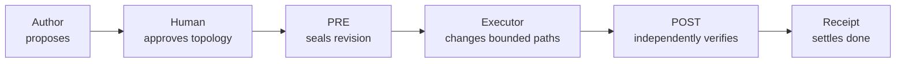

### B. Graph and concurrency

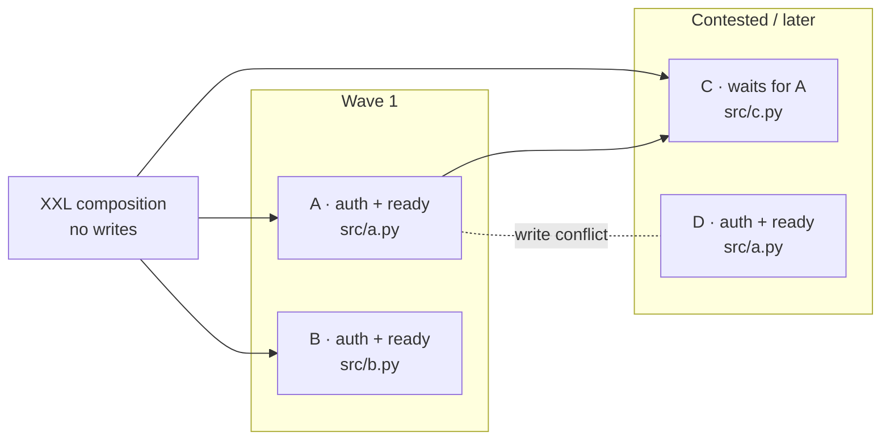

### C. PRE/POST symmetry

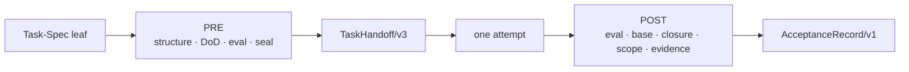

### D. TaskMesh attempt topology

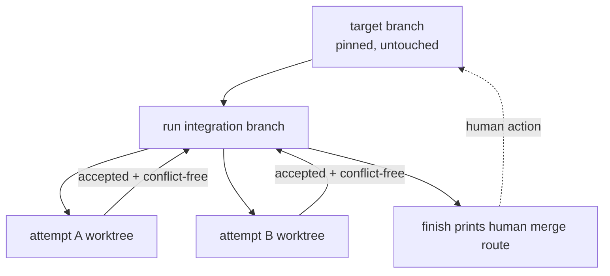

### E. Evidence boundary

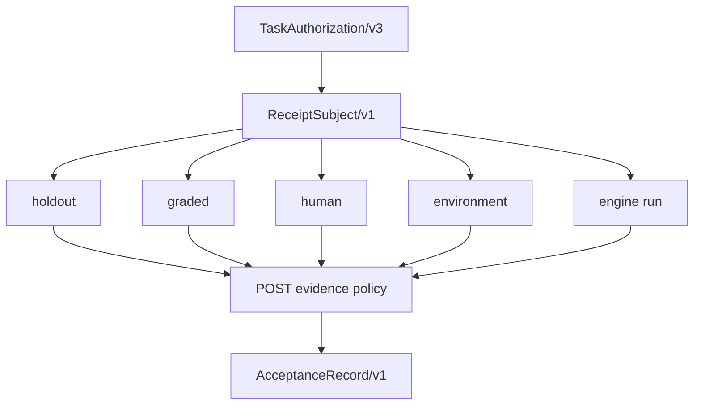

---

## 7. Comparison table bank

Use each table on only one slide. Split any table that cannot stay readable at
1366×768.

### Prompt vs Task-Spec

| Prompt-only work | Task-Spec work |
|---|---|
| intent is reconstructed during execution | behavior and boundaries are explicit before execution |
| worker may choose its own definition of done | evals and POST policy define the technical verdict |
| scope changes disappear in chat | TaskRevision mutation breaks authorization |
| harness-specific interpretation | one TaskHandoff travels across harnesses |
| “tests pass” is the closing claim | acceptance binds eval, Git scope, base, closure, and evidence |

### Task-Spec vs TaskMesh

| Dimension | Task-Spec | TaskMesh |
|---|---|---|
| role | contract and receipt authority | optional execution control plane |
| source of truth | Markdown + Git + signed/accepted envelopes | derived events and runtime state |
| decides scope | yes, through approved/sealed contract | no |
| decides ready frontier | canonical graph projection | consumes and filters it |
| runs workers | reference runner only | routes supported adapters |
| accepts result | canonical POST gate | invokes Task-Spec acceptance |
| merges target branch | no | no; prints human route |

### Trust tier policy

| Tier | Cryptographic state | Dispatch | Acceptance |
|---|---|---|---|
| 1 | current HMAC v3 verifies | unsupervised eligible | normal POST policy |
| 2 | legacy/narrow/no-key | supervised only | explicit supervisor, reason, and override |
| 3 | malformed/mismatch | refuse | refuse |

### v3 vs v4

| Surface | v3 | v4 |
|---|---|---|
| authoring status | default | opt-in |
| core leaf | complete | compatible extension |
| evaluation | deterministic runnable evals | explicit deterministic/holdout/graded/human policy |
| environment | runtime declaration | digest-bound contract + receipts |
| identity | local HMAC authorization | external Ed25519 evaluator trust/receipts |
| authoring evidence | contextual prose | sealed references that still cannot satisfy acceptance |

### Supervised vs autonomous TaskMesh

| Surface | Supervised | Autonomous OMP |
|---|---|---|
| execution | local process adapter | non-root container worker |
| supervision | mandatory for native adapters | not interactive after verified preflight |
| credentials | host process environment | expiring attempt capability through proxy |
| filesystem | attempt worktree | exactly one writable workspace mount |
| isolation claim | none against hostile code | bounded container controls + host evidence |
| downgrade | n/a | forbidden; missing proof fails closed |

### Released, current, proposed

| Label | Meaning | Example |
|---|---|---|
| released/evidenced | immutable proof tied to a release | `release/3.9.0/mesh-release-evidence.json` |
| current-main | implemented at audited HEAD, outside frozen corridor | named-model roster |
| documentary | useful explanation; check against norm/code | older harness recipes |
| proposed | roadmap item, not runtime behavior | production sandbox integrations/certification program |

---

## 8. Code specimen bank

Every code slide must show only the relevant fragment. Never expose real HMAC,
private key, provider credential, or private holdout content.

### Everyday path

```bash
taskspec init
taskspec setup signing
taskspec plan --manifest tasks/.plans/change.yaml
taskspec batch --plan tasks/.plans/change.yaml
taskspec validate tasks/T-leaf.md
taskspec dod tasks/T-leaf.md
taskspec gate --stamp tasks/T-leaf.md
taskspec handoff tasks/T-leaf.md --backend codex --out .taskspec/handoffs/attempt.json
# executor works inside the handed-off boundary
taskspec accept --handoff .taskspec/handoffs/attempt.json --stamp tasks/T-leaf.md
taskspec status T-leaf
```

### TaskMesh path

```bash
taskspec mesh doctor
taskspec mesh frontier --repo .
taskspec mesh explain --task T-leaf
taskspec mesh start --task T-leaf --adapter codex-native --model <named-model>
taskspec mesh get --run <run-id>
taskspec mesh accept --run <run-id> --supervised-by <human> --reason <reason>
taskspec mesh finish --run <run-id>
```

### Stable failure family

```text
PRE:      INVALID_TASK · DOD_GAPS · TIER_TOO_LOW
HANDOFF:  HANDOFF_STALE · GRAPH_INVALID · CLOSURE_DRIFT
POST:     EVAL_FAILED · EVAL_NONDISCRIMINATING · POLICY_TAMPER
SCOPE:    BLAST_RADIUS · BASE_DIVERGED
MESH:     MESH_VERSION_MISMATCH · EMPTY_MODEL · STALE_FENCE
```

### Acceptance receipt shape

```json
{
  "contract": "AcceptanceRecord/v1",
  "task_id": "T-…",
  "task_revision": "sha256:…",
  "attempt_id": "uuid",
  "authorization_ref": "hmac-sha256-v3:…",
  "accepted_by": "independent-reviewer",
  "accepted_at": "2026-08-26T00:00:00Z",
  "record_digest": "sha256:…"
}
```

---

## 9. Presenter route and timing

This is a deep dive, not a single 30-minute keynote. Preserve the complete
65-slide architecture and cut by act for the available session.

| Session | Slides | Time | Outcome |
|---|---:|---:|---|
| Executive category | 01–06, 45, 64–65 | 20–25 min | understands the problem, boundary, and proof posture |
| Core practitioner | 01–44, 60, 64–65 | 75–90 min | can author, seal, hand off, and independently accept a leaf |
| TaskMesh operator | 01–06, 17–24, 45–65 | 60–75 min | can reason about frontier, routing, leases, worktrees, isolation, and finish |
| Full deep dive | 01–65 | 2.5–3 hours plus demo | understands the complete contract, graph, evidence, runtime, and release story |

### Demo placement

Do not interrupt every mechanism with a command. Use three bounded demos:

1. **After S18:** preview an approved TaskPlan and materialize one leaf.
2. **After S39:** run PRE → handoff → independent POST in a disposable repo.
3. **After S59:** show a TaskMesh run reconnecting across cockpits and finishing with human merge instructions.

### Audience checks

Ask these before advancing acts:

- After S06: “Who may authorize, execute, and accept?”
- After S16: “Where is write authority expressed?”
- After S24: “What change requires new authority?”
- After S34: “What does the runtime own that Task-Spec does not?”
- After S44: “What does a valid receipt still not prove?”
- After S59: “What can TaskMesh never do to the target branch?”

---

## 10. Build order

Follow the user’s quality rule: one slide, one review, one correction cycle.

1. Preserve S01–S02 exactly unless a new explicit change is requested.
2. Build S03 only. Verify copy, hierarchy, connectors, overflow, and speaker notes.
3. Continue one slide at a time through S06; review the category act as one story.
4. Build each later act slide-by-slide; run an act-level sequence review only after every slide in that act is individually accepted.
5. After S65, run a full story review for repetition, terminology, source labels, transitions, and claim boundaries.
6. Perform automated and visual checks at 1440×900, 1920×1080, 1366×768, and 390×844.
7. Re-run the canonical Task-Spec evidence commands before publishing any slide that says “current.”

### Per-slide acceptance checklist

- [ ] One idea and one primary visual.
- [ ] Header has a short description beneath it.
- [ ] Body text is left-aligned and vertically centered inside cards.
- [ ] Connectors use the Seamwise solid luminous line system.
- [ ] Code uses the signed-off macOS code-window component.
- [ ] No text is clipped or below the viewport.
- [ ] No claim exceeds its source label.
- [ ] Speaker notes name exact source paths and qualifiers.
- [ ] Transition makes the next slide feel inevitable.
- [ ] Slide works without reading the agenda.

---

## 11. Canonical source index

### Product ownership and format

- `OPERATING.md`
- `AGENTS.md`
- `spec/README.md`
- `spec/task-spec-v3.md`
- `spec/task-spec-v4.md`
- `spec/schemas/README.md`
- `spec/schemas/*.json`

### Authoring, graph, PRE, handoff, POST

- `src/author/taskplan.py`
- `src/author/batch-generate.sh`
- `src/graph/task_graph.py`
- `src/gate/validate-task-spec.sh`
- `src/gate/definition-of-done.sh`
- `src/gate/safe-to-delegate.sh`
- `src/gate/run-task-spec.sh`
- `src/security/task_revision.py`
- `src/security/stamp.py`
- `src/dispatch/handoff.py`
- `src/accept/accept-task.sh`
- `src/accept/preflight.py`
- `src/accept/finalize.py`
- `src/accept/record.py`
- `src/lib/workspace.py`

### Evidence and interop

- `src/evidence/`
- `src/interop/`
- `docs/reference/acceptance-contracts.md`
- `docs/concepts/evidence-receipts.md`
- `docs/concepts/environment-contract.md`
- `interop/UPSTREAM.lock`

### TaskMesh

- `src/meshctl/cli.py`
- `src/meshctl/mcp_server.py`
- `mesh/cmd/taskspec-meshd/`
- `mesh/internal/mesh/`
- `harness/mesh-adapters/`
- `release/mesh/`
- `docs/getting-started/taskmesh.md`
- `docs/reference/taskmesh-contracts.md`
- `docs/trust/taskmesh-boundaries.md`
- `docs/trust/threat-model.md`

### Dogfood and release proof

- `tasks/.plans/task-spec-3.8.1.yaml`
- `tasks/.plans/task-spec-3.9.0.yaml`
- `tasks/done/`
- `.taskspec/acceptance/`
- `CHANGELOG.md`
- `release/README.md`
- `release/evidence.json`
- `release/3.8.1/scorecard.json`
- `release/3.9.0/mesh-release-evidence.json`
- `release/3.9.0/reviewer-report.json`
- `release/3.9.0/release-report.json`
- `tools/render-status.py`
- `Makefile`

### Tests that carry the presentation’s hardest claims

- `tests/test-demo.sh`
- `tests/test-v36-experience.sh`
- `tests/test-v37-evidence-integrity.sh`
- `tests/test-v38-hardening.sh`
- `tests/test-v381-workspace.sh`
- `tests/test-backlog-analysis.sh`
- `tests/test-effort-sizing.sh`
- `tests/test-extractor-fuzz.sh`
- `tests/test-hmac-envelope.sh`
- `tests/test-mesh-contracts.sh`
- `tests/test-mesh-daemon.sh`
- `tests/test-mesh-leases.sh`
- `tests/test-mesh-routing-integration.sh`
- `tests/test-mesh-adapters.sh`
- `tests/test-mesh-cockpit.sh`
- `tests/test-mesh-isolation.sh`
- `tests/test-mesh-install.sh`
- `tests/test-mesh-conformance.sh`
- `tests/test-release-audit.sh`
- `tests/test-protocol-conformance.sh`
- `tests/test-repo-organization-e2e.sh`

---

## 12. Final editorial rules

- Say **Task-Spec** for the contract-and-receipt product and **TaskMesh** for the optional control plane.
- Say **leaf** for XS/S/M/L executable tasks and **composition node** for XL/XXL.
- Say **authorization** before work and **acceptance** after work. Never call both “approval.”
- Say **TaskRevision** when discussing the sealed authority digest.
- Say **attempt** when discussing one execution, lease, worktree, or receipt subject.
- Say **derived graph** and **derived state**; Markdown/Git remain canonical.
- Say **Tier 1 eligible**, not “cryptographically safe.”
- Say **host-signed environment evidence**, not “the container proves everything.”
- Say **local control plane**, not “hosted orchestration service.”
- Say **human merge route**, not “TaskMesh ships the branch.”
- Label current-main roster behavior and the README marker drift explicitly.
- Keep research-provider content in authoring context only. Firecrawl, Tavily,
  and Exa can inform constraints or risks; they cannot satisfy an acceptance gate.
- The closing promise is inspectable authority and proof—not guaranteed success.
