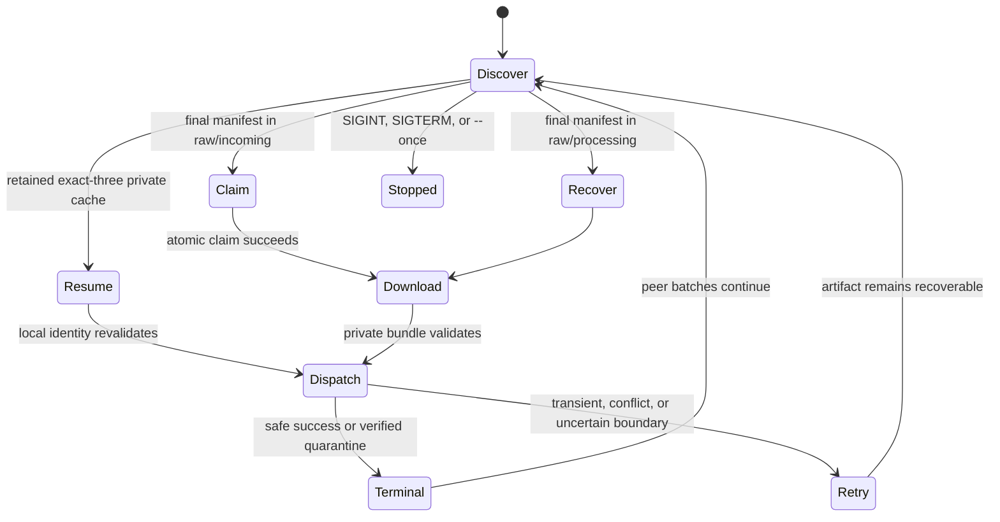
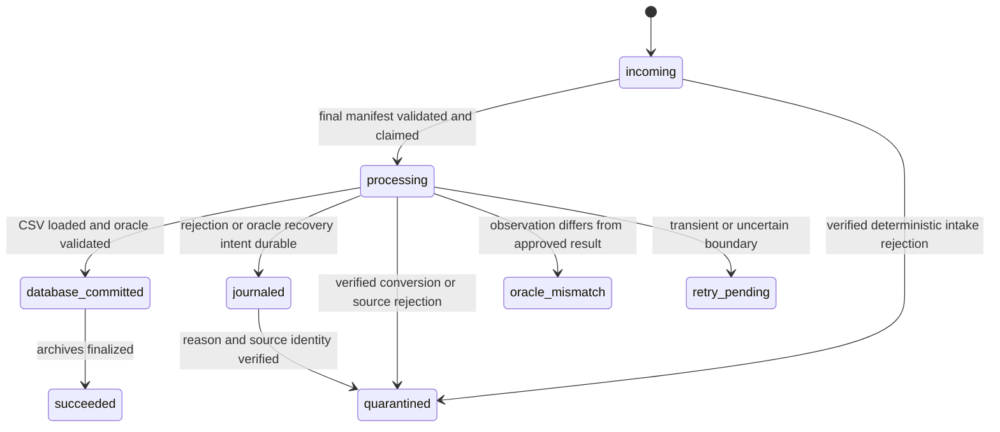

# NorthWind Pay EDP — completed legacy baseline

This is one of the two engagement plans. [`README.md`](README.md) is the
map; [`modern.md`](modern.md) is the contract for the second
implementation. This file is the **frozen use case**: what already runs,
what a green result is allowed to mean, and the 2026-07-24 proof that
the five types close.

Nothing in `legacy/`, `contracts/`, `gen/`, or `infra/` may be edited to
make a later fabric, detector, or gate pass. When two components
disagree, the contract decides which one is wrong.

## How the engagement uses this document

| Moment | What you take from here |
|---|---|
| Arrival (Day 1) | The flow, the four truth roles, and `make deploy` / `make run` until Type `01` **MATCHED**, net `173.45` |
| First live batch | The [25-batch catalog](#canonical-25-batch-catalog) and the [evidence packet](#batch-evidence). `evidence/` is gitignored — open it in the terminal |
| The inbound drop | [`spec/`](../spec/README.md) is mail, not this plant. Feed it to the Second Brain ([`brain/notebooklm/`](../brain/notebooklm/README.md)); do not treat `cover.md` as `contracts/` |
| A rejected batch | The [source-defect seeds](#source-defect-seeds) — compute the truth, keep the lie |
| A later observer | The handoff contract at the end: read-only, batch-scoped, privacy-safe |
| A dispute with modern | This file plus `contracts/` win. Modern may not rewrite these observations |

The July ledgers stay. They are dated proof, not a license to claim the
current checkout is still that tree. Re-prove on a fresh runtime before
quoting a number as current.

## Purpose and complete boundary

This plan is the consolidated architecture, operating model, and proof
ledger for the completed local legacy baseline. It records five
representative file types through every boundary a later observer — the
modern fabric or a read-only detector — is allowed to consume:

```mermaid
flowchart LR
    C["Executable contract"] --> G["Python DataGen"]
    G --> RP["Raw publisher"]
    RP --> RI["SFTP raw/incoming"]
    RI --> W["Intake: synchronous runner or worker"]
    W --> J["Java 21 typed privacy boundary"]
    J --> CO["SFTP csv/outgoing"]
    CO --> L["Typed PostgreSQL loader"]
    L --> ST["Staging"]
    ST --> SP["Secured PL/pgSQL"]
    SP --> R["Reporting reconciliation"]
    R --> O["Independent oracle + evidence"]
    O --> T["Archive or isolated quarantine"]
```



Every arrow crosses an explicit interface. DataGen does not call Java, Java
does not write PostgreSQL, procedures do not read SFTP, and application code
does not use a mounted-directory transport shortcut.

That is the **base plant**:

```text
SFTP raw/incoming
  → Java 21  (parse, validate, sanitize)
  → SFTP csv/outgoing
  → COPY staging.*
  → stored procedures  (legacy.* then reporting.*)
  → independent oracle
  → archive or quarantine
```

The first sanitized write is **CSV on SFTP**. Postgres is the warehouse.
Modern does not reuse this first write. Its first write is Parquet in
`modern/landing/` — see [`modern.md`](modern.md).

[`spec/`](../spec/README.md) is not this plant. It is the inbound
customer drop the week unpacks before building beside Java. Day 1 feeds
it to the Second Brain and OntoLayer and stops at Intent
([`docs/`](../docs/README.md)). The first modern write is landing Parquet
**after Bind and ingest Consensus** — designed on Day 2, not required on
disk Tuesday; Type `01` Gold closes on Day 3 — see [`modern.md`](modern.md).
Method manuals live in [`presentation/`](../presentation/README.md), not
under `docs/`.

This baseline reproduces the legacy process. It does not replace Java or
PostgreSQL, and it does not implement the modern fabric or the detector.
The legacy implementation is the observed reference system. Later work
consumes its contracts and evidence; it does not quietly refactor this
behavior.

## Current state

The checkout now contains source implementations for all five vertical slices,
the generic synchronous runner, and the automatic manifest-ready worker.

| Evidence level | Current state |
|---|---|
| Executable contracts and canonical truth sets | Complete for Types `01`–`05` |
| DataGen | Complete for five scenarios per type |
| Java conversion | Types `01`–`05` registered and regression-tested in Java 21 |
| PostgreSQL | Typed loaders/procedures and migrations `001`–`010` implemented |
| Generic synchronous orchestration | Types `01`–`05` implemented |
| Automatic worker | Implemented and live verified with `processing → cache → incoming` priority, exact-three private cache, and separate terminal-recovery journal |
| Current-checkout clean-volume five-type proof | Live verified 2026-07-24 |
| Live automatic-worker proof | Live verified 2026-07-24 through the full `make test` gate |
| Type `01` parity proof | Re-standardized and independently live verified 2026-07-24 through `make test-type01` |
| Legacy stopping boundary | Complete |
| Modern pipeline | Not on this tree. Specified by [`modern.md`](modern.md) and built during the week |
| Inbound customer drop | Compiled under [`spec/`](../spec/README.md) for Types `01`–`05`. Type `06` sealed |
| Dark Factory | Not on this tree. Built later. Day five red pill: Type `06` may expose a `CONFIRMED_LEGACY_DEFECT` — classify, do not edit this plant to hide it |

The authoritative evidence comes from separate clean synchronous and
automatic-worker runtimes. It records the current checkout's integrated
behavior; it does not imply that a later reused local runtime remains clean.

## Four truth roles

The design preserves four different authorities:

| Role | Definition |
|---|---|
| System of record | The simulated upstream owns the raw file and declared source controls; committed PostgreSQL tables own applied legacy state |
| Source of observation | Raw and sanitized SFTP bytes, hashes, manifests, database observations, and evidence show what actually happened |
| Source of correctness | Independently reviewed expected CSV, reconciliation, and governed business rules define what should happen |
| Executable Git contract | Versioned YAML, schemas, canonical fixtures, and tests encode the approved expectation |

No component may quietly merge these roles. A source-defect scenario keeps its
incorrect source-owned declaration unchanged. Java and PostgreSQL independently
calculate the right value and preserve the disagreement as evidence.

## Included scope

- Five synthetic raw file types.
- Deterministic Python source simulator.
- Manifest-last role-separated local SFTP.
- Java 21 parsing, validation, masking/tokenization, and canonical CSV.
- PostgreSQL 16 staging, secured procedures, operational state, and reporting.
- Type-specific reconciliation and independent oracles.
- Synchronous scenario and explicit-file workflows.
- Continuous bounded new-file worker.
- Immutable privacy-safe batch evidence.
- Versioned checksum-governed migrations.
- Pure, component, security, PostgreSQL, and live acceptance gates.

## Excluded scope

- Replacing Java or PL/pgSQL with Python.
- Parquet, dlt, DuckLake, DuckDB, dbt, Dagster, FastAPI, or MCP.
- Production connectivity or production fidelity claims.
- The complete 30-plus file-type estate.
- The modern fabric (`modern/`) and its Make targets.
- Dark Factory implementation.

Types `06`–`10`, if later authorized, extend this baseline but are not part of
the current definition of done.

## Repository ownership

```text
uc-northwind-pay-edp/
├── contracts/                    executable contracts and canonical main/
├── gen/                          independent Python source simulator
├── infra/local/sftp/             local OpenSSH SFTP and role boundaries
├── legacy/
│   ├── publisher/                raw publication
│   ├── intake/                   readiness, claim, replay, quarantine
│   ├── processor/                typed privacy conversion
│   ├── postgres/
│   │   ├── loader_common.py     shared lifecycle and control helpers
│   │   ├── type01_diagnostics.py privacy-safe Type 01 recomputation
│   │   ├── type01_loader.py     card-settlement loader
│   │   ├── type02_loader.py     instant-payment-event loader
│   │   ├── type03_loader.py     payment-slip-settlement loader
│   │   ├── type04_loader.py     TED-transfer-settlement loader
│   │   ├── type05_loader.py     merchant-fee-assessment loader
│   │   ├── migrations/          immutable database evolution
│   │   └── procedures/          governed PL/pgSQL processing
│   └── runner/                   synchronous workflow and worker
├── validation/oracle/            independent expected-result comparison
├── tests/
│   ├── contracts/
│   ├── unit/
│   ├── security/
│   ├── postgres/
│   └── end-to-end/
├── docs/                         Converge paper trail (BRD, tech-spec, ADRs) — not the manuals
├── evidence/                     runtime evidence, normally ignored
└── plans/
```

Application components must use SFTP. A host volume can support local
inspection, but it is never an application transport shortcut.

### Component ownership

| Component | Owns | Must not own |
|---|---|---|
| Contracts | Detection, layout, transport, privacy, sanitized shape, reconciliation, and canonical outcomes | Runtime state or observed results |
| DataGen | Deterministic source bytes, source-owned controls, checksum, manifest, and local receipt | Java parsing or business posting |
| Publisher and intake | Manifest-last transport, readiness, integrity, claim, replay, and quarantine | Type-specific business interpretation |
| Java processor | Typed parsing, validation, masking/tokenization, and atomic sanitized publication | PostgreSQL persistence |
| PostgreSQL loader | Sanitized validation, COPY, governed transaction order, and recovery | Raw restricted values or source parsing |
| Stored procedures | Staging-to-operational mutation and reporting reconciliation | SFTP access or raw parsing |
| Oracle | Independent expected-result and reconciliation comparison | Mutation of observed results |
| Runner and worker | Boundary orchestration, recovery, isolation, and evidence assembly | Hidden business rules |

## Initial five-type portfolio

| Type | Synthetic contract | Distinct problem |
|---|---|---|
| `01` | Card Settlement Detail | ISO-8859-1 fixed width, COBOL overpunch, PAN/CPF privacy, and signed money |
| `02` | Instant Payment Events | UTF-8 escaped pipe grammar, offsets, document variants, and credit/debit direction |
| `03` | Payment Slip Settlement | Exact 240-byte CRLF records, lots, and paired physical segments |
| `04` | TED Transfer Settlement | Heterogeneous lengths, conditional returns, inherited context, and signed movements |
| `05` | Merchant Fee Assessment | UTF-8/NFC quote-aware semicolon grammar, decimal commas, dates, and exact `HALF_UP` |

Each type owns five canonical outcomes:

- a minimal accepted batch;
- a boundary accepted batch;
- a layout-specific third accepted batch;
- one isolated malformed rejection;
- one canonical source-defect seed for the future Dark Factory.

The contract `main/` fixtures are approved truth examples, not generated
runtime files.

## Canonical 25-batch catalog

Every type has five immutable batch identities. They are reused by the
synchronous suites and the automatic worker, which is why those two
portfolios cannot share one runtime.

| Type | Scenario | Batch ID | Expected terminal |
|---|---|---|---|
| `01` | `valid-minimal` | `B202607230000001` | succeeded · net `173.45` · 2 rows |
| `01` | `valid-boundary` | `B202402290000001` | succeeded · net `9999999999.99` |
| `01` | `negative-overpunch` | `B202607230000002` | succeeded · net `-12.34` |
| `01` | `malformed` | `B202607230000003` | quarantined · `INVALID_OVERPUNCH` |
| `01` | `DF-SOURCE-001` | `B202607230000004` | quarantined · `SOURCE_CONTROL_TOTAL_MISMATCH` |
| `02` | `valid-minimal` | `B202607230000101` | succeeded · net `173.45` · 2 events |
| `02` | `valid-boundary` | `B202402290000102` | succeeded · net `0.01` |
| `02` | `escaped-content` | `B202607230000104` | succeeded · net `1.23` |
| `02` | `malformed` | `B202607230000103` | quarantined |
| `02` | `DF-SOURCE-002` | `B202607230000105` | quarantined · `SOURCE_CONTROL_NET_MISMATCH` |
| `03` | `valid-minimal` | `B202607230000201` | succeeded · net `198.50` · 2 logical |
| `03` | `valid-boundary` | `B202402290000202` | succeeded |
| `03` | `multi-lot` | `B202607230000204` | succeeded · net `198.50` |
| `03` | `malformed` | `B202607230000203` | quarantined |
| `03` | `DF-SOURCE-003` | `B202607230000205` | quarantined · `SOURCE_CONTROL_NET_MISMATCH` |
| `04` | `valid-minimal` | `B202607230000301` | succeeded · net `1000.00` |
| `04` | `valid-boundary` | `B200002290000302` | succeeded |
| `04` | `all-returned-zero-net` | `B202607230000304` | succeeded · net `0.00` |
| `04` | `malformed` | `B202607230000303` | quarantined |
| `04` | `DF-SOURCE-004` | `B202607230000305` | quarantined · `SOURCE_CONTROL_NET_MISMATCH` |
| `05` | `valid-minimal` | `B202607230000401` | succeeded · assessed `12.36` |
| `05` | `valid-boundary` | `B200002290000402` | succeeded |
| `05` | `rounding-half-up` | `B202607230000404` | succeeded · assessed `0.04` on `3.50` |
| `05` | `malformed` | `B202607230000403` | quarantined |
| `05` | `DF-SOURCE-005` | `B202607230000405` | quarantined · `SOURCE_CONTROL_ASSESSED_FEE_MISMATCH` |

`TYPE=all SCENARIO=valid-minimal` runs only the five `valid-minimal`
rows. The other twenty are reached by naming the scenario, or by the
live suites.

### Source-defect seeds

These five are the most important fixtures in the estate. The source
declares a control its own detail rows contradict. Java independently
computes the true value, **refuses the batch**, preserves the wrong
declaration, writes no CSV, mutates no business table, and lets
unrelated batches continue.

| Seed | Batch | Declared | Computed | Code |
|---|---|---|---|---|
| `DF-SOURCE-001` | `B202607230000004` | net `173.44` | `173.45` | `SOURCE_CONTROL_TOTAL_MISMATCH` |
| `DF-SOURCE-002` | `B202607230000105` | net `173.44` | `173.45` | `SOURCE_CONTROL_NET_MISMATCH` |
| `DF-SOURCE-003` | `B202607230000205` | net `198.49` | `198.50` | `SOURCE_CONTROL_NET_MISMATCH` |
| `DF-SOURCE-004` | `B202607230000305` | net `999.99` | `1000.00` | `SOURCE_CONTROL_NET_MISMATCH` |
| `DF-SOURCE-005` | `B202607230000405` | assessed fee `0.99` | `1.00` | `SOURCE_CONTROL_ASSESSED_FEE_MISMATCH` |

They are confirmed **source-system** defects, not planted legacy bugs
and not proof that a detector exists. A later modern pipeline that
"fixes" the declared number has destroyed the evidence.

## Boundary rules

### DataGen

- Does not import or reuse Java parsing logic.
- Owns raw bytes, source controls, checksum, manifest, and local receipt.
- Produces deterministic output across working directory, locale, timezone,
  and hash seed.
- Keeps restricted values out of metadata and console diagnostics.

### SFTP

- Uses separate publisher, processor, loader, and operator roles.
- Uploads temporary artifacts and renames the readiness manifest last.
- Claims atomically and never processes an incomplete directory.
- Treats immutable batch identity and hash as replay boundaries.
- Quarantines only the affected batch.

```text
/raw/incoming    → /raw/processing    → /raw/archive
                                      ↘ /raw/quarantine

/csv/outgoing    → /csv/processing    → /csv/archive
                                      ↘ /csv/quarantine
```

A ready source publication contains the raw file, its SHA-256 sidecar, and
`source-manifest.json`; a sanitized publication has the equivalent CSV
artifacts and readiness manifest. Data and checksum are renamed first and the
manifest last. An identical replay may resume only when batch identity and
immutable hashes agree. Changed bytes under an existing batch ID are a
conflict. A batch visible in both incoming and processing is one retryable
`SFTP_ZONE_AMBIGUITY` outcome, never two competing executions.

Four Unix roles, eight zones, every zone mode `2770`. The loader has
**no** group on `raw/*`. That is how "the loader cannot see a PAN"
becomes a kernel fact rather than a comment. Full matrix:
[`infra/README.md`](../infra/README.md).

| Zone | raw-publisher | processor | loader | operator |
|---|:-:|:-:|:-:|:-:|
| `raw/incoming` | ✓ | ✓ | — | ✓ |
| `raw/processing` | — | ✓ | — | ✓ |
| `raw/quarantine` | — | ✓ | — | ✓ |
| `raw/archive` | — | — | — | ✓ |
| `csv/outgoing` | — | ✓ | ✓ | ✓ |
| `csv/processing` | — | — | ✓ | ✓ |
| `csv/quarantine` | — | — | ✓ | ✓ |
| `csv/archive` | — | — | — | ✓ |

### Java

- Dispatches by exact manifest number, code, contract, and layout identity.
- Preserves type-specific transport and grammar.
- Uses `BigDecimal`, never binary floating point, for money.
- Completes validation and privacy transformation before publication.
- Scans the complete candidate output for prohibited values.
- Publishes CSV, checksum, and manifest all-or-nothing, manifest last.
- Emits privacy-safe adapter-allowlisted evidence. Type `01` may include its
  approved safe transaction reference and derived controls; prohibited PAN,
  CPF, raw rows, and unapproved fields remain excluded.

Dispatch is by exact manifest number, code, contract version, and layout
version — never by file extension. `.dat` is Types `01` and `04`; `.csv`
is Type `05` and every sanitized output.

```text
legacy/processor/src/main/java/com/northwindpay/legacy/
├── core/                 ProcessorMain, dispatcher, SFTP, artifacts
├── type01/Type01Processor.java    ISO-8859-1 fixed width, overpunch
├── type02/Type02Processor.java    UTF-8 escaped pipes
├── type03/Type03Processor.java    240-byte CRLF paired segments
├── type04/Type04Processor.java    mixed widths, inherited returns
└── type05/Type05Processor.java    semicolon CSV, NFC, HALF_UP
```

One Java main, one Java test, one Python loader, one oracle, one
workflow adapter per type. There is no half-implemented type. Type `01`
tables live in migration `001` under generic names; its procedures are
version `002`. Types `02`–`05` have numbered migrations. See
[`legacy/README.md`](../legacy/README.md).

### PostgreSQL

- Uses `control`, `staging`, `legacy`, and `reporting` schemas.
- Loads only validated sanitized CSV.
- Uses a non-superuser application role.
- Executes governed mutations through fixed-search-path secured functions.
- Keeps COPY, procedures, reconciliation validation, and final state in one
  transaction.
- Rolls back business mutation when the in-transaction oracle fails.

### Oracle

- Reads approved expected artifacts independently from implementations.
- Compares sanitized output before posting.
- Compares complete reconciliation before commit.
- Never mutates observations to make a run pass.

### Privacy boundary

Raw synthetic files deliberately contain restricted identifiers appropriate
to each type. Java must finish validation and privacy transformation before
publication, scan the whole candidate output, and publish nothing partial.
Raw PAN, CPF, CNPJ, account values, names, prohibited descriptions, and raw
rows must not enter sanitized CSV, logs, evidence, staging, operational state,
or reconciliation except through an explicitly approved transform. Type `01`
may retain its approved safe transaction reference and derived controls; that
exception does not permit PAN or CPF.

## Automatic-worker contract

The worker discovers only final regular manifests and processes a bounded,
deterministically ordered cycle.



Required invariants:

- order candidates as `raw/processing → retained cache → raw/incoming`;
- represent a batch in both zones as one retryable ambiguity outcome;
- hold one non-blocking private host lock;
- use an exact three-artifact private cache with no symlinks or extras;
- persist terminal rejection/oracle intent in a separate bounded private
  journal bound to batch, type, raw hash, and manifest hash;
- replay journaled terminal work without rerunning Java, and remove neither
  journal nor cache before verified database state and immutable evidence;
- validate immutable source identity before type dispatch;
- route only registered Types `01`–`05`;
- isolate every batch exception and continue peer candidates;
- classify quarantine as terminal only after it is verified;
- preserve transient, cache, and uncertain failures for retry;
- atomically write a private heartbeat;
- remove cache only after a validated terminal outcome;
- release lock and write stopped state on SIGINT/SIGTERM.

Source/unit/security coverage exists for these rules. The live suite at
`tests/end-to-end/run_worker_suite.py` is exposed by `make test-worker-e2e`
and the full `make test` gate. Its 2026-07-24 clean-runtime execution verified
all 25 canonical cases (`15` success, `10` quarantine), one integrity
quarantine, one forced oracle mismatch, and four exact-batch restart probes at
`database_commit`, `raw_archive`, rejection `raw_quarantine`, and
oracle-mismatch quarantine. It also verified ambiguity, cache conflict,
quarantine uncertainty, lock contention, heartbeat, and clean
SIGTERM/reacquisition.

## Runtime terminal outcomes



Command exit zero means the requested workflow reached its expected safe
terminal state. A canonical rejection can therefore exit successfully while
reporting `quarantined`; consumers must inspect the structured terminal status
and code rather than infer acceptance from the process exit code.

## PostgreSQL layers

| Schema | Responsibility |
|---|---|
| `control` | Batch identity, source/stage controls, files, loads, rejects, procedure history, and migration ledger |
| `staging` | Privacy-safe rows shaped for one file type |
| `legacy` | Governed operational result produced by secured procedures |
| `reporting` | Counts, amounts, deltas, and terminal reconciliation |

The application role is a non-superuser. Loader preparation is non-mutating;
COPY, procedure execution, reconciliation validation, and final state share
one transaction. An oracle failure therefore rolls back the business mutation.

## PostgreSQL migration chain

Migrations and procedures share one global version order:

| Version | Purpose |
|---|---|
| `001` | Shared schemas and original Type `01` tables |
| `002` | Type `01` secured procedures |
| `003` | Five-type control plane |
| `004` | Type `02` |
| `005` | Type `03` |
| `006` | Type `04` |
| `007` | Type `05` |
| `008` | Type `05` shared-control compatibility |
| `009` | Type `05` independent positive-value `HALF_UP` constraints |
| `010` | Type `05` multi-row reporting aggregate width |

The migration runner takes an advisory transaction lock and records version,
filename, SHA-256, and application time. Exact replay is idempotent. Applied
filename/checksum drift is an error; changes require a higher version.

## Make command facade

Make delegates to typed Python, Java, SQL, and Compose entrypoints:

| Target | Responsibility |
|---|---|
| `make help` | Show supported targets and variables |
| `make init` | Create protected local environment and build base images |
| `make deploy` | Start SFTP/PostgreSQL, bootstrap host keys, migrate, and check health |
| `make migrate` | Apply or verify immutable migrations |
| `make status` | Check Compose, SFTP roles, and PostgreSQL |
| `make down` | Stop services without deleting volumes |
| `make gen TYPE=01|02|03|04|05|all` | Generate one type or a common scenario for all |
| `make publish BATCH=...` | Publish one immutable bundle; `publish-raw` is an alias |
| `make run TYPE=01|02|03|04|05|all` | Run one scenario synchronously; `run-type` is an alias |
| `make run-file TYPE=NN FILE=...` | Run one explicit typed source bundle |
| `make worker` | Run automatic intake in the foreground |
| `make worker-once` | Run one bounded deterministic polling cycle |
| `make check` | Run pure/source gates and build the Java image |
| `make test-type01` | Run the complete Type `01` proof on a clean deployed runtime |
| `make test-postgres` | Run live rollback/permission/procedure regressions |
| `make test-e2e TYPE=NN|all` | Run selected live typed acceptance |
| `make test` | Run source/build, rollback-only PostgreSQL, and the 25-case worker E2E portfolio |
| `make test-worker-e2e` | Run the live automatic-worker acceptance suite |
| `make clean CONFIRM=clean-runtime` | Explicitly delete disposable volumes/runtime/evidence; `clean-runtime` is an alias |

Make never runs arbitrary commands, bypasses business validation, backgrounds
the worker, or cleans automatically before a test.

The synchronous typed and automatic-worker live portfolios reuse canonical
immutable batch IDs and therefore cannot share one acceptance runtime.
`make test` chooses the worker portfolio, which covers all 25 type/scenario
outcomes; `make test-e2e TYPE=...|all` remains the independent synchronous
proof surface.

## Reproduce and operate the frozen baseline

Requirements are Docker with Compose, GNU Make, and Python 3.12 or newer.
Initialize and verify the local services with:

```bash
make init
make deploy
make status
```

Run one synchronous observation or one bounded automatic-intake cycle:

```bash
make run TYPE=01 SCENARIO=valid-minimal
make worker-once MAX_BATCHES=10 POLL_INTERVAL=1
```

Use a fresh disposable runtime for acceptance because canonical batch IDs are
immutable:

```bash
make test-type01
make test-e2e TYPE=all
```

The synchronous and automatic-worker portfolios reuse the same batch IDs and
must not run sequentially on one runtime. No test target deletes state. Stop
without deleting volumes using `make down`; remove disposable state only with:

```bash
make clean CONFIRM=clean-runtime
```

### Change control after completion

- Treat `contracts/`, canonical fixtures, observed legacy outputs, and dated
  proof ledgers as frozen inputs to modern work and to any later detector.
- Do not refactor legacy merely to make a new observer or a second
  implementation easier to build.
- Correct a genuine legacy defect only with an explicit contract decision,
  regression proof, and a new evidence boundary.
- Never edit an applied PostgreSQL migration; add a higher version.
- Preserve the generic public runner and type-owned adapters.
- Re-run `make check`, `make test-postgres`, and the affected clean-runtime
  acceptance before changing a completed claim.
- Keep restricted values out of documentation, diagnostics, and examples.

## Test ledger

| Gate | Implemented | Current claim |
|---|---:|---|
| Contract suites, Types `01`–`05` | Yes | Source/pure gate |
| DataGen tests and strict typing | Yes | Source/pure gate |
| Python unit and oracle tests | Yes | Source/pure gate |
| Worker security tests | Yes; included by `make test-python` | Source/pure gate |
| Java Types `01`–`05` | Yes; 78 regressions in the source-converged image | Passed in the 2026-07-24 full gate |
| PostgreSQL typed regressions | Yes | 13 passed after Type `01` rollback parity |
| Dedicated Type `01` vertical gate | Yes; `make test-type01` | Fresh isolated runtime passed 2026-07-24 |
| Typed E2E suites, Types `01`–`05` | Yes | Clean `TYPE=all` portfolio live verified 2026-07-24 |
| Live worker E2E | 25-case suite, reserved lifecycle probes, and pure harness tests | Clean-runtime live verified 2026-07-24 |
| CI recreation from clean checkout | No current claim | Pending |

No green lower-level gate may be reported as a substitute for a higher live
gate.

The complete file-by-file Type `01` coverage map is maintained in
[`tests/README.md`](../tests/README.md). Shared worker, SFTP, migration, and
batch-control tests deliberately keep shared names; the Type `01` live suite
proves those common boundaries with the Type `01` contract.

## Batch evidence

A terminal run uses a privacy-safe packet shaped like:

```text
evidence/<batch-id>/
├── source-manifest.json
├── generation-receipt.json       # local generated scenarios only; never SFTP
├── raw-file.sha256
├── raw-publication.json
├── raw-intake.json
├── java-run.json
├── sanitized-csv.sha256          # successful conversion only
├── postgres-load.json
├── postgres-diagnostic.json
├── procedure-run.json
├── reconciliation.json
├── expected-diff.json
└── final-status.json
```

Evidence stores hashes, controlled filenames, adapter-allowlisted controls and
references, procedure status, and approved rejection context. Type `01` may
retain its approved safe transaction reference and derived amounts. It never
stores raw PAN, CPF, CNPJ, account values, prohibited descriptions, or raw row
bodies.

Automatic worker calls use `scenario=None`; each packet is internally
reconciled but unscored against a named canonical fixture. The acceptance
harness independently maps immutable canonical batch identities to expected
status/code, controls, reporting, transport, and privacy outcomes.

## Type 01 parity rerun — 2026-07-24

Type `01` began as the first vertical slice. The parity pass removed the
prototype ambiguity and made its test ownership visible:

- the former generic generator integration suite was split into a shared
  framework suite and `test_type_01_generation.py`;
- the independent root contract oracle now has
  `tests/contracts/test_type01_contract.py`;
- loader and workflow APIs are explicitly Type `01`, including
  `type01_diagnostics.py`, `PreparedType01Load`, typed Java dispatch, and
  receipt identity enforcement;
- Java's shared launcher moved to `core/ProcessorMain`, while Type `01`
  processor result factories became explicit;
- PostgreSQL gained a Type `01` whole-transaction rollback test and stronger
  procedure/reconciliation assertions;
- `make test-type01` now exposes the entire vertical proof as one command.

The current source/build result was `47` contract, `68` DataGen, `144` Python
unit, `15` security, `31` oracle, and `78` Java tests. The live PostgreSQL
portfolio passed `13` tests. An uncached focused Maven execution separately
ran all `13` `Type01ProcessorTest` cases with zero failures or skips. In a
fresh runtime on isolated ports, the dedicated Type `01` gate passed its five
canonical outcomes:

| Scenario class | Result |
|---|---|
| Accepted | `3` batches; all `MATCHED`; `4` total business rows |
| Malformed | Quarantined as `INVALID_OVERPUNCH`; zero business rows |
| Source defect | Quarantined as `SOURCE_CONTROL_TOTAL_MISMATCH`; zero business rows |
| Raw SFTP terminal topology | `3` archive, `2` quarantine |
| Sanitized SFTP terminal topology | `3` archive, `0` rejected output |
| Restart seams | Database commit and raw archive replayed idempotently |
| Source-defect observability | Verified source-system-of-record fault with unaffected peer continuation |

This rerun was intentionally scoped to Type `01`; it does not claim a new
execution of the full 25-case worker portfolio.

## Authoritative five-type proof ledger — 2026-07-24

The root-owned acceptance used two distinct clean runtimes because the
synchronous and automatic-worker portfolios intentionally reuse canonical
immutable batch identities.

### Provenance boundary

The proof exercised the current working tree, not a committed release. Its
implementation/input boundary contained 260 regular files: root
`.dockerignore`, `.env.example`, `Makefile`, and `compose.yaml`, plus
`contracts/`, `gen/`, `infra/`, `legacy/`, `tests/`, and `validation/`.
Virtual environments, build/cache/runtime/generated-output directories,
generated packaging metadata such as `*.egg-info`, evidence, `.git`,
`.DS_Store`, and compiled Python files were excluded. Relative paths were
byte-sorted; each file contributed a `{sha256}  {relative_path}\n` record to a
second SHA-256 manifest.

| Identity | SHA-256 |
|---|---|
| Tested implementation/input manifest | `d3e6e95a718dacbd0b7af6405b57fbb0d4cb7354f946ef94bc1d29a9ddc6824e` |
| Processor local image | `689ace8474b0ef6babe5dab43aeb9049ff380eba7d75e2fc59180a2860f67f34` |
| SFTP local image | `55f6da53272257516760c1bb8db4c89f01a95fee7f282a3cd5d8597c2352114e` |
| Sorted migrations `001`–`010` manifest | `f8666474dc0e5f2d6c43946fdf60aaeaf689cfa2257c0a3f9dfacd312b137748` |
| PostgreSQL pinned input digest | `57c72fd2a128e416c7fcc499958864df5301e940bca0a56f58fddf30ffc07777` |

The Git base was `dc3c4692c6352aa355dec437f80c74fc16e13015` on
`main`, with the implementation and documentation present as local working-tree
changes. The manifest above, rather than the base commit alone, identifies the
code exercised by this ledger.

### Synchronous `TYPE=all`

| Type | Succeeded | Expected quarantine | Reporting `MATCHED` | Business rows |
|---|---:|---:|---:|---:|
| `01` | 3 | 2 | 3 | 4 |
| `02` | 3 | 2 | 3 | 4 |
| `03` | 3 | 2 | 3 | 5 |
| `04` | 3 | 2 | 3 | 8 |
| `05` | 3 | 2 | 3 | 5 |

Migrations `001`–`010` were present. The final SFTP and evidence topology was:

| Observation | Count |
|---|---:|
| Raw archive batches | 15 |
| Raw quarantine batches | 10 |
| CSV archive batches | 15 |
| Evidence packets | 25 |

### Earlier full automatic-worker `make test`

| Gate | Passed |
|---|---:|
| Contracts | 40 |
| DataGen | 65 |
| Python unit | 134 |
| Security | 15 |
| Oracle | 31 |
| Java | 78 |
| PostgreSQL | 12 |

The final worker proof was:

| Observation | Verified result |
|---|---:|
| Canonical outcomes | `25` |
| Canonical successes / quarantines | `15 / 10` |
| Additional integrity quarantines | `1` |
| Additional oracle mismatches | `1` |
| Exact-batch restart probes | `4` |
| Status | `passed` |

The preserved terminal runtime was audited read-only after that result:

| Observation | Verified state |
|---|---|
| Control batches | `26` total: canonical controls plus the forced oracle-mismatch control |
| Reject records | `11` |
| Control-plane detail | `control.files=41`, `loads=15`, `procedure_runs=30` |
| Reporting | Every type: `3 MATCHED`, `0 MISMATCHED` |
| Staging / legacy rows, Types `01`–`05` | `4/4`, `4/4`, `5/5`, `8/8`, `5/5` |
| Raw SFTP | 15 archive; 12 quarantine (10 canonical + 1 integrity + 1 oracle mismatch); 1 incomplete incoming; 0 processing |
| Sanitized SFTP | 15 archive; 1 oracle-mismatch quarantine; 0 outgoing or processing |
| Deliberate incomplete upload | One 32-byte `.part` in raw incoming; no manifest and therefore undiscoverable |
| Evidence | 26 exact packets / 301 files (`15` success × `12`, `11` failure × `11`) with no shape/lineage/status/privacy/permission mismatch |
| Worker residue | Heartbeat v1 stopped after a final no-work cycle (`ignored=1`); process released; private intake-cache and terminal-recovery roots both empty with mode `0700` |
| Restart / integrity probes | Forced oracle probe: one control/reject and zero business rows; nonterminal restart probes: zero duplicate database mutation |

The only `.part` file is the deliberate incomplete-upload probe. It is not a
partial artifact from a completed or quarantined canonical batch.

### Acceptance-found fixes

The corrections below were included before the final clean rerun:

1. Type `05` recovery from an already committed PostgreSQL state now selects
   the Type `05` control dispatch before transport finalization.
2. `generation-receipt.json` remains local to DataGen rather than crossing
   SFTP, and the Type `01` safe transaction-ID detector no longer raises false
   positives for approved transaction identifiers.
3. Rejection and oracle-mismatch terminal moves now persist durable,
   privacy-safe recovery intent outside the exact-three cache. Retained-cache
   replay validates source identity and remote quarantine reason, skips Java,
   idempotently completes PostgreSQL control/evidence, and cleans journal state
   only after terminal verification.

## Committed-tree re-proof ledger — 2026-07-24 (Dark Factory Phase 0)

The five-type ledger above was produced from working-tree content that preceded
the Type `01` parity refactor; only the Type `01` vertical was re-proven live on
the final bytes. The Dark Factory autonomous mandate requires the *committed*
tree to be re-proven before any Dark Factory code exists. This entry records
that re-proof. It supersedes nothing: it is a second, independently dated proof
of a different tree.

### Provenance boundary

Same published boundary as the earlier ledger — root `.dockerignore`,
`.env.example`, `Makefile`, `compose.yaml`, plus every regular file under
`contracts/`, `gen/`, `infra/`, `legacy/`, `tests/`, and `validation/`, with
virtual environments, build/cache/runtime/generated-output directories,
`*.egg-info`, evidence, `.git`, `.DS_Store`, and compiled Python excluded;
byte-sorted relative paths; one `{sha256}  {relative_path}\n` record per file
into a second SHA-256. The committed tree contains **268** files against the
earlier 260. Exact rules live with the ledger in this file. Prior-run decision records
were removed from the tree so the base stays a clean slate.

The implementation-manifest tool lived with the detector and is not on
this tree. The hashes below remain the recorded ledger from 2026-07-24.

| Identity | SHA-256 |
|---|---|
| Tested implementation/input manifest | `12ce7f449228ae70d4781066b009ce63d5b18e037795ab70c5e0c4e6cd0d0dea` |
| Processor local image | `b4ee761a399c83a8edadb56af1c571fcb602b140577704587b8ab7e182bab362` |
| SFTP local image | `55f6da53272257516760c1bb8db4c89f01a95fee7f282a3cd5d8597c2352114e` |
| Applied migrations `001`–`010` manifest | `26e153f6c24a987ebb0e2729dee8b828b17283dc9838ba95ea4a0822b30b4be0` |
| PostgreSQL pinned input digest | `57c72fd2a128e416c7fcc499958864df5301e940bca0a56f58fddf30ffc07777` |

The Git base was `e9f3460` on `wktr-dark-factory-e2e`, with a clean working
tree — unlike the earlier ledger, the manifest and the commit describe the same
bytes. The SFTP image reproduced the earlier ledger's digest exactly; the
processor image did not, which is expected because its build embeds the changed
source tree. The applied-migration manifest is computed from
`control.schema_migrations` (`sha256  name`, ordered by version) rather than
from disk, so it proves what the database actually applied.

### Runtime freshness

The host already carried a `northwind-pay-legacy` Compose project whose
`sftp_data` volume held 143 files under `raw/quarantine` with canonical batch
identities already consumed. It was destroyed before the first gate. Freshness
was then asserted positively — zero files in `sftp_data`, migrations `001`–`010`
applied from scratch — not inferred from a clean exit code. The same assertion
was repeated for the second runtime.

### Source and build gates

| Gate | Result |
|---|---:|
| Contracts | `47` passed |
| DataGen | `68` passed |
| Python unit | `144` passed |
| Security | `15` passed |
| Oracle | `31` passed |
| Java | `78` passed, `0` failures, `0` skipped |
| PostgreSQL (live, rollback-only) | `13` passed |
| mypy `--strict` | clean on both boundaries |

`make check` served the processor image from the local build cache, which
proves only that build inputs were unchanged relative to an earlier build on
this host. The Java suite was therefore re-executed with
`docker compose build --no-cache processor`.

### Automatic-worker portfolio — first fresh runtime

```json
{"cache_conflict": "verified_retry", "canonical_quarantines": 10,
 "canonical_successes": 15, "daemon_sigterm": "verified",
 "integrity_quarantines": 1, "lock_contention": "verified",
 "oracle_mismatches": 1, "quarantine_uncertainty": "verified_retry",
 "restart_database_commit": "verified", "restart_oracle_mismatch": "verified",
 "restart_raw_archive": "verified", "restart_raw_quarantine": "verified",
 "retained_cache_replay": "verified", "status": "passed", "worker_cases": 25}
```

### Synchronous `TYPE=all` — second fresh runtime

The two portfolios reuse canonical immutable batch identities, so
`make clean CONFIRM=clean-runtime` ran between them.

| Type | Succeeded | Expected quarantine |
|---|---:|---:|
| `01` | 3 | 2 |
| `02` | 3 | 2 |
| `03` | 3 | 2 |
| `04` | 3 | 2 |
| `05` | 3 | 2 |

| Observation | Count |
|---|---:|
| Raw archive / quarantine | `15` / `10` |
| Raw incoming / processing | `0` / `0` |
| CSV archive / quarantine | `15` / `0` |
| CSV outgoing / processing | `0` / `0` |
| `control.batches` | `25` (`15` succeeded, `10` quarantined) |
| `control.rejects` | `10` |
| `control.files` / `loads` / `procedure_runs` | `40` / `15` / `30` |
| Evidence packets | `25` |

Nothing under `legacy/`, `contracts/`, `gen/`, `infra/`, or the applied
migrations changed to produce this result. The committed baseline is green.

## Handoff contract for later observers

The legacy baseline is an observed system, not implementation material
for the modern fabric or a later detector to rewrite.
`DF-SOURCE-001` through `DF-SOURCE-005` are seeded source-system-defect
fixtures. They prove the process exposes enough information for an
observer to detect, attribute, isolate, and record a mismatch.

No observer is on this tree. The modern pipeline is specified in
[`modern.md`](modern.md) and built during the week. A read-only detector
is later still. What must never exist, by design: a remediation engine
that silently repairs the source. An observer reports; it never repairs.

The contract below is what the detector operates under, and what any future
observer must also honor:

- consume contracts, manifests, hashes, independently computed controls,
  reconciliation, terminal status, and evidence read-only;
- preserve the source-owned declaration even when it is wrong;
- keep source of record, source of observation, source of correctness, and
  executable Git contract distinct;
- bind every finding to immutable observation and contract references;
- quarantine only the affected batch and require unaffected peers to continue;
- keep findings privacy-safe and never use raw restricted values as evidence;
- use a fresh runtime for every authoritative live acceptance;
- avoid modifying legacy behavior merely to make observation easier.

Type `01` is the first bounded Dark Factory acceptance target:

| Expected observation | Value |
|---|---|
| Scenario | `DF-SOURCE-001` |
| Batch | `B202607230000004` |
| Source declaration | `173.44` |
| Independent computation | `173.45` |
| Terminal code | `SOURCE_CONTROL_TOTAL_MISMATCH` |
| Attribution | Source system of record |
| Sanitized CSV produced | No |
| PostgreSQL business mutation | No |
| Isolation | Affected batch only |
| Peer continuation | Required |

The implementation was verified from local working-tree content rather
than a committed release. Clean-checkout recreation and CI remain
release-hardening work. They do not block local construction of the
modern fabric against this baseline.

The second implementation is specified in [`modern.md`](modern.md).

## Legacy stopping boundary — complete

The clean portfolios proved that each supported type can enter through its
readiness-manifest boundary and reach reconciled committed PostgreSQL state
with archived transport artifacts or its approved isolated quarantine without
partial CSV or business mutation.

Continuous intake, locking, heartbeat, four exact-batch restart seams,
retained-cache terminal replay without a second Java invocation, peer
continuation, ambiguity handling, cache integrity, quarantine uncertainty, and
graceful shutdown were also verified. That observable legacy baseline
completes this round. The modern fabric is next and is specified in
[`modern.md`](modern.md). A read-only detector remains unimplemented.

## Completed definition of done

- [x] Five executable contract packages and canonical truth sets.
- [x] Five deterministic DataGen implementations.
- [x] Five Java handlers with mandatory privacy boundaries.
- [x] Five PostgreSQL staging/procedure/reconciliation routes.
- [x] Generic synchronous scenario and explicit-file runner.
- [x] Immutable migrations `001`–`010`.
- [x] Automatic worker implementation.
- [x] Durable rejection and oracle-mismatch restart recovery outside the
      exact-three intake cache.
- [x] Live automatic-worker acceptance suite and Make wiring.
- [x] Pure/unit/security/build gates wired into `make check`.
- [x] Fresh current-checkout Types `01`–`05` live acceptance recorded.
- [x] Live automatic-worker clean-runtime acceptance recorded.
- [x] Final privacy and evidence audit recorded by the clean acceptance gates.

Types `06`–`10`, clean-checkout release recreation, and CI publication are
outside this completed local definition.
