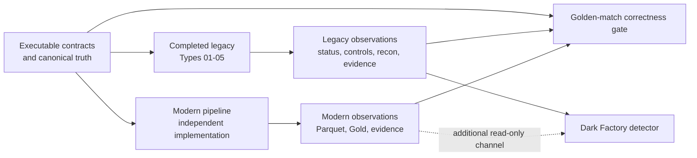
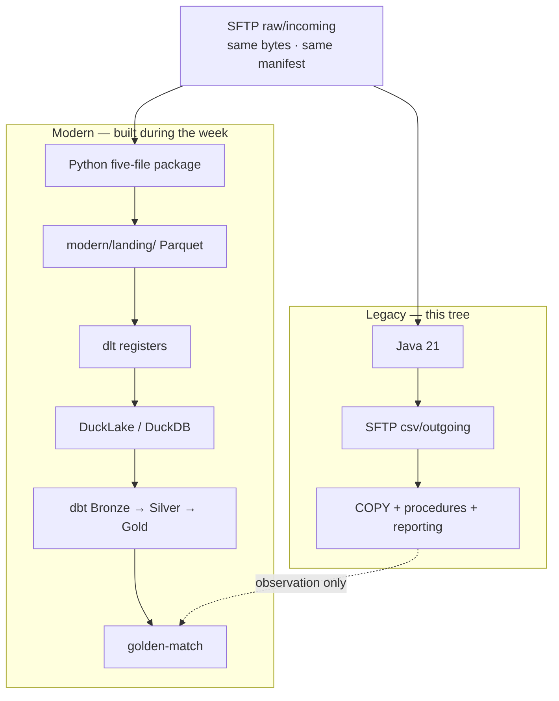
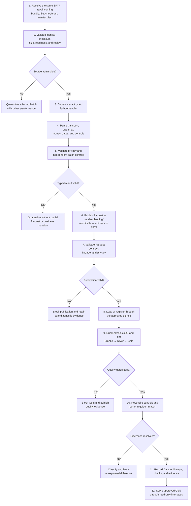

# NorthWind Pay EDP — modern pipeline specification

This is the other engagement plan. [`README.md`](README.md) is the map;
[`legacy.md`](legacy.md) is the frozen use case. This file is the
**contract the week must satisfy** when the second implementation is
built. Read it as binding specification, not as a description of code
that is already here.

## How the engagement uses this document

| Moment | What you take from here |
|---|---|
| Day 1 | **Do not write a parser.** Capture + Intent only (`docs/brd-…`, `docs/tech-spec-…`). Brain + graph exist; ADRs wait. |
| Day 2 | Recap 0–1. Bind. Close landing facts as ADRs 0001–0005; **park** lakehouse as 0006. Ingest Consensus. One Type 01 **parser** leaf. Parquet **not** required on disk Tuesday. |
| Day 3 | Unpark 0006. Lakehouse sign (`docs/consensus-lakehouse.md`). Type 01 **steel thread**: emit if missing → dlt register → B/S/G → golden-match. Types `02`–`05` parked. |
| Day 4 | Generate remaining SWE + DE leaves (`02`–`04`, Type `05`, orchestrate). Mesh + Pass 6–8 crank (Linear). Type `05` unattended. Small red pill: `HALF_UP`. |
| Closing a type | The [completion checklist](#completion-checklist-for-each-type) and golden-match classifications |
| A source-defect batch | The two questions stay separate. Classification is `CONFIRMED_SOURCE_DEFECT` |
| Day 5 red pill | Type `06` unseen. A numeric miss may be `CONFIRMED_LEGACY_DEFECT` — the main system, not the file |
| Type `05` | Inbound pack (Second Brain pack 07). **Do not implement on Day 3.** Thursday: `rounding-half-up` is `HALF_UP`. Default/`normal` rounding is the trap |
| Serving a result | Only an approved Gold snapshot. Unresolved golden-match is not servable |

**Day 1 does not construct this fabric.** It understands the legacy
(MATCHED plant, Second Brain, OntoLayer, Capture → Intent). **Days 2–3**
are Type `01` steel threads (SWE landing, then DE Gold). **Day 4**
generates remaining Types `02`–`05` and cranks them. Day 5 is the
unattended factory on **Type `06`** — a kit the room has not unpacked —
and the **red pill**: golden-match may classify a numeric miss as
`CONFIRMED_LEGACY_DEFECT`. The main plant can be wrong. The factory
finds it; it does not edit `legacy/` to hide it.

Week clock: [`agenda/`](../agenda/README.md). Staff: [`run/d1/`](../run/d1/README.md)
· [`run/d2/`](../run/d2/README.md) · [`run/d3/`](../run/d3/README.md).
Papers: [`docs/`](../docs/README.md). **One Night.** Bind is on before any
`modern/` write.

Nothing in this document authorizes empty scaffolding on day zero, and
nothing puts Type `06` in `spec/` before that day.

## Status and evidence boundary

**Not on this tree.** The boundaries, golden-match rules, per-type
checklist, and definition of done below are what "done" means when the
code exists.

| Area | Live repository state |
|---|---|
| Legacy Types `01`–`05` | Implemented and live verified through contracts, DataGen, SFTP, Java, PostgreSQL, reconciliation, oracle, and evidence |
| Type `01` parity | Explicitly standardized and independently reverified |
| Dark Factory | Not on this tree. Built later as a read-only witness |
| Modern pipeline | **Not on this tree.** Built during the week against this spec |
| Modern Type `05` | **Not built.** Inbound pack is in [`spec/type-05-merchant-fee-assessment/`](../spec/type-05-merchant-fee-assessment/README.md). Do not search git history for a prior implementation — build it from the drop and the contract |
| Release boundary | Local working-tree and committed-branch content only. **No CI exists**; no clean-checkout or production-readiness claim may be made from this proof |

The proven shared baseline is five types. Types `06`–`10` require new contracts
and observations before they can enter either legacy parity or modern scope.

Where this document and later code disagree, the code and `contracts/`
win, and the document is the bug — with one exception: the boundaries
and prohibitions below are binding on the code, not descriptive of it.

### Already on the tree vs built during the week

| Already here | Built during the week |
|---|---|
| Five signed contracts and `main/` oracles | Type `01` five-file package on Days 2–3 (parser leaf Tuesday; emit + Gold Wednesday). Types `02`–`05` generated Thursday |
| Legacy observations you can re-run any time | Deterministic sanitized Parquet and `modern/landing/` |
| `validation/golden-match/golden_match.py` — the referee module | dlt + DuckLake/DuckDB + dbt Bronze/Silver/Gold |
| Inbound packs `01`–`05` under [`spec/`](../spec/README.md) | Dagster, read-only FastAPI, narrow MCP |
| Second Brain ([`brain/notebooklm/`](../brain/notebooklm/README.md)) + OntoLayer | Queried as evidence for ADRs. They do not replace a signed ADR |
| This specification | `tests/modern/`, `make modern-*`, `evidence/modern/` |

The referee module is not an implementation. It compares observations
it is given. Until modern produces Parquet, Gold, and a terminal status,
there is nothing to attach.

## Relationship among legacy, Dark Factory, and modern

These are separate systems with separate evidence:



- Legacy is the frozen oracle and can be observed at any time.
- Modern is an **independent second implementation**, not part of the Dark
  Factory, and it does not replace legacy. Its whole purpose is to disagree
  detectably.
- The detector consumes modern observations only as an additional read-only
  channel; it never computes modern business results.
- Golden-match compares observations; it is not the Dark Factory.
- Neither modern nor Dark Factory may rewrite legacy observations or contract
  expectations to manufacture agreement.

The two plants share raw intake and then split:



## Goal

Build an independent modern replacement for the same five approved raw file
types and produce deterministic, privacy-safe analytical results locally:

```text
same SFTP raw/incoming  (file + checksum + manifest last)
  → event-driven Python  (model → parser → schema → writer → handler)
  → modern/landing/      deterministic sanitized Parquet + readiness manifest
  → dlt                  registers landing; does not re-parse
  → DuckLake and DuckDB
  → dbt Bronze → Silver → Gold
  → golden-match         vs contract AND vs legacy observation
  → Dagster              lineage, retries, evidence — not the parser
  → read-only FastAPI    approved Gold only
```

**The first modern write is `modern/landing/`, not SFTP.** Java writes
CSV to `csv/outgoing`. Python writes Parquet to landing. dlt does not
own money, privacy, or grammar. Nothing repairs a source declaration.

The modern system must not call the legacy Java processor, import its parsing
logic, or reuse legacy stored procedures to calculate a result. Legacy CSV,
PostgreSQL state, and evidence are comparison observations only. The executable
contracts and independently approved truth sets remain the source of
correctness. Inbound prose under [`spec/`](../spec/README.md) is how the
customer arrived; it does not outrank `contracts/`.

## Shared boundaries with legacy

| Shared boundary | Rule |
|---|---|
| Contract identity | Use the exact number, code, contract version, and layout version under `contracts/types/` |
| Raw input | Process the exact same bytes and source manifest used by legacy |
| Supported formats | Respect the type-specific `.dat`, `.txt`, `.rem`, and `.csv` transport contracts |
| Implementations | Java/PostgreSQL and Python/lakehouse remain independent |
| Legacy CSV | Comparison evidence only; never a modern input |
| Legacy PostgreSQL | Observation environment only; never a modern source database |
| Correctness | Compare both systems with independent expected outcomes |
| Source defects | Preserve the wrong source-owned declaration and compare it with independent calculations |
| Privacy | Modern output may contain only contract-approved transformations |
| Terminal behavior | Compare success, rejection code, isolation, mutation, and peer continuation—not only successful rows |

Type `01` Card Settlement Detail is the approved first shared slice. Its raw
fixtures, sanitized expectations, reconciliation, source-defect outcome, and
legacy evidence path are complete and live verified.

## Per-type contract map

Modern reads the four YAMLs and `main/` under `contracts/types/`. It
never reads Java, legacy CSV, or PostgreSQL to compute a result. Those
are comparison observations only.

| Type | Transport | Privacy that must not leak | Source-defect code | Declared → computed |
|---|---|---|---|---|
| `01` | ISO-8859-1 fixed width, COBOL overpunch, LF | PAN (token + last4), CPF (`*******` + last4) | `SOURCE_CONTROL_TOTAL_MISMATCH` | net `173.44` → `173.45` |
| `02` | UTF-8 escaped pipes | CPF / CNPJ variants | `SOURCE_CONTROL_NET_MISMATCH` | net `173.44` → `173.45` |
| `03` | Exact 240-byte CRLF paired segments | document / account identifiers | `SOURCE_CONTROL_NET_MISMATCH` | net `198.49` → `198.50` |
| `04` | Heterogeneous fixed widths, inherited returns | account tokenization, tax-ID mask | `SOURCE_CONTROL_NET_MISMATCH` | net `999.99` → `1000.00` |
| `05` | Semicolon CSV, NFC, decimal comma, `HALF_UP` | document / merchant identifiers | `SOURCE_CONTROL_ASSESSED_FEE_MISMATCH` | assessed `0.99` → `1.00` |

`canonical_rejection_codes` in each `layout.yaml` is binding. Inventing
a parallel vocabulary turns every refusal into a spurious golden-match
difference. Tolerances are zero everywhere.

Canonical batch identities and the other twenty scenarios live in
[`legacy.md`](legacy.md#canonical-25-batch-catalog). Modern must accept
or refuse the **same** batch IDs.

## First modern tranche

### Included

- Types `01`–`05`, one vertical slice at a time.
- Python packages organized as `model → parser → schema → writer → handler`.
- Type-specific parsing:
  - Type `01`: ISO-8859-1 fixed width and COBOL overpunch;
  - Type `02`: UTF-8 escaped pipe grammar;
  - Type `03`: exact 240-byte CRLF remittance records;
  - Type `04`: heterogeneous fixed widths and inherited return context;
  - Type `05`: quote-aware semicolon CSV, NFC, decimal comma, and `HALF_UP`.
  Modern Type `05` is **not built**. The contract, oracle, and a live
  legacy execution are docked in
  [`spec/type-05-merchant-fee-assessment/`](../spec/type-05-merchant-fee-assessment/README.md).
  Build it from that kit, not from git history.
- Exact `Decimal` financial arithmetic. Python's default rounding is
  `ROUND_HALF_EVEN`. Type `05` forbids it.
- Contract-approved masking, tokenization, and safe passthrough rules.
- Deterministic sanitized Parquet with immutable provenance.
- An explicitly approved dlt, DuckLake, and DuckDB handoff.
- dbt Bronze, Silver, and Gold models with exact grains and controls.
- Golden-match against contract truth and legacy observation.
- Dagster orchestration, lineage, retries, and evidence.
- One read-only FastAPI surface and narrow MCP tools over approved Gold.
- Local execution, privacy gates, and reproducible tests.

### Excluded

- Modifying completed legacy behavior to simplify modern implementation.
- Types `06`–`10` before their contracts and reference observations exist.
- The complete 30-plus file-type estate.
- Unrestricted natural-language SQL.
- Cloud deployment before a target is selected.
- Treating Dark Factory, golden-match, or modern orchestration as the same
  subsystem.
- Claiming production or CI readiness from local proof alone.

## Modern runtime flow



For canonical rejected batches, the flow ends before Parquet and Gold. That is
an expected terminal result, not missing data.

## Target repository additions

Current legacy paths remain in place. Modern work should add, not rename, the
following boundaries:

```text
uc-northwind-pay-edp/
├── contracts/
│   └── types/                         approved Types 01-05
├── plans/
│   ├── README.md                      engagement map
│   ├── legacy.md                      completed oracle baseline
│   └── modern.md                      this specification
├── modern/                            to be built
│   ├── ingestion/
│   │   └── src/northwind_pay/
│   │       ├── common/
│   │       ├── intake/
│   │       └── types/
│   │           └── <number-name>/
│   │               ├── model.py
│   │               ├── parser.py
│   │               ├── schema.py
│   │               ├── writer.py
│   │               └── handler.py
│   ├── landing/
│   ├── lakehouse/
│   │   ├── dlt/
│   │   ├── ducklake/
│   │   └── duckdb/
│   ├── dbt/
│   │   ├── models/bronze/
│   │   ├── models/silver/
│   │   ├── models/gold/
│   │   └── tests/
│   ├── dagster/
│   └── serving/
│       ├── api/
│       └── mcp/
├── validation/
│   ├── oracle/                        completed legacy oracle
│   └── golden-match/                  comparison boundary
├── tests/
│   └── modern/                        layered modern tests
└── evidence/
    └── modern/                         generated and normally ignored
```

The exact package and tooling choices remain design decisions. This tree names
trust boundaries; it does not authorize empty scaffolding or imply that the
components exist.

## Implementation package for one type

```text
modern/ingestion/src/northwind_pay/types/<number-name>/
├── model.py        typed domain records and exact Decimal values
├── parser.py       transport, positions, grammar, encoding, dates, and signs
├── schema.py       validation, privacy-safe fields, and controls
├── writer.py       deterministic atomic Parquet plus metadata
└── handler.py      composes the four boundaries for one batch
```

Shared libraries may own genuinely universal mechanics such as exact money,
checksums, idempotency, quarantine, and provenance. Type-specific grammar,
privacy, rounding, precedence, and reconciliation remain inside the numbered
package.

## Modern data zones

| Zone | Meaning |
|---|---|
| Restricted raw | SFTP `raw/incoming` — original file and manifest; ingestion-only |
| Landing | `modern/landing/` — immutable sanitized Parquet plus lineage. **Not SFTP.** |
| Bronze | Typed, source-aligned records with minimal reinterpretation |
| Silver | Conformed entities, signs, dates, and business grain |
| Gold | Governed reports, controls, and reconciliations |

FastAPI and MCP use approved Gold by default. They must not expose restricted
raw values, clear-text PII, incomplete batches, or unresolved reconciliations.

## Implementation rules

### Python and Parquet

- Use `Decimal`, never binary floating point, for money.
- Parse bytes according to the exact numbered contract.
- Keep detection and record-validation precedence deterministic.
- Transform prohibited values before any Parquet publication.
- Pin schema, compression, ordering, metadata, and canonical hashing.
- Publish Parquet and its readiness manifest atomically.
- Make replay identity-bound, deterministic, and idempotent.

### Lakehouse and dbt

- Give dlt one explicit role; do not duplicate ownership with the writer.
- Keep landing immutable.
- Give Bronze, Silver, and Gold one documented grain and owner each.
- Add structural, privacy, lineage, and financial business-rule tests.
- Block Gold when upstream identity, schema, or quality checks fail.

### Dagster and serving

- Keep parsing and business logic outside orchestration code.
- Use Dagster for sensing, dependencies, retries, partitions, backfills,
  checks, and lineage.
- Serve only an approved immutable Gold snapshot.
- Start with explicit read-only API endpoints and narrow MCP tools.
- Never expose arbitrary SQL over restricted or unapproved zones.

## Golden-match and terminal parity

Every comparison asks two separate questions:

1. **Legacy parity:** did modern reach the same observable outcome as legacy?
2. **Business correctness:** did modern satisfy the approved contract and
   independently reviewed expectation?

A source defect or legacy defect can make those answers differ. Classify every
difference as exactly one of:

- `CONFIRMED_SOURCE_DEFECT`
- `CONFIRMED_LEGACY_DEFECT`
- `MODERN_DEFECT`
- `APPROVED_BEHAVIOR_CHANGE`
- `CONTRACT_AMBIGUITY`
- `UNRESOLVED`

The release gate permits no unexplained financial difference. No silent
tolerance is allowed unless the contract explicitly defines one.

Successful comparisons cover records, controls, reconciliation, and Gold.
Rejected comparisons cover:

- terminal status and stable rejection code;
- declared versus independently computed controls;
- batch-scoped quarantine;
- zero Parquet, Gold, and business mutation;
- no partial publication;
- unaffected peer continuation.

The five existing `DF-SOURCE-*` fixtures are confirmed source-system seeds,
not confirmed legacy defects and not proof of a Dark Factory. The
declared-versus-computed pairs are in the
[per-type contract map](#per-type-contract-map).

The comparison code already lives at
`validation/golden-match/golden_match.py`. It asks the two questions
above, classifies every difference, and has no tolerance member. The
week attaches modern observations to it; it does not rewrite the
module to invent slack.

## Relationship to Dark Factory

Dark Factory is the next repository phase, but it remains implementation
pending. Its first slice may consume the completed legacy observation surfaces
read-only. Modern can later become another independent observation channel.

Dark Factory must not:

- calculate modern business results;
- replace golden-match;
- rewrite source declarations, legacy output, or modern output;
- treat a model judgment as correctness evidence;
- make an external change without its own contract and approval gate.

The doctrine is the list above. There is no separate detector plan on
this tree; the detector is built later against the same contracts and
the observations this fabric will emit.

## Build order

This is the week's standing route. Last run executed it and then the
implementation was removed so the room would build it. Read the
imperative mood as work to do, not as a history of a folder that is
no longer here. A sixth type, if one arrives, repeats this order
rather than inventing one. Type `05` is already an open work order.

Map to the nights (see [`agenda/`](../agenda/README.md)):

| Night | What this file is for |
|---|---|
| 1 | Not this fabric. Brain + graph + Capture → Intent in `docs/`. Stop. |
| 2 | Recap 0–1. Bind. Milestone 0 as ADRs (close landing facts; **park** lakehouse). Ingest Consensus. Milestone 1 **design** — parser leaf. Parquet not required on disk. |
| 3 | Milestone 1 remainder if no Parquet. Milestones 2–3 (dlt → Gold, golden-match). Type `01` vertical closes. |
| 4 | Milestone 5 generate (`02`–`04` + Type `05`) + Milestone 4 (Dagster) + unattended Type `05`. Linear. Mesh + Pass 6–8 crank. Small `HALF_UP` pill. |
| 5 | Repeat the order on sealed Type `06`. Classify, do not patch |

### Milestone 0 — approve the modern task specification

- Use Type `01` as the first slice.
- Freeze landing facts: first write is Parquet, five-file package, Decimal,
  privacy at the parser, source lie kept.
- Freeze or **park** (named owner) the raw / Bronze / Silver / Gold /
  comparison grains and dlt's exact role — those are Day 3 unless decided.
- Decide Python packaging, schema tooling, Parquet canonicalization for
  landing. Write ADRs under `docs/adrs/`. Bind is on before any write.
- Define privacy and evidence gates before production code.

**Gate:** every handoff has one owner, one input contract, and one accepted
output. No sign in `docs/consensus.md` → no Milestone 1.

### Milestone 1 — Type 01 Python-to-Parquet

- Implement Type `01` model, parser, schema, writer, and handler.
- Cover all five canonical outcomes plus replay and immutable conflict.
- Produce no Parquet for rejected source or malformed batches.

**Gate:** identical approved inputs and versions produce identical canonical
Parquet and terminal evidence.

### Milestone 2 — Type 01 lakehouse and dbt path

- Load or register Parquet through the approved dlt boundary.
- Configure DuckLake and DuckDB locally.
- Build and test Bronze → Silver → Gold.
- Produce a modern reconciliation.

**Gate:** a clean local environment can rebuild the approved Gold result.

### Milestone 3 — close Type 01 golden-match

- Compare modern output with legacy observations.
- Compare both with contract truth.
- Compare canonical rejection and source-defect terminal outcomes.
- Produce a structured difference report.

**Gate:** Type `01` has zero unexplained differences.

### Milestone 4 — add Dagster and modern evidence

- Model deterministic components as assets.
- Add sensing, retries, partitions, backfills, checks, and lineage.
- Prove direct and orchestrated execution produce the same result.

**Gate:** replay is safe and the evidence packet is complete and privacy-safe.

### Milestone 5 — expand through Types 02–05

Add one complete vertical slice at a time. Do not create empty type packages
in advance.

**Gate:** all five types run independently and as mixed batches with zero
unexplained differences.

### Milestone 6 — serve and harden

- Add one read-only reconciliation API.
- Add narrow MCP tools for batch status, reconciliation, and difference
  explanation.
- Add authorization, audit, observability, PII scans, and clean-environment
  CI.
- Add Terraform or Terragrunt only after selecting a deployment target.

**Gate:** no unapproved or incomplete result can be served or released.

Types `06`–`10` become a later milestone only after their contracts, legacy
observations, and explicit scope approval exist.

## Completion checklist for each type

- [ ] Approved numbered raw contract and five canonical outcomes.
- [ ] Model, parser, schema, writer, and handler implemented.
- [ ] Deterministic transport, replay, conflict, and privacy tests passing.
- [ ] Canonical Parquet contract approved.
- [ ] Bronze, Silver, and Gold grains and tests approved.
- [ ] Modern reconciliation approved.
- [ ] Success and rejection terminal parity verified.
- [ ] Golden-match has zero unexplained differences.
- [ ] Dagster direct/orchestrated equivalence and replay passing.
- [ ] Complete immutable privacy-safe evidence generated.
- [ ] Clean-environment end-to-end test passing.

## Modern batch evidence

An accepted batch should produce:

```text
evidence/modern/<batch-id>/
├── source-manifest.json
├── raw-file.sha256
├── parser-run.json
├── privacy-scan.json
├── parquet-file.sha256
├── parquet-contract-result.json
├── dlt-load.json
├── ducklake-snapshot.json
├── dbt-results.json
├── dagster-run.json
├── golden-match.json
├── difference-adjudication.json
└── final-status.json
```

A rejected batch must have a smaller explicit schema and must not invent
Parquet, lakehouse, dbt, or Gold artifacts that were never created.

## Design decisions

### Already closed by the base (do not reopen)

- First shared slice: Type `01` Card Settlement Detail.
- Shared truth root: `contracts/types/<slug>/main/`.
- Legacy fixtures, terminal expectations, reconciliation, and live evidence
  route are approved and frozen.
- Source-defect attribution compares source-owned declarations with
  independent observations. The declaration is never repaired.
- Modern must be independent from Java and PL/pgSQL calculations.
- CI and deployment are **out of scope**. No CI exists, no target is
  selected, no Terraform is written. Claiming CI readiness from local
  proof remains forbidden.

### Closed during the week (Converge / Seamwise, not in this file)

These ten questions have no binding answer on this tree. Last run's
ADRs were removed so the room would write them. **Close or park them on
Day 2 as Pass 2 Structure** under [`docs/adrs/`](../docs/README.md) —
facts from the Second Brain and OntoLayer, never how to build —
**before** the code that depends on them exists. They are not Day 1 work.

Tonight **must** close the landing facts (first write is Parquet, five-file
package, Decimal, privacy at the parser, source lie kept). Questions that
belong to Days 3–4 (dlt, DuckLake, Gold, Dagster, FastAPI) may be **parked
with an owner**. A question without a sentence is not closed.

1. Python version, packaging tool, and validation libraries.
2. Canonical Parquet schema, compression, ordering, partitioning, and metadata.
3. Exact dlt loading or registration role. *(park for Day 3 if not decided)*
4. DuckLake storage and catalog placement. *(park for Day 3)*
5. Bronze, Silver, and Gold grains and keys. *(park for Day 3)*
6. Rule allocation between ingestion and dbt. *(park for Day 3)*
7. Record and aggregate keys for golden-match. *(park for Day 3)*
8. Dagster asset, partition, retry, and backfill model. *(park for Day 4)*
9. First read-only FastAPI endpoint and MCP tools. *(park for Day 4)*
10. Whether any later CI surface is even in scope — default remains no.

A decision that is not written is not closed. Do not copy last run's
choices out of git history and call them the week's.

## Modern definition of done

The first modern foundation is complete only when Types `01`–`05` independently
process the same approved raw inputs through Python, deterministic Parquet,
DuckLake/DuckDB, and Bronze/Silver/Gold; accepted and rejected outcomes have
zero unexplained differences; Dagster can process and replay safely; only
approved Gold is served; prohibited values do not leak; and clean-environment
gates block financial, schema, privacy, lineage, and evidence regressions.
