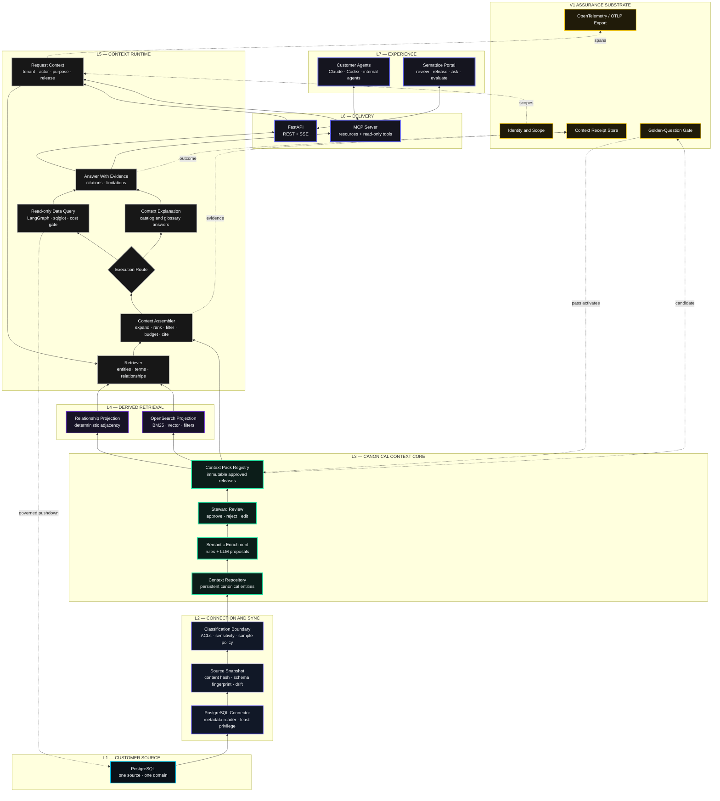
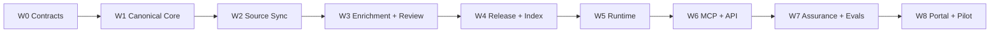

# Semattice Context V1 — Locked Release Strategy

> **Release:** `semattice-context-v1`  
> **Document version:** 1.0  
> **Status:** LOCK CANDIDATE — scope is frozen by this document; product-owner sign-off promotes it to `LOCKED`  
> **Product owners:** Luan and Raphael  
> **Reference domain:** NorthWind Pay — Type 01 card settlement and reconciliation  
> **Last reviewed:** 2026-08-27

This document defines the first buildable release of **Semattice Context**. It is a normative
product and architecture contract: it fixes what V1 contains, what it produces, how it is accepted,
and what is deliberately deferred.

The purpose of V1 is not to prove that many frameworks can be integrated. It is to prove one
commercially meaningful claim:

> An enterprise agent answers a domain question more accurately when it receives approved,
> versioned business context than when it sees a raw database schema, and Semattice can prove
> exactly which context produced the answer.

---

## 1. Executive decision

### 1.1 Product promise

**Semattice Context turns enterprise data metadata into approved, versioned, agent-ready context
and delivers it read-only through MCP and APIs with citations and a durable evidence receipt.**

V1 serves one isolated customer deployment, one business domain, and one PostgreSQL source. It
supports the complete flow from source discovery to an approved Context Pack and a grounded agent
answer.

### 1.2 V1 commercial unit

The first sellable unit is a fixed-scope production-readiness pilot:

- one customer environment;
- one PostgreSQL source;
- one business domain;
- at least 30 customer-approved golden questions;
- one read-only MCP deployment;
- one approved Context Pack;
- one before/after evaluation report;
- a Context Receipt for every accepted answer.

This is a forward-deployed product installation, not an open-ended consulting engagement. Customer
configuration varies; product code and release contracts do not.

### 1.3 Product boundary

V1 includes **Semattice Context** and the minimum assurance substrate needed by the future
**Semattice Control** product.

| Product boundary | V1 decision |
|---|---|
| Semattice Context | Included: connect, model, enrich, review, release, retrieve, assemble, query, and serve context |
| Semattice Control | Substrate only: identity propagation, OpenTelemetry emission, read-only enforcement, evaluations, and Context Receipts |
| Full Control product | Deferred: centralized OTLP ingestion, policy studio, approval queues, MCP registry, fleet governance, behavioral recommendations |
| Protocol product | No separate V1 product; MCP is a delivery surface inside Semattice Context |

### 1.4 V1 is not

V1 is not a general-purpose data integration platform, a new vector database, a generic agent
framework, an autonomous write system, or a replacement for a data catalog. Its product value is
the approved context contract and the proof chain from source to answer.

---

## 2. Evidence boundary

The repositories contain a real starting point, but not the complete V1 product. This distinction
must remain visible in design reviews and customer conversations.

| State | Directly observed capability |
|---|---|
| Proven in this repository | Read-only PostgreSQL catalog crawl; tables, columns, foreign keys, views, and routines; deterministic `graph.json`; `catalog_search`, `catalog_get`, and `catalog_ask`; one NorthWind golden question; stdio MCP |
| Proven in OntoLayer | PostgreSQL, DuckDB, and Fabric connectors; metadata sampling; manifests; LLM enrichment; embeddings; OpenSearch hybrid retrieval; canonical entity models; LangGraph NL-to-SQL; SQL safety and cost gating; FastAPI/SSE; Next.js UI |
| Transitional in OntoLayer | Canonical `EntityStore` exists, but the running ingestion pipeline remains document-first; canonical entity-to-index projection is a migration path |
| Concept only | Semattice Control screens and broader OTLP governance experience |
| Required by this V1 | Persistent canonical context repository, review and release workflow, Context Pack, deterministic Context Assembler, product MCP/API contract, customer-scale eval gate, Context Receipt, isolated deployment |

The NorthWind ontology cut is intentionally narrower than OntoLayer. Its boundary is recorded in
[`ontology/SOURCE.md`](ontology/SOURCE.md), and its executable demonstration is described in
[`ontology/README.md`](ontology/README.md).

### 2.1 Current proof

The current steel thread is:

```text
live PostgreSQL catalog
        ↓ read-only crawl
canonical in-memory entities
        ↓ deterministic projection
ontology/output/graph.json
        ↓ read-only retrieval
catalog_search · catalog_get · catalog_ask
        ↓ MCP stdio
agent receives table · grain · writer procedure
```

The current test suite proves the deterministic retrieval and MCP tool contract. The live database
crawl is a separate proof and may skip when the plant is unavailable.

Baseline verification on 2026-08-27: `make test-ontology` ran 10 tests with 9 passing and the live
PostgreSQL crawl smoke skipped because the plant was down. The stored-graph retrieval and MCP tool
tests passed; this is local proof of the slim demo, not proof of the V1 target architecture.

### 2.2 V1 target proof

```text
isolated customer source
        ↓ governed metadata sync
persistent canonical Context Repository
        ↓ enrichment proposals + steward review
approved, immutable Context Pack
        ↓ derived OpenSearch projection
deterministic request Context Bundle
        ↓ read-only MCP/API query
answer with citations + Context Receipt
        ↓ golden-question evaluation
release passes or fails closed
```

---

## 3. V1 architectural invariants

The following decisions are release-blocking. A component that violates one of them is not V1.

1. **Canonical context is authoritative.** Search indexes, embeddings, and graph views are derived
   projections that can be rebuilt from an approved Context Pack.
2. **Metadata first; no raw-copy requirement.** Semattice does not copy source business rows by
   default. Approved statistics and sample values are opt-in, masked, and attributable.
3. **Read-only end to end.** V1 does not mutate customer business systems. Generated SQL is parsed,
   schema-scoped, cost-bounded, row-limited, and executed through a read-only credential.
4. **Human approval separates inference from truth.** LLM enrichment produces proposals. Only
   steward-approved assertions enter an approved Context Pack.
5. **Every answer binds to a release.** A successful response identifies the exact Context Pack
   version and content hash used to assemble it.
6. **Every factual answer cites evidence.** Unsupported answers abstain; they do not fill gaps with
   plausible text.
7. **Telemetry is not the audit ledger.** OpenTelemetry carries operational evidence. A durable
   Context Receipt independently records the proof chain for an answer.
8. **Customer isolation precedes shared tenancy.** V1 is deployed once per customer. All durable
   models still contain `tenant_id` so a later shared control plane does not require a semantic
   migration.
9. **Frameworks remain replaceable.** LangGraph, OpenSearch, model providers, and telemetry
   backends implement internal ports. Product contracts do not expose their native object models.
10. **A release is earned by evaluation.** A Context Pack cannot become production-active until
    its golden-question suite, safety suite, provenance checks, and isolation checks pass.

---

## 4. Locked system architecture



---

## 5. Layer lock

### L1 — Customer source

**V1 responsibility:** provide one bounded, discoverable enterprise system.

**Locked components:**

- PostgreSQL only;
- one database and an explicit schema allowlist;
- one payments/reconciliation domain;
- dedicated read-only metadata credential;
- separate read-only query credential when runtime SQL is enabled.

**Output:** a source registration with stable `source_id`, `tenant_id`, connection metadata, schema
allowlist, credential reference, and sampling policy.

**Not V1:** Slack, file shares, email, SaaS applications, SQL Server, Fabric, Snowflake, Databricks,
CDC, webhooks, and streams.

### L2 — Connection and sync

**V1 responsibility:** convert a source catalog into a reproducible source snapshot without taking
ownership of customer business rows.

**Locked components:**

- connector registry and PostgreSQL adapter;
- discovery of schemas, tables, columns, foreign keys, views, functions, and procedures;
- stable source-neutral entity IDs;
- TTL and content-hash short-circuit;
- schema fingerprint and drift report;
- metadata ACL and sensitivity capture where the source exposes it;
- opt-in column statistics and masked samples;
- sync-state persistence and observable failure states.

**Output:** `SourceSnapshot`.

```yaml
source_snapshot:
  snapshot_id: snap_...
  tenant_id: tenant_...
  source_id: src_...
  connector: postgres
  started_at: timestamp
  completed_at: timestamp
  schema_fingerprint: sha256:...
  content_hash: sha256:...
  schemas: [reporting, legacy]
  entity_counts: {}
  drift:
    status: compatible | review_required | blocking
    changes: []
  warnings: []
  status: completed | partial | failed
```

**Fail-closed rule:** a partial crawl cannot silently replace the last complete snapshot.

### L3 — Canonical Context Core

**V1 responsibility:** own the source-neutral, persistent meaning of the customer domain.

**Locked entity types:**

| Entity | Required meaning |
|---|---|
| Data source | Customer system and connector boundary |
| Schema | Source namespace and access boundary |
| Table | Business object, grain, domain, ownership, classifications |
| Column | Type, meaning, sensitivity, examples policy, parent table |
| Relationship | Source-declared or inferred edge, direction, confidence, provenance |
| View | Definition and referenced entities |
| Procedure | Writer/reader relationships and execution semantics |
| Measure | Name, expression, aggregation, unit, parent entity |
| Business term | Definition, synonyms, executable resolution, scope |
| Domain | Grouping, owners, key entities, limitations, sample questions |

Every semantic assertion carries:

- `assertion_id`;
- `entity_id`;
- `field` and typed `value`;
- `origin`: `source`, `manifest`, `rule`, `llm_proposed`, or `steward`;
- source reference or prompt/model metadata;
- confidence;
- author or confirmer;
- created and superseded timestamps;
- review status.

LLM output is never directly authoritative. It enters the repository as `llm_proposed` and must be
reviewed before release.

#### Context Pack

A Context Pack is the immutable, approved release artifact of Semattice Context.

```yaml
context_pack:
  pack_id: ctx_northwind_settlement_v1
  tenant_id: tenant_northwind
  domain_id: payments_settlement
  version: 1.0.0
  status: approved
  source_snapshots: [snap_...]
  schema_fingerprint: sha256:...
  entity_manifest_hash: sha256:...
  entities: []
  assertions: []
  glossary: []
  relationship_manifest: []
  limitations: []
  evaluation_run_id: eval_...
  approved_by: steward_...
  approved_at: timestamp
  content_hash: sha256:...
```

Allowed lifecycle:

```text
draft → in_review → evaluated → approved → active → superseded
                                      └──→ revoked
```

Only one Context Pack is active for a tenant/domain pair. Previous approved versions remain
addressable for replay and audit.

### L4 — Derived retrieval

**V1 responsibility:** make an approved Context Pack efficiently searchable without becoming a
second source of truth.

**Locked components:**

- OpenSearch as the only V1 search backend;
- keyword/BM25 retrieval;
- vector retrieval over approved descriptions and glossary terms;
- structured filters for tenant, domain, entity type, classification, source, and release;
- deterministic relationship adjacency generated from canonical relationships;
- index version equal to Context Pack content hash;
- full rebuild and atomic alias swap on release activation.

**Not V1:** pgvector, Qdrant, Graphiti, Neo4j, FalkorDB, and a separate temporal knowledge graph.

### L5 — Context runtime

**V1 responsibility:** assemble the smallest approved and policy-compliant context needed for one
request, then either explain the context or safely query the source.

**Locked components:**

- request context validator;
- intent route: `context_explanation` or `data_query`;
- hybrid retriever;
- business-term resolver with clarification for ambiguous terms;
- deterministic relationship expansion;
- Context Assembler;
- LangGraph NL-to-SQL workflow for the data-query route;
- sqlglot AST safety validation;
- schema qualification, row limit, timeout, and cost gate;
- answer synthesis with citations and limitations;
- explicit abstention when evidence is insufficient.

#### Context Bundle

The Context Assembler creates an ephemeral request artifact:

```yaml
context_bundle:
  bundle_id: bundle_...
  tenant_id: tenant_...
  actor_id: actor_...
  purpose: settlement_investigation
  context_pack_id: ctx_...
  context_pack_hash: sha256:...
  question_hash: sha256:...
  entities: []
  relationships: []
  glossary_resolutions: []
  excluded_assets: []
  citations: []
  token_budget: 12000
  assembled_at: timestamp
```

ACT belongs here if ACT means the rules for selecting, ordering, constraining, and packaging request
context. ACT does not own ontology persistence, search storage, or long-term agent memory.

**Not V1:** LlamaIndex as a required runtime, autonomous multi-agent planning, long-term personal
memory, Graphiti episodes, and write-capable action routing.

### L6 — Delivery

**V1 responsibility:** expose stable product contracts to agents and applications.

#### MCP tools

| Tool | Purpose | Required evidence |
|---|---|---|
| `context_search` | Search approved entities and terms | Pack version, entity IDs, scores, citations |
| `context_get` | Retrieve one approved entity and neighborhood | Pack version, assertions, provenance, relationships |
| `context_explain` | Answer a business-context question without querying business rows | Pack version, cited assertions, limitations |
| `context_lineage` | Traverse table, view, and procedure relationships | Pack version, path and edge provenance |
| `data_query` | Run an approved, read-only natural-language query | Pack version, SQL fingerprint, assets, citations, receipt ID |

The local developer/demo transport is stdio. The first customer deployment may run the MCP server
as a customer-side process or sidecar. Remote multi-tenant MCP and OAuth authorization are deferred.

#### MCP resources

```text
semattice://tenants/{tenant_id}/domains/{domain_id}/packs/{version}
semattice://tenants/{tenant_id}/entities/{entity_id}
semattice://tenants/{tenant_id}/glossary/{term}
semattice://tenants/{tenant_id}/receipts/{receipt_id}
```

#### FastAPI surface

```text
POST /v1/context/search
GET  /v1/context/entities/{entity_id}
POST /v1/context/explain
POST /v1/context/lineage
POST /v1/data/query
GET  /v1/context/packs
GET  /v1/context/packs/{pack_id}
GET  /v1/receipts/{receipt_id}
GET  /v1/health
```

MCP and HTTP call the same application services. Neither transport contains business logic.

### L7 — Product experience

**V1 responsibility:** let an engineer or data steward complete the lifecycle without editing JSON
or calling internal functions.

**Locked portal surfaces:**

1. **Connections** — source, schema allowlist, credential health, last snapshot, drift state.
2. **Context Catalog** — tables, columns, views, procedures, measures, terms, domains, lineage.
3. **Review Queue** — compare source facts, rules, LLM proposals, and steward edits.
4. **Releases** — pack diff, evaluation status, approve, activate, supersede, revoke.
5. **Ask Context** — context explanation and read-only data query with citations.
6. **Evaluations** — golden questions, baseline, candidate results, regressions, failures.
7. **Receipt Inspector** — answer, context version, retrieved assets, SQL fingerprint, trace link.

The V1 UI optimizes for correctness and reviewability. Rich Control dashboards, policy simulation,
approval queues for write actions, voice governance, and recommendation engines are later products.

---

## 6. V1 assurance substrate

Semattice Context V1 must leave clean integration points for Semattice Control without attempting
to build the entire Control product.

### 6.1 Identity and tenant scope

Every application request carries:

- `tenant_id`;
- `actor_id`;
- `actor_type`: human, service, or agent;
- `purpose`;
- requested Context Pack version or `active`;
- granted tool scopes.

HTTP uses OIDC when a customer identity provider is available; the isolated pilot may use a scoped
service credential. Local stdio inherits the customer-side process identity and configuration.

### 6.2 Policy enforcement

V1 policy is intentionally small and deterministic:

- tenant and domain isolation;
- tool-level allowlist;
- source/schema/table/column allowlist;
- sensitivity filtering;
- read-only SQL contract;
- sampling and output-row limits;
- context release must be active and not revoked.

OPA/Cedar and a general policy authoring language are deferred. V1 exposes a `PolicyPort` so the
deterministic rules can later be replaced without changing application services.

### 6.3 OpenTelemetry

Instrument these operations:

- connector sync and drift detection;
- enrichment proposal generation;
- review and release transition;
- retrieval;
- context assembly;
- model invocation;
- MCP tool call;
- SQL validation and execution summary;
- answer synthesis;
- evaluation case and release gate.

Content capture is opt-in. Raw prompts, SQL results, and sample values are not exported by default.
OTLP is the export protocol; the backend may be Langfuse, Jaeger, or the customer's existing
observability platform.

### 6.4 Context Receipt

A receipt is written independently of telemetry for every accepted or refused request.

```yaml
context_receipt:
  receipt_id: rcpt_...
  timestamp: timestamp
  tenant_id: tenant_...
  actor_id: actor_...
  actor_type: agent
  purpose: settlement_investigation
  request_hash: sha256:...
  context_pack_id: ctx_...
  context_pack_hash: sha256:...
  retrieved_entity_ids: []
  citation_ids: []
  policy_decisions: []
  tool_name: data_query
  sql_fingerprint: sha256:... | null
  source_snapshot_ids: []
  answer_hash: sha256:... | null
  outcome: answered | abstained | blocked | failed
  trace_id: trace_...
  latency_ms: 0
```

Receipts are append-only application records. Telemetry loss must not delete them.

---

## 7. Locked feature inventory

### 7.1 Release-blocking features

| Feature group | V1 feature | Acceptance evidence |
|---|---|---|
| Source | PostgreSQL registration and connection test | Valid and invalid credential tests |
| Source | Explicit schema allowlist | Out-of-scope schemas never appear |
| Sync | Stable IDs, snapshot, hash, and drift | Repeat crawl is idempotent; drift is classified |
| Context | Persistent canonical entities | Restart preserves entities and provenance |
| Context | Business terms, domains, measures, procedures | Contract tests for each entity type |
| Enrichment | Rule and LLM proposal creation | Proposal never appears as approved automatically |
| Review | Approve, reject, edit, supersede | State-transition and authorization tests |
| Release | Immutable Context Pack | Hash is stable; mutation creates a new version |
| Retrieval | OpenSearch derived projection | Index rebuild reproduces approved pack |
| Runtime | Deterministic Context Bundle | Same request and pack produce stable entity set |
| Runtime | Clarification and abstention | Ambiguous or unsupported question does not guess |
| Query | Read-only NL-to-SQL | Unsafe SQL, excessive cost, and out-of-scope assets fail closed |
| Delivery | Five MCP tools and matching APIs | Tool/API contract and integration tests |
| Evidence | Citations and Context Receipt | Every terminal outcome has a receipt |
| Evaluation | Golden-question release gate | Candidate cannot activate on gate failure |
| Experience | Seven V1 portal surfaces | Lifecycle completed without internal data edits |
| Operations | Isolated Compose deployment | Clean install, health, backup, restore, and upgrade smoke |

### 7.2 Explicitly deferred

The following components may be investigated behind ports but cannot become release dependencies:

- Slack, files, PDFs, email, and SaaS content connectors;
- dlt, Debezium, Redpanda Connect, and CDC;
- LlamaIndex;
- Graphiti, Neo4j, FalkorDB, and temporal memory;
- pgvector and Qdrant;
- entity-resolution products such as Splink or Senzing;
- OpenRouter or LiteLLM as required gateways;
- shared multi-tenant SaaS;
- remote MCP fleet management;
- generalized OPA/Cedar policies;
- writes, actions, approvals, and OAuth action gateways;
- cross-customer Pattern Library automation;
- recommendations derived from production behavior.

Deferral means “not required to ship V1,” not “rejected forever.”

---

## 8. Evaluation and release gates

### 8.1 Evaluation design

Each pilot has three comparable runs over the same question set:

1. **Raw-schema baseline** — source metadata without generated or steward semantics.
2. **Generated context** — automated enrichment proposals, not presented as approved truth.
3. **Approved context** — the candidate Context Pack.

The test set contains at least 30 customer-authored questions, including at least five critical
questions where an incorrect answer would cause operational or financial harm.

### 8.2 Required metrics

- correct entity retrieval;
- correct business-term resolution;
- correct relationship/path selection;
- SQL validity and safe execution;
- answer correctness;
- citation correctness and completeness;
- appropriate clarification or abstention;
- latency and model cost;
- policy and tenant-scope violations;
- regression against the currently active Context Pack.

### 8.3 V1 activation gates

A candidate release activates only when all conditions hold:

| Gate | Threshold |
|---|---|
| Critical golden questions | 100% pass |
| Overall golden-question pass rate | At least 85% |
| Improvement | Approved context outperforms the raw-schema baseline |
| Citation coverage | 100% of accepted factual answers |
| Unsupported-answer behavior | 100% clarify, abstain, or block; no fabricated source |
| SQL safety | Zero unsafe statements accepted |
| Tenant and scope isolation | Zero cross-tenant or out-of-scope asset disclosures |
| Approved assertion provenance | 100% |
| Critical regressions from active release | Zero |
| Receipt coverage | 100% of terminal requests |
| Clean deployment and recovery smoke | Pass |

The customer data steward approves semantic correctness. Engineering cannot waive a failed critical
question or missing provenance field.

---

## 9. Step-by-step delivery plan

This sequence is gate-driven, not a calendar promise. No work package starts its dependent work
until its exit evidence exists.



### W0 — Freeze contracts

**Build:**

- ADRs for canonical authority, no-raw-copy default, read-only boundary, release lifecycle,
  receipt durability, and isolated deployment;
- JSON Schema/Pydantic contracts for `SourceSnapshot`, canonical entities, semantic assertions,
  `ContextPack`, `ContextBundle`, `AnswerWithEvidence`, and `ContextReceipt`;
- internal ports for connectors, repositories, search, models, policy, telemetry, and receipts;
- golden-question authoring guide and V1 test fixtures.

**Exit:** all contracts have examples, round-trip tests, and product-owner review. No framework type
appears in a public contract.

### W1 — Make the canonical core authoritative

**Build:**

- persistent Context Repository in product PostgreSQL;
- entity, assertion, provenance, review, release, and receipt tables;
- deterministic stable IDs and content hashing;
- version and state-transition services;
- migration from the current in-memory/document-first paths.

**Exit:** a process restart preserves a source snapshot, draft assertions, an approved Context Pack,
and its hash. OpenSearch can be deleted without deleting canonical context.

### W2 — Productize PostgreSQL sync

**Build:**

- least-privilege PostgreSQL connector configuration;
- tables, columns, foreign keys, views, functions, and procedures;
- schema allowlist, classifications, sampling policy, sync state, and drift classification;
- last-known-good snapshot behavior;
- connector contract tests against NorthWind and a neutral fixture.

**Exit:** two identical crawls are idempotent; compatible and blocking drift cases are demonstrated;
a failed partial crawl does not replace the previous complete snapshot.

### W3 — Add enrichment and steward review

**Build:**

- deterministic rule enrichment;
- provider-neutral LLM proposal generation;
- glossary, domains, measures, grains, synonyms, descriptions, and limitations;
- proposal diff and provenance;
- review queue and approve/reject/edit/supersede actions.

**Exit:** an LLM proposal cannot become approved without a steward event; every approved assertion
has provenance and an accountable confirmer.

### W4 — Release Context Packs and derived indexes

**Build:**

- Context Pack builder and validation;
- immutable versioning and content hash;
- candidate evaluation state;
- OpenSearch projection from the approved pack;
- release-scoped aliases and atomic activation;
- rollback to the previous active pack.

**Exit:** the active pack can be replayed, compared, superseded, revoked, and used to reproduce the
same canonical search documents with pinned embedding-model metadata and a matching release hash.

### W5 — Build the Context Runtime

**Build:**

- request validation and intent route;
- hybrid retrieval and term resolution;
- deterministic relationship expansion;
- Context Assembler with policy filtering and token budget;
- context explanation route;
- LangGraph NL-to-SQL route with sqlglot safety, cost gate, timeout, and row limit;
- `AnswerWithEvidence` and abstention behavior.

**Exit:** NorthWind questions resolve from the active Context Pack; ambiguous questions clarify;
unsafe or unsupported requests fail closed.

### W6 — Stabilize MCP and API delivery

**Build:**

- the five V1 MCP tools;
- versioned MCP resources;
- matching FastAPI services and SSE events;
- consistent error and evidence envelopes;
- tool scopes and request identity propagation;
- SDK examples for Python and TypeScript.

**Exit:** MCP and HTTP return equivalent domain results and conformant evidence envelopes through
shared application services; each transport request receives its own receipt ID.

### W7 — Add assurance and release evaluation

**Build:**

- OpenTelemetry instrumentation and OTLP export;
- append-only Context Receipt persistence;
- 30-question NorthWind evaluation set with critical labels;
- raw/generated/approved comparison runner;
- release gate, regression report, and refusal reasons;
- security, isolation, and unsafe-SQL suites.

**Exit:** a deliberately broken Context Pack cannot activate; every evaluated request has a receipt;
telemetry can be disabled or lost without deleting receipt evidence.

### W8 — Complete the pilot experience

**Build:**

- the seven V1 portal surfaces;
- isolated Docker Compose deployment;
- secret injection, health checks, backup, restore, and upgrade runbook;
- onboarding and steward documentation;
- before/after pilot report template;
- customer acceptance checklist.

**Exit:** a new isolated environment can connect NorthWind, produce and approve a Context Pack,
serve it over MCP, run evaluations, inspect receipts, and recover from backup using only documented
steps.

---

## 10. Feature-component architecture

Implementation should be organized around product capabilities with ports and adapters, not around
vendor SDKs.

```text
src/semattice/
  domain/
    entities/
    assertions/
    releases/
    evidence/
  application/
    ports/
    policies/
  features/
    connect_source/
    sync_context/
    review_semantics/
    release_context/
    search_context/
    explain_context/
    query_data/
    evaluate_release/
    inspect_receipt/
  adapters/
    postgres_source/
    postgres_repository/
    opensearch/
    llm_openai_compatible/
    langgraph/
    mcp/
    fastapi/
    opentelemetry/
  web/
  tests/
    contracts/
    unit/
    integration/
    end_to_end/
    eval/
```

Rules:

- a feature owns its request, use case, result, policy checks, and tests;
- adapters implement ports and never define domain contracts;
- cross-feature writes go through application services;
- feature completion requires its failure path and receipt behavior;
- generated code is accepted only after deterministic tests and human review;
- dark-factory automation begins with bounded work packets and explicit exit gates, not open-ended
  autonomous changes.

---

## 11. Ownership map

| Own as Semattice product IP | Encapsulate behind a port |
|---|---|
| Canonical context and assertion model | PostgreSQL driver and migration library |
| Context Pack lifecycle and hashing | OpenSearch |
| Steward review workflow | LLM providers and embedding models |
| Context Assembler / ACT rules | LangGraph |
| Evidence and citation contract | sqlglot |
| Golden-question release gate | FastAPI and MCP SDK |
| Context Receipt | OpenTelemetry SDK and Collector |
| MCP tool semantics | Optional observability backend |
| Domain pattern authoring contract | Identity provider |

The moat is not a wrapper around these libraries. It is the governed chain:

```text
source fact
  → semantic assertion
  → steward approval
  → immutable Context Pack
  → bounded Context Bundle
  → controlled query
  → cited answer
  → durable Context Receipt
  → evaluated correction
```

---

## 12. Definition of V1 done

V1 is complete only when all of the following are directly demonstrated in a fresh isolated
environment:

- one PostgreSQL source connects with least-privilege credentials;
- source sync creates a complete, persisted snapshot and drift fingerprint;
- canonical entities and assertions survive restart;
- an LLM enrichment remains a proposal until a steward approves it;
- an approved Context Pack is immutable, hashed, evaluated, and active;
- OpenSearch is rebuilt from that pack;
- an agent can use all five MCP tools;
- `data_query` executes only bounded read-only SQL;
- answers cite approved entities and identify the Context Pack;
- ambiguous or unsupported questions clarify or abstain;
- every request produces a durable Context Receipt;
- the 30-question evaluation satisfies every activation gate;
- the raw/generated/approved report shows the measured effect of context;
- backup, restore, rollback, and pack revocation are demonstrated;
- no deferred component is required to pass the release.

Passing unit tests alone does not prove V1. A mockup, architecture diagram, or skipped live test is
not release evidence.

---

## 13. Risks and kill criteria

| Risk | Control | Kill signal |
|---|---|---|
| V1 becomes an integration showcase | Enforce deferred list and work-package gates | More time is spent integrating frameworks than improving golden-question results |
| Canonical truth splits across databases | Context Repository remains authoritative; indexes rebuild | An approved fact can exist only in OpenSearch or a graph database |
| LLM proposals are mistaken for truth | Mandatory review and provenance | Unreviewed assertion reaches an active pack |
| Customer data leaks through sampling or telemetry | Metadata-only default, masking, opt-in content capture | Raw sensitive value appears in an index, log, trace, or receipt without policy |
| Pilot remains bespoke | Tenant configuration is data; code is shared | Customer-specific branches or hard-coded business answers become necessary |
| MCP becomes the product story | Measure context uplift and assurance | Sales proof is only “the agent can call an MCP tool” |
| Governance is observational only | Durable receipts and inline read-only enforcement | A trace exists but the system cannot prove or prevent an unsafe access |
| Context provides no material benefit | Raw/generated/approved benchmark | Approved context does not outperform raw schema on the customer set |

If the approved-context run does not outperform the raw-schema baseline, stop expanding connectors
and repair the semantic model, assembly strategy, or evaluation design.

---

## 14. Change control for the V1 lock

After product-owner sign-off, a V1 scope change requires:

1. a short ADR stating the problem and evidence;
2. the component or feature entering scope;
3. the existing V1 item removed or the delivery impact accepted;
4. contract, security, evaluation, and migration impact;
5. approval from both product owners.

Framework substitution behind an existing port is not a scope change if public contracts,
acceptance gates, and evidence remain unchanged.

### Decisions required to promote this document to `LOCKED`

- confirm PostgreSQL-only and one-domain scope;
- confirm isolated per-customer deployment rather than shared SaaS;
- confirm OpenSearch as the sole V1 derived retrieval store;
- confirm LlamaIndex and Graphiti are deferred adapters;
- confirm the five MCP tools;
- confirm the 30-question and 85% activation gate;
- confirm Context Pack and Context Receipt as the primary V1 contracts.

---

## 15. Immediate next actions

1. Review and sign the seven lock decisions above.
2. Convert W0 into the first bounded implementation packet: contracts and ADRs only.
3. Promote the NorthWind golden set from one question to at least 30 steward-reviewed cases.
4. Design the persistent canonical repository before adding new connectors or retrieval systems.
5. Build the first end-to-end vertical slice:

```text
PostgreSQL
  → SourceSnapshot
  → canonical entities
  → one approved Context Pack
  → OpenSearch projection
  → context_explain over MCP
  → Context Receipt
  → golden-question gate
```

Only after that slice passes should V1 add the read-only `data_query` path and complete the portal.
